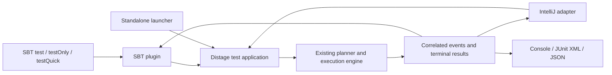

# Native distage test library and runner

Research and proposed implementation plan, 2026-10-01. Repository inspected at
`5be95fb6309c4b0cb9dbea37ed84c0db0a8ff870`. “Native distage runner” means a
distage-owned runner; Scala Native is a separate required execution backend.
Elsewhere in this document, “Native” means Scala Native only; the distage-owned
specification DSL and its registration are called the distage spec front end.

The recommended direction is an independent assertion library and an explicit
test application built on the existing distage planning/execution engine. The
application owns discovery, selection, resource lifetime, and execution. An SBT
plugin preserves the standard `test`, `testOnly`, and `testQuick` commands while
launching that application; IntelliJ uses the same execution contract. JSON is a
boundary format; the in-process engine uses typed models.

This document records source inspection and research, not a completed runtime
reproduction or implementation. In particular, issue #2361 has not been rerun in
this investigation. Proposed interfaces and commands below do not exist yet.
Decisions that belong to the project owner are listed under
[Open decisions](#open-decisions), with the assumption this plan proceeds under.

## Evidence and implications

The [issue report](https://github.com/7mind/izumi/issues/2361) records lost tests
when SBT 2 selects several explicit suite names. Its explanation is that a
ScalaTest filter for one suite is applied to the combined distage test set.
The current checkout has a different registry implementation from the released
version cited in parts of the report, but retains that architectural pattern:

- [DistageTestsRegistrySingleton](../../distage/distage-testkit-scalatest/src/main/scala/izumi/distage/testkit/services/scalatest/dstest/DistageTestsRegistrySingleton.scala)
  selects one runner and collects tests from suite instances, using ScalaTest's
  `Runner.discoveredSuites` when available.
- [DistageScalatestTestSuiteRunner](../../distage/distage-testkit-scalatest/src/main/scala/org/scalatest/distage/DistageScalatestTestSuiteRunner.scala)
  applies the initiating suite's `Args.filter` to the collected tests. Its JS
  mode disables global memoization by default and documents a sequential SBT
  execution requirement for the override.
- [DistageTestRunner](../../distage/distage-testkit-core/src/main/scala/izumi/distage/testkit/runner/impl/DistageTestRunner.scala),
  [TestPlanner](../../distage/distage-testkit-core/src/main/scala/izumi/distage/testkit/runner/impl/TestPlanner.scala),
  and [TestReporter](../../distage/distage-testkit-core/src/main/scala/izumi/distage/testkit/runner/api/TestReporter.scala)
  already provide substantial independent machinery. Preserve the existing
  planning, environment merging, memoization trees, and effect execution.
- [ScalatestAbstractDistageSpec](../../distage/distage-testkit-scalatest/src/main/scala/izumi/distage/testkit/services/scalatest/dstest/ScalatestAbstractDistageSpec.scala)
  still depends on ScalaTest verbs, assertions, cancellation, and IDE finders.
  Replacing the adapter also requires a distage spec front end.
- [WithTestRegistration](../../distage/distage-testkit-scalatest/src/main/scala/izumi/distage/testkit/services/scalatest/dstest/WithTestRegistration.scala)
  already collects tests per instance, but gives them identity-hash-based UIDs.
  Those UIDs are unsuitable as persistent selection identifiers.
- [DistageTestEnv](../../distage/distage-testkit-core/src/main/scala/izumi/distage/testkit/spec/DistageTestEnv.scala)
  contains global environment and default-module caches. Explicit session
  ownership must address these caches as well as the ScalaTest registry.
- `ScalatestAbstractDistageSpec` defaults to the deprecated `TestConfig.forSuite`,
  which on the JVM
  [scans the suite's package](../../distage/distage-testkit-core/.jvm/src/main/scala/izumi/distage/testkit/model/TestConfigPlatformSpecific.scala)
  for plugins. The JVM
  [test configuration loader](../../distage/distage-testkit-core/.jvm/src/main/scala/izumi/distage/testkit/runner/impl/services/BootstrapFactory.scala)
  merges system properties and environment overrides, and the default activation
  strategy reads activations from that configuration. Effective wiring and
  activation therefore depend on inputs that are not static class dependencies of
  the suite.

The [build definition](../../sbtgen/Deps.scala) targets JVM and JS, with Scala
2.12.21, 2.13.18, and 3.7.4. It does not define a Native target. The build uses SBT
2.0.9 and Scala.js 1.22.0. Scala Native support and Scala 3.3 consumer compatibility
therefore need dedicated work; neither follows from the present build matrix.
Steps 1a, 2a, and 2e of the delivery sequence schedule that work.

## Assertion contract

The agreed result/error policy is:

| Entry point | Result | Failure |
| --- | --- | --- |
| `assert(condition)` | `Unit` | Throws the library's assertion failure |
| `assert1[F](condition)` | `F[Unit]` | Raised inside the effect's suspended computation |
| `assert2[F](condition)` | `F[Nothing, Unit]` | An effect defect, not a typed error |

Use a portable `AssertionError` subtype carrying structured diagnostics, with a
useful message even when consumed by an unrelated runner.

`F` requires evidence for suspension and failure handling; higher-kinded arity
alone cannot supply those capabilities. For BIO, preserve the existing
`IO2.sync` defect behavior. For cats-effect, `Sync.delay` supplies the unary
behavior. Keep the plain assertion module independent of both runtimes. If the
public API needs a shared suspension capability, make it a small, explicitly
lawful boundary with adapters to the existing typeclasses. Do not expose
`QuasiIO` as a suspension guarantee: its Identity instance intentionally does
not suspend.

The first release takes ordinary Boolean expressions. Existing conveniences
such as `assertIO(effect)(predicate)` can be migrated with adapters or added
after the three requested forms are stable. They are not prerequisites for
effectful assertions.

### Diagnostics

Use two compiler implementations—Scala 2 blackbox macros and Scala 3
quotes/reflection—feeding one portable diagnostic model and renderer. Share
runtime representation and behavioral fixtures, rather than attempting to
abstract over the two compiler AST APIs. Macros execute in the JVM compiler for
all three backends; their emitted code and diagnostic runtime must be portable.
Separate macro definition compilation from consumer compilation where required,
especially on Scala 2.

Capture a source identity, expression span, the original expression text, and
observations associated with subexpression spans. Source identity should include
a normalized path relative to a supplied source root when available. Retain a
documented representation for absolute and virtual-source paths. Specify offset,
line, and column conventions; render tabs and Unicode separately from compiler
offsets.

Store the expression text at compilation time. A file path alone fails in CI,
remote runs, packaged tests, and browser JS. A source provider can enrich failures
with surrounding lines when the runner can access matching sources. Validate
available source content against the recorded span/content before placing
pointers; when it differs, display the compiled excerpt and identify the
mismatch. Missing source/range information must be represented explicitly.

Scala 3.3.0 already has `Position.sourceCode`, offsets, and line/column APIs in
[Quotes.scala](https://github.com/scala/scala3/blob/3.3.0/library/src/scala/quoted/Quotes.scala).
For Scala 2, step 1b must establish the available ranges with and without range
positions. Scala 2.13 enables `-Yrangepos` by default and Scala 2.12 does not, so
most 2.12 consumers compile without ranges. Do not assume every typed tree
retains a useful range. The current
[SourceFilePosition](../../fundamentals/fundamentals-language/src/main/scala/izumi/fundamentals/platform/language/SourceFilePosition.scala)
contains only a file name and line. Introduce a richer assertion-specific type
without forcing an unrelated repository-wide position migration.

Illustrative output:

```text
UserSpec.scala:42:10
assert(user.age >= minimum && user.enabled)
       ^^^^^^^^^^^^^^^^^^^
       user.age = 17; minimum = 18; result = false
                             user.enabled: not evaluated
```

The macro still needs expression structure to associate values with spans. The
improvement is preserving actual source and structured observations instead of
using a compiler pretty-print as the primary diagnostic.

### Semantic requirements

Start with Boolean leaves, built-in `&&`, `||`, `!`, and a conservative set of
comparison forms. Preserve the resolved operator and operand types. An operator
spelling alone is insufficient to justify rewriting a user-defined method.
Expressions outside the recognized set remain valid assertions, with an opaque
expression observation and source location.

The implementation must preserve evaluation count, order, short-circuiting,
by-name behavior, and thrown exceptions. Capturing the operands once but invoking
an overloaded comparison twice is still a semantic regression. Do not implement
`&&` by evaluating both branches to improve the message. Do not silently change
array equality to deep equality or convert unrelated exceptions into false
predicates.

For effectful forms, expression evaluation and per-execution diagnostic state
belong inside suspension. Constructing the effect must not evaluate the
condition; executing it twice must check twice, with independent observations.
`assert2` must leave the typed error channel unchanged. Failure rendering should
be bounded and lazy; a failed value renderer must preserve the original failure
and expose the rendering error.

[uTest](https://github.com/com-lihaoyi/utest) demonstrates universal assertions
across all requested language/platform families. Its
[Scala 3 tracer](https://github.com/com-lihaoyi/utest/blob/master/utest/src-3/utest/asserts/Tracer.scala)
and [ZIO smart assertions](https://zio.dev/reference/test/assertions/smart-assertions/)
are useful design references. Neither should be adopted without checking its
evaluation and failure contract against ours. Owning a small implementation is
reasonable; cloning an entire assertion framework is unnecessary.

## Test application and execution ownership

The intended dependency boundaries are an assertions module with optional effect
adapters; the existing testkit core with the distage spec front end and session
ownership; a portable application/protocol layer; and host-specific SBT/IDE
adapters. Share protocol data independently of SBT's classloader and Scala
version. Keep ScalaTest compatibility in its own artifact. These boundaries need
not become a separate published artifact for every interface.



Expose four logical operations, with platform launchers around the same core:

```text
discover(catalogue)                 -> test and suite descriptors
resolve(descriptors, request)       -> selected tests and effective settings
plan(resolved selection)            -> DI plans and memoization groups
execute(plan, event sink)           -> terminal results and run outcome
```

Discovery may execute specification registration code. It must not provision
test dependencies or execute test bodies. Arbitrary side effects in a user's
suite constructor cannot be made harmless by a framework; require declarative
registration and verify that library discovery does not acquire resources.
Planning may load configuration and execute user planning extensions, so report
its failures separately from test failures.

A `RunSession` owns registration, configuration snapshots, environment caches,
memoized resources, cancellation, and reporting state. Instantiate suites through
factories per session. Release resources before declaring the run complete.
Inspect static logging setup and other bootstrap hooks when enabling concurrent
sessions; removing one singleton is not sufficient proof of isolation.

Use logical test IDs derived from build target, suite identity, structured test
path, and explicit variant identity where needed. Keep names for display and
positions for navigation. Reject duplicate logical IDs. Do not use registration
order, object identity, or a source line as the persistent identity. Retain path
segments rather than flattening them into an ambiguous space-separated string.

Selection must precede provisioning. Distinguish:

- Selecting existing suites/tests or variants.
- Filtering by their effective axis choices.
- Overriding activation choices for the requested run.
- Disabling cross-test memoization while retaining ordinary dependency sharing
  inside each individual test graph.

Define precedence between suite configuration and explicit run overrides. Resolve
and validate axis overrides before applying a filter on effective axes. The plan
output shows the final activation and sharing boundaries. Unknown axis values,
unknown explicit test IDs, and stale catalogue references are errors. An empty
explicit selection must not produce an unexplained successful run.

The JSON protocol needs a schema version, build/catalogue identity, logical IDs,
locations, effective settings, structured failures, and correlated events. A
saved selection refers to a build and is revalidated; do not serialize live
closures, DI locators, or arbitrary effect values. Use an explicit transport
channel/framing so test output cannot corrupt protocol messages. CLI, SBT, and
IDE clients share selection semantics through this contract.

## SBT integration strategy

A test framework dependency implementing `sbt.testing.Framework` and an SBT
`AutoPlugin` are different integration surfaces. The framework runs inside the
test environment. The plugin runs inside SBT and can control complete-run launch
boundaries while preserving the standard commands. There is no fundamental
conflict between a distage-owned application and standard `test*` integration.

The [test-interface Runner contract](https://github.com/sbt/test-interface/blob/master/src/main/java/sbt/testing/Runner.java)
permits repeated `tasks` calls. It describes tasks in terms of individual input
task definitions. It provides no general discovery-complete barrier before
execution. Waiting for every suite task to enter `execute` can deadlock with a
sequential or bounded scheduler. Deferring all execution to `done` also fails the
event lifetime requirements of actual hosts.

In [SBT 2.0.9 TestFramework](https://github.com/sbt/sbt/blob/v2.0.9/testing/src/main/scala/sbt/TestFramework.scala),
events are collected during task execution and delivered to listeners after
`execute` returns. The
[JUnit listener](https://github.com/sbt/sbt/blob/v2.0.9/testing/src/main/scala/sbt/JUnitXmlTestsListener.scala)
groups those events by the task group; its nested selector handling matters for
an aggregate application. SBT 1.13.0's inspected execution path has the same
per-task collection pattern. A cross-suite task cannot obtain correct ordinary
suite reporting just by changing `Event.fullyQualifiedName`.

The recommended plugin pipeline is:

```text
test / testOnly / testQuick / testFull (where available)
  -> compile and discover ordinary suite identities
  -> apply this SBT version's selection and incremental-test policy
  -> partition by build target and configured execution/fork group
  -> launch a distage test application with an explicit selection
  -> stream distage events and collect terminal results
  -> publish per-suite SBT outcomes, listeners, reports, and success state
```

The names users select remain the ordinary suite names. The application is the
execution backend, not a replacement name users must know. Distage owns scheduling
inside each application and shares compatible resources across its selected
suites. Memoization remains bounded by the process/execution group, not the entire
aggregated multi-project SBT build. Honor explicit fork groups instead of silently
merging them.

There are concrete implementation seams to verify:

- In [SBT 1.13.0 Defaults](https://github.com/sbt/sbt/blob/v1.13.0/main/src/main/scala/sbt/Defaults.scala),
  `test` uses `executeTests`, while `testOnly` and `testQuick` use `inputTests`.
  Overriding only `executeTests` would leave the input commands on the old path.
- In [SBT 2.0.9 Defaults](https://github.com/sbt/sbt/blob/v2.0.9/main/src/main/scala/sbt/Defaults.scala),
  `test` delegates to the incremental input path and `testFull` uses
  `executeTests`. `testOnly` evaluates `inputTests(testSelected)`, so settings
  scoped to `testOnly` are not the ones it reads. Its private
  grouping/option-processing helpers are not stable public extension points.
  Design narrow version-specific bindings over public keys, and establish whether
  a small upstream extension is preferable to copying host orchestration. Do not
  use classes in SBT's private packages as an API.
- Reuse public discovery/filter/listener keys where possible. Both versions
  expose `definedTests`, `testFilter`, `testListeners`, and
  `loadedTestFrameworks`; SBT 2 additionally exposes `definedTestDigests` and
  `extraTestDigests`. `definedTests` is computed by `Tests.discover` over
  `loadedTestFrameworks`, so reusing it requires a registered framework whose
  fingerprints match distage specs. Spike 0a decides between a test-classpath
  framework and plugin-side discovery with distage fingerprints, and how stock
  test tasks and configurations that the plugin does not override are kept from
  executing distage specs. Preserve framework arguments, configured
  filters/exclusions, setup/cleanup, fork settings, classloader lifetime, and
  aggregation. Mixed-framework projects must keep routing their other tests to
  their original frameworks exactly once.
- Evaluate `loadedTestFrameworks` substitution, which Scala.js and Scala Native
  already use for their host-side framework proxies, as the non-forked seam. It
  keeps SBT's own input-test path, where SBT 2 passes framework arguments to its
  success recorder. In-process SBT also passes the whole selected set to one
  `Runner.tasks` call per framework; that is host behavior, not a test-interface
  guarantee. Forked groups need a separate mechanism, because
  [ForkTests](https://github.com/sbt/sbt/blob/v2.0.9/main-actions/src/main/scala/sbt/ForkTests.scala)
  sends framework class names and the fork instantiates the frameworks again.
- Preserve version-specific incremental semantics where they remain sound. SBT 2's
  [documented behavior](https://www.scala-sbt.org/2.x/docs/en/reference/sbt-test.html)
  makes `test` incremental/cached and supplies `testFull` for complete execution.
  Its [status recorder](https://github.com/sbt/sbt/blob/v2.0.9/main/src/main/scala/sbt/internal/IncrementalTest.scala)
  stores success by suite digest and framework arguments. Reporting success only
  for an application name would lose ordinary suite history. Spike 0a must prove
  argument-sensitive recording through an appropriate public seam or identify
  the precise upstream API needed.
- Stock invalidation is insufficient for DI-wired suites. SBT 2 derives a suite's
  digest from the suite class's transitive class dependencies, the `Test`
  configuration's own resources, test options, and `extraTestDigests`. SBT 1
  `testQuick` compares the last success time with compilation timestamps of the
  same class closure and ignores resources. Neither covers implementations wired
  only through scanned plugins, configuration files outside SBT 2's hashed `Test`
  resources, or activation inputs from system properties or the environment.
  Stock semantics would therefore skip a suite whose effective wiring changed,
  which is the silent non-execution class of #2361. Add a digest of the classes
  and resources reachable through each suite's plugin configuration, its
  configuration files, normalized distage options, and activation-relevant
  properties and environment. On SBT 2, contribute it through `extraTestDigests`
  (global and conservative) or a `definedTestDigests` override (per suite); on
  SBT 1, through `testQuick / testFilter`. The alternative is a documented policy
  that always invalidates distage suites.
- Running one selected test must not cache success for an entire suite under an
  unfiltered request. SBT 1's
  [status recorder](https://github.com/sbt/sbt/blob/v1.13.0/testing/src/main/scala/sbt/TestStatusReporter.scala)
  keys success by suite name only, and SBT 1 installs it for `test`, `testOnly`,
  and `testQuick`. With stock listeners, a partial `testOnly` records the whole
  suite as succeeded and a later `testQuick` skips it, so the SBT 1 binding must
  suppress success recording for partial selections. Cached exclusions and user
  exclusions must be visible as different selection reasons; neither counts as
  an executed test.
- Translate correlated distage results into per-suite listener/result batches.
  Where SBT listeners assume contiguous suite events, buffer that projection;
  keep the distage event stream available for live progress. Do not emit late
  events into handlers belonging to already completed tasks. Every component that
  calls a host `EventHandler` serializes its calls per task:
  [SBT 1.13.0](https://github.com/sbt/sbt/blob/v1.13.0/testing/src/main/scala/sbt/TestFramework.scala)
  collects task events in an unsynchronized buffer, while SBT 2.0.9 switched to a
  thread-safe collection. Run-level finalization failures must prevent a
  successful overall result and inappropriate success caching.

`distageList` and `distagePlan` are additive inspection commands. Framework
arguments after `--` supply test IDs, activation overrides, axis filtering, and
memoization settings to ordinary commands. A standalone launcher accepts the
same normalized request without SBT.

A portable `sbt.testing.Framework` adapter can still serve other hosts. An
aggregate application with nested selectors is one legitimate mapping; ordinary
suite tasks are another when the sharing scope is narrower. Neither constrains
the plugin's standard command names. On the JVM, choose that mapping after the
application/plugin path works; on JS and Native, the transport decision below
may require it earlier. Never register both specs and their containing
application for execution in the same mode, and never silently fall back to a
different sharing scope.

SBT discovers suites only through frameworks listed in `testFrameworks`. The
[default list](https://github.com/sbt/sbt/blob/v2.0.9/testing/src/main/scala/sbt/TestFramework.scala)
does not include distage, and nothing on the test classpath can add itself to
it. Once specs stop inheriting ScalaTest classes, a build that adds the new
testkit without the distage SBT plugin or an explicit framework registration
discovers no distage specs, and `test` succeeds. The library cannot detect this
from the test classpath. The plugin, or explicit registration, is therefore a
hard requirement of SBT use, which the installation and migration documentation
must state. The residual risk remains for builds that ignore it. Migration
acceptance reconciles discovered suite and test counts before and after each
module migrates.

Build the plugin for SBT 1 and 2 separately while sharing its protocol/logic.
Keep SBT implementation dependencies out of the portable engine. Forked JVM
tests execute in the test JVM. JS and Native use their actual target programs,
not JVM evaluation of the specifications. The architectural direction is clear;
the exact supported SBT wiring remains an executable spike, not a proven adapter.

## Scala.js and Scala Native

[Scala.js Runner](https://github.com/scala-js/scala-js/blob/v1.22.0/test-interface/src/main/scala/sbt/testing/Runner.scala)
supports controller/worker communication and task serialization; its
[Task](https://github.com/scala-js/scala-js/blob/v1.22.0/test-interface/src/main/scala/sbt/testing/Task.scala)
adds asynchronous completion. Never block the JS event loop waiting for effects.
Use serializable test/application identities and reconstruct executable state
in the target runtime.

Scala Native also has
[task serialization and runner messaging](https://github.com/scala-native/scala-native/blob/v0.5.12/test-interface-sbt-defs/src/main/scala/sbt/testing/Runner.scala).
Its inspected adapter launches native runner processes. Neither separate native
processes nor separate JS runtimes can share a memoized live object. Keep an
entire sharing group within one execution process; introduce explicit shards
only when their resource-sharing cost is accepted. A single application task can
still run its internal tests concurrently.

Under SBT, both platform plugins reach the target runtime only through their test
adapters. The
[Scala.js](https://github.com/scala-js/scala-js/blob/v1.22.0/sbt-plugin/src/main/scala/org/scalajs/sbtplugin/ScalaJSPluginInternal.scala)
and
[Scala Native](https://github.com/scala-native/scala-native/blob/v0.5.12/sbt-scala-native/src/main/scala/scala/scalanative/sbtplugin/ScalaNativePluginInternal.scala)
plugins install host-side framework proxies by overriding `loadedTestFrameworks`
and reject `fork := true`. Their
[Scala.js](https://github.com/scala-js/scala-js/blob/v1.22.0/test-adapter/src/main/scala/org/scalajs/testing/adapter/TestAdapter.scala)
and
[Scala Native](https://github.com/scala-native/scala-native/blob/v0.5.12/test-runner/src/main/scala/scala/scalanative/testinterface/adapter/TestAdapter.scala)
test adapters start one JS runtime or native process per SBT thread that uses
them. Decide the JS/Native transport before the JVM SBT integration (step 2d)
fixes the plugin's structure:

- A target-side `sbt.testing.Framework` reached through the platform test
  adapter, exposing one aggregate task per sharing group that reports nested
  selectors. That framework is then a required component on JS and Native, not a
  secondary mapping.
- A plugin-owned launcher over the platforms' public run interfaces: a Scala.js
  `JSEnv` run with a communication channel, or a separately linked Native
  application.

With the stock per-thread adapters, keeping a sharing group within one process
holds only when the whole group executes as one task. Spike 0c exercises the
chosen transport on both platforms.

Start standalone applications with an explicit catalogue of suite factories.
SBT can use its discovered test definitions and supported reflective
instantiation. A generated catalogue is an alternative for closed-world linking,
but its build ordering must be designed: generating sources from the same
compilation's analysis can create a cycle or read stale discovery. Compile suite
definitions first and generate a separate launcher when taking that route.
Avoid runtime classpath scanning as the portable discovery mechanism.

Native feasibility must cover the dependency closure: fundamentals, BIO runtime,
logging, distage core, framework configuration/resources, and plugin loading.
`distage-testkit-core` depends on `distage-framework`, and `TestPlanner` uses
configuration loading, the role launcher's logger and activation parsing, module
providers, and plugin configuration. The configuration extension uses pureconfig
on the JVM and circe on JS, so Native needs an explicitly chosen backend.
The pinned [izumi-reflect 3.0.8 build](https://github.com/zio/izumi-reflect/blob/v3.0.8/build.sbt)
already declares Native targets, which removes one obvious concern but does not
prove the remaining closure links. Audit the existing `.jvm` and `.js`
implementations; neither set should be blindly reused as the Native backend.
JVM-only integrations such as Docker remain separately identified capabilities.

Scala Native's [0.5.12 compatibility table](https://scala-native.org/en/latest/changelog/0.5.x/0.5.12.html)
covers Scala 2.12, 2.13, and 3.3. Thus the requested language matrix is plausible
at the toolchain level; izumi portability is the unverified part.

For Scala 3, compile published APIs/macros against the oldest supported language
baseline and test consumers on newer releases. Check the complete dependency
closure at that baseline. A library compiled with 3.7 is not automatically
consumable by 3.3; see Scala's
[compatibility rules](https://docs.scala-lang.org/scala3/reference/language-versions/binary-compatibility.html).
This plan reads “3.3+” literally (see [Open decisions](#open-decisions)), so 3.3.0
is the oldest supported consumer. Published Scala 3 artifacts compile with a 3.3
LTS compiler. The 3.3.0 consumer lane decides whether the newest LTS patch is
acceptable as that compiler or 3.3.0 itself is required. Consumer lanes cover
3.3.0, the newest 3.3 LTS patch, and the current stable release.
Runtime/toolchain changes such as the newer Scala standard library require
dedicated consumer checks. Pin compatible stable dependencies when
implementation begins rather than upgrading this repository during research.

## Reporting, coverage, and IntelliJ

Use correlated run/suite/test events and a terminal result model. JUnit XML and
console output are projections of this model. Assertion failures, unexpected
exceptions, planning failures, explicit skips, cancellation, and run-level
teardown failures remain distinguishable. Concurrent test events must not depend
on adjacency to find their matching start/end. A selected test that never starts
because setup failed still needs a visible outcome.

For portable runs, the build-tool host can write XML and enrich source excerpts;
the browser need not provide a filesystem. JUnit XML does not require a JUnit
runtime or test engine dependency. Reconcile selected IDs, executed IDs,
terminal events, and report counts. A process that exits without a completed run
is an incomplete failure, even if every received test event was successful.

For code coverage, first integrate Scoverage and validate collection/reporting
through every launch mode. The current
[sbt-scoverage documentation](https://github.com/scoverage/sbt-scoverage)
supports Scala 2.12/2.13/3, but restricts JS/Native support to Scala 2.
The repository currently disables JS coverage in its generated settings and
omits Scala 3 coverage in CI with a compiler-crash comment. Those are observed
configuration choices, not evidence that every current compiler has that crash.

| Execution target | Initial coverage strategy |
| --- | --- |
| JVM, Scala 2 | Scoverage, including forked runs and multiple modules |
| JVM, Scala 3.3+ | Scoverage on explicitly tested compiler versions; include assertion macro fixtures |
| JS/Native, Scala 2 | Validate documented Scoverage support with the chosen toolchain, runtime, and output transport |
| JS/Native, Scala 3 | Track as a separate tooling gap; do not promise parity from JVM support |

JaCoCo is a possible JVM alternative. JS engine coverage with source maps and
LLVM-based Native coverage are research options, not drop-in guarantees of Scala
source or branch coverage. Do not create a new instrumentation engine as part of
the runner replacement.

Keep code coverage separate from exact test execution accounting. Shared setup
and concurrent tests also make per-test coverage attribution a distinct problem:
subtracting global counters before/after a test cannot isolate overlapping work.
Defer attribution unless required; isolated runs or instrumentation that tracks
execution context would need their own design.

For IntelliJ, stabilize IDs, locations, launch requests, cancellation, and the
event stream first. Then add Scala PSI recognition, gutter actions, run/debug
configurations, a structured test console, navigation, and rerun-failed support.
Use the shared application/protocol to resolve dynamic tests; the IDE should not
invent a second execution model by parsing test-name expressions.

JetBrains documents
[run configuration integration](https://plugins.jetbrains.com/docs/intellij/run-configurations.html)
and the [execution API](https://plugins.jetbrains.com/docs/intellij/execution.html).
The Scala plugin's
[MUnit integration](https://github.com/JetBrains/intellij-scala/tree/idea262.x/scala/test-integration/testing-support-munit)
is a reference for configuration types, configuration producers, and framework
detection only: it runs MUnit through IntelliJ's JUnit 4 starter and depends on
the JUnit plugin. The plugin's
[test-runners module](https://github.com/JetBrains/intellij-scala/tree/idea262.x/scala/test-integration/test-runners),
whose ScalaTest, uTest, and specs2 runners report to the structured test console
through TeamCity service messages, is the closer precedent for a custom runner.
Check the actual supported Scala-plugin extension points; existing
framework-specific classes are not a promise of stable third-party APIs. JVM
debugging is the initial target; JS/Native debugger integration is separately
validated. JUnit XML alone cannot provide the live IDE experience.

## Delivery sequence and acceptance gates

| Step | Deliverable | Observable acceptance |
| --- | --- | --- |
| 0a | Application/plugin spike for SBT 1 and 2 on the JVM | Standard `test*` commands launch the application; multiple explicit suites, incremental reruns, changed arguments, sequential scheduling, forks, mixed frameworks, and JUnit output preserve suite identities and counts. The spike records its discovery mechanism, its non-forked and forked seams, and its incremental-invalidation inputs |
| 0b | Native and Scala 3.3 feasibility spike for the testkit path | `TestPlanner` and `DistageTestRunner` link and run a DI-backed test on Native with configuration loading and a static, non-scanning plugin configuration; the spike lists every module it linked, including the configuration backend chosen for Native. The proposed dependency closure compiles with a Scala 3.3 compiler and is consumed from a separate 3.3 build, or each concrete blocker is recorded; blockers are recorded before estimating the port |
| 0c | JS and Native transport spike under SBT | With a stub application, SBT 1 and 2 `test` and `testOnly` on JS and on Native preserve per-suite identities and counts through the chosen transport, and a shared stub resource is acquired and released exactly once per sharing group |
| 1a | Build matrix for the assertion modules | The assertion modules and their dependencies build on Scala Native and compile with the Scala 3.3 baseline compiler; separate consumer builds compile against locally published artifacts on every Scala 3 consumer lane; existing JVM and JS lanes still pass |
| 1b | Plain assertion macro, spans, diagnostics | Behavioral fixtures compile and execute on 2.12, 2.13, and 3.3+, across JVM/JS/Native. Fixtures compiled on 2.12 with and without `-Yrangepos`, and on 2.13 with range positions disabled, render exact spans or the explicit representation for missing ranges. The assertion artifacts' dependency graphs contain no `org.scalatest` or `org.scalactic` module |
| 1c | `assert1`, `assert2`, effect adapters, temporary ScalaTest bridge | No eager checks; repeat/concurrent execution is independent; BIO failures are defects; old runner correctly displays new failures |
| 2a | Scala 3.3 baseline for the testkit closure | Every module in the closure identified by 0b compiles with the Scala 3.3 baseline compiler and passes its existing tests; consumer builds on every Scala 3 lane compile against it |
| 2b | Distage spec front end and session ownership | Discovery acquires no test resources; repeated/concurrent sessions do not share registration or run resources; duplicate IDs fail explicitly; existing testkit suites that use no ScalaTest-specific API compile after dependency and import changes only |
| 2c | Application discovery, selection, planning, and execution | List/resolve/run agree on IDs. Unknown axis values and unknown explicit test IDs fail before provisioning. An activation override changes the activation shown by the plan output. With cross-test memoization disabled, a memoized resource is acquired and released once per test while sharing inside each test graph is unchanged; otherwise it is acquired and released once per intended sharing scope |
| 2d | JVM SBT integration and structured/JUnit reporting | Standard command semantics match the SBT version; exact execution and reporting sets agree; per-suite history is correct. Editing an implementation reachable only through a scanned plugin reruns the dependent suite under SBT 2 `test` and SBT 1 `testQuick`. A partial-suite run does not suppress a later complete run on either SBT version. Concurrent test events within one suite all reach SBT 1 listeners. No incomplete run reports success |
| 2e | Native port of the testkit closure; JS and Native target integrations | The closure links on Native and passes its portable tests; linker retains selected suites; serialized tasks reconstruct correctly; async JS completion and target shutdown preserve events and finalization |
| 3 | Coverage integration | A fixture with known executed/unexecuted branches produces the expected report under each claimed combination; instrumentation is absent from published normal artifacts |
| 4 | IntelliJ integration | Run suite/test, navigate failure, rerun failed tests, cancel, and debug a JVM test using the same IDs and settings as CLI/SBT |
| 5 | Migration and ScalaTest retirement | No published distage artifact other than an explicitly retained legacy adapter depends on `org.scalatest` or `org.scalactic`; migrated suites reference neither package; each migrated module discovers and reports the same suites and tests as before migration. An extended scope (see [Open decisions](#open-decisions)) also removes both organizations from every module's test dependencies |

Assertions (steps 1a–1c) can ship independently and need not await the runner.
The initial spikes (0a–0c) establish the constraints most likely to change the
total scope. The largest uncertainties are Native portability and SBT
scheduling/identity parity, not the syntax of the three assertion entry points.

Acceptance fixtures should check behavior through public boundaries. Macro
fixtures record counters/order and inspect failures using an independent oracle,
so the assertion under test is not its own verifier. Include short-circuiting,
overloaded operators, thrown operands, by-name calls, generic expressions,
multiline source, missing/moved sources, and lazy messages.

Runner fixtures need at least five suites with three tests each: selecting all
five executes/reports exactly 15; selecting two executes/reports exactly six;
selecting one test executes/reports exactly one. Check body-execution records,
not just reported totals. Add equal display names in different suites, wildcard
selection, multiple modules, repeated runs in one process, planning failures,
resource acquisition/release failures, cancellation, and worker serialization.
For SBT 2, distinguish an incremental no-op from a full run. Under SBT 2 `test`
and SBT 1 `testQuick`, verify that changes to activation, memoization, test
selection, configuration resources, and implementations reachable only through
scanned plugins invalidate the relevant cached success, and that partial-suite
runs cannot suppress a subsequent complete run. Emit concurrent events from
parallel tests in one suite and check that SBT 1 listeners receive every event.
A correction to the legacy runner, if scheduled (see
[Open decisions](#open-decisions)), first reproduces the original failure and
confirms its cause.

Use deterministic in-process selection/session checks for most behavioral
coverage, plus real SBT/Node/Native process fixtures for host contracts. Exercise
published macro artifacts from separate consumer compilations. Run both a
baseline Scala 3.3 lane and newer consumer lanes; compiling only at the newest
version cannot demonstrate backwards consumer compatibility.

During migration, allow both directions: new assertions with the old runner,
and the new runner executing tests whose bodies still throw ScalaTest failures.
Put temporary translation in a separate compatibility adapter. Distage spec
front-end definitions must stop inheriting ScalaTest suite/finder classes before
both frameworks can coexist without duplicate discovery. From then on, SBT
discovers migrated specs only through the distage plugin or explicit
registration, so each migrated module reconciles its discovered suite and test
counts with its pre-migration counts. Within the retirement scope, inventory
cancellation, exception assertions, property-testing integrations, wiring tests,
and compile-time type-check assertions before deleting the old artifact;
replacing `assert` alone is not complete retirement. The testkit's own DSL tests
use `assertCompiles`, and such checks need separate Scala 2 and Scala 3
implementations.

## Open decisions

These choices belong to the project owner. The plan proceeds under the stated
assumptions; a different answer changes the listed steps.

- **Scope of ScalaTest retirement.** Assumed: the published distage testkit and
  the repository suites that use its ScalaTest-based front end. This
  repository's plain ScalaTest suites stay out of scope unless the scope is
  extended. At the inspected commit, 118 test files extend `AnyWordSpec`
  directly; 24 of the 25 test files that use `assertTypeError`,
  `assertDoesNotCompile`, or `assertCompiles` are plain suites; and ScalaTest is a
  global test dependency of every module. Extending the scope requires the front
  end to host plain non-DI suites and puts every module's test dependencies under
  the step 5 gate.
- **Legacy correction for #2361.** Assumed: the new runner and plugin address the
  failure class. A correction to the released ScalaTest-based runner is separate
  maintenance tracked by the issue, not a step of this plan; scheduling it adds a
  step independent of 0a–5.
- **Meaning of “Scala 3.3+”.** Assumed literal: 3.3.0 is the oldest supported
  consumer. A later baseline changes the consumer lanes and the compiler choice
  in 0b, 1a, and 2a.
- **Source compatibility of the spec front end.** Assumed: the front end keeps
  the `Spec1`, `Spec2`, `SpecZIO`, and `SpecIdentity` entry points and the
  `should`/`must`/`can`/`in` registration shape, so a suite that uses no
  ScalaTest-specific API migrates by dependency and import changes. Bodies
  returning ScalaTest `Assertion`, matchers, and other ScalaTest APIs migrate
  explicitly, temporarily through the compatibility adapter. A new DSL changes
  steps 2b and 5.
