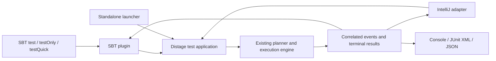

# Native distage test library and runner

Research and proposed implementation plan, 2026-10-01. Repository inspected at
`5be95fb6309c4b0cb9dbea37ed84c0db0a8ff870`. “Native distage runner” means a
distage-owned runner; Scala Native is a separate required execution backend.
Elsewhere in this document, “Native” means Scala Native only; the distage-owned
specification DSL and its registration are called the distage spec front end.

The recommended direction is an independent assertion library and an explicit
test application in two layers. A base runner for plain suites depends on
fundamentals modules only, so distage's own dependencies can test with it; a
distage runner extends it on the existing distage planning/execution engine (see
[Runner layers](#runner-layers)). The application owns discovery, selection,
resource lifetime, and execution. An SBT plugin preserves the standard `test`,
`testOnly`, and `testQuick` commands while launching that application; IntelliJ
uses the same execution contract. JSON is a boundary format; the in-process
engine uses typed models.

This document combines source inspection with the executed spikes linked below.
The spikes exercise stub host applications and portability fixtures; they are not
a production runner implementation. Issue #2361 itself has not been rerun in this
investigation. Proposed production interfaces and commands below do not exist yet.
Recorded [owner decisions](#owner-decisions) and the remaining
[open decisions](#open-decisions) are listed at the end.

## Evidence and implications

The [issue report](https://github.com/7mind/izumi/issues/2361) records lost tests
when SBT 2 selects several explicit suite names. Its explanation is that a
ScalaTest filter for one suite is applied to the combined distage test set.
The current checkout has a different registry implementation from the released
version cited in parts of the report, but retains that architectural pattern:

- [DistageTestsRegistrySingleton](../../distage/distage-testkit-scalatest/src/main/scala/izumi/distage/testkit/services/scalatest/dstest/DistageTestsRegistrySingleton.scala)
  selects one runner and collects tests from suite instances, using ScalaTest's
  `Runner.discoveredSuites` when available.
- [DistageScalatestTestSuiteRunner](../../distage/distage-testkit-scalatest/src/main/scala/org/scalatest/distage/DistageScalatestTestSuiteRunner.scala)
  applies the initiating suite's `Args.filter` to the collected tests. Its JS
  mode disables global memoization by default and documents a sequential SBT
  execution requirement for the override.
- [DistageTestRunner](../../distage/distage-testkit-core/src/main/scala/izumi/distage/testkit/runner/impl/DistageTestRunner.scala),
  [TestPlanner](../../distage/distage-testkit-core/src/main/scala/izumi/distage/testkit/runner/impl/TestPlanner.scala),
  and [TestReporter](../../distage/distage-testkit-core/src/main/scala/izumi/distage/testkit/runner/api/TestReporter.scala)
  already provide substantial independent machinery. Preserve the existing
  planning, environment merging, memoization trees, and effect execution.
- [ScalatestAbstractDistageSpec](../../distage/distage-testkit-scalatest/src/main/scala/izumi/distage/testkit/services/scalatest/dstest/ScalatestAbstractDistageSpec.scala)
  still depends on ScalaTest verbs, assertions, cancellation, and IDE finders.
  Replacing the adapter also requires a distage spec front end.
- [WithTestRegistration](../../distage/distage-testkit-scalatest/src/main/scala/izumi/distage/testkit/services/scalatest/dstest/WithTestRegistration.scala)
  already collects tests per instance, but gives them identity-hash-based UIDs.
  Those UIDs are unsuitable as persistent selection identifiers.
- [DistageTestEnv](../../distage/distage-testkit-core/src/main/scala/izumi/distage/testkit/spec/DistageTestEnv.scala)
  contains global environment and default-module caches. Explicit session
  ownership must address these caches as well as the ScalaTest registry.
- `ScalatestAbstractDistageSpec` defaults to the deprecated `TestConfig.forSuite`,
  which on the JVM
  [scans the suite's package](../../distage/distage-testkit-core/.jvm/src/main/scala/izumi/distage/testkit/model/TestConfigPlatformSpecific.scala)
  for plugins. The JVM
  [test configuration loader](../../distage/distage-testkit-core/.jvm/src/main/scala/izumi/distage/testkit/runner/impl/services/BootstrapFactory.scala)
  merges system properties and environment overrides, and the default activation
  strategy reads activations from that configuration. Effective wiring and
  activation therefore depend on inputs that are not static class dependencies of
  the suite.

The [build definition](../../sbtgen/Deps.scala) targets JVM and JS, with Scala
2.12.21, 2.13.18, and 3.7.4. It defines no Native target, but nothing in the
toolchain prevents one. Once a Native platform is added to the cross targets, the
pinned sbtgen generates Native projects for every cross-built module, and the
existing ScalaTest suites of two modules pass on Native in that build (see
[Scala.js and Scala Native](#scalajs-and-scala-native)). The build uses SBT 2.0.9
and Scala.js 1.22.0. The project owner has since made Scala 3.9.0 the Scala 3
target and kept 3.3 consumers only if a 3.9 compiler can emit output they can read
(see [Owner decisions](#owner-decisions)). No 3.9 compiler setting does that, so
3.3 consumer support is dropped; see
[Scala 3 publishing baseline](#scala-3-publishing-baseline). Native support and
the repository-wide 3.9 move still require dedicated work. Step 1a builds the
existing libraries for Native, step 2a moves Scala 3 to 3.9, and step 2e brings
the runner to JS and Native targets. The portability spike links and runs the
testkit engine on Native with Scala 2.12, 2.13, 3.7.4, and 3.9.0. Production
`.native` source sets and a released ZIO interop with Native artifacts are still
missing.

### Executed feasibility status

| Spike | Observed result | Remaining acceptance |
| --- | --- | --- |
| [0a: JVM SBT](spikes/20261001/sbt/REPORT.md) | Public host substitution and fork bootstrap work on SBT 1.13.0/2.0.9; selection/body/XML counts agree; DI omission and partial-cache failures reproduced; safe public policies exercised | Real engine integration, streaming/concurrent events, failing bodies and launch-failure memoization, cancellation, default parallel task execution, an in-process run of the target bootstrap without host substitution, classloader lifetime, multi-project/configuration behavior |
| [0b: portability](spikes/20261001/portability/REPORT.md) | Native acceptance passed in a second round: the real `TestPlanner` and `DistageTestRunner` link and run on Native 0.5.12 with Scala 3.9.0, for a DI and configuration test and for a parallel run with one memoized resource acquisition. It runs with stand-ins for the unpublished ZIO interop artifacts, or with a local publish of [zio/interop-cats#763](https://github.com/zio/interop-cats/pull/763), and with fixture-local Native platform files. A third round passes the same programs on 3.7.4, 2.13.18, and 2.12.21, and the existing ScalaTest suites of two modules pass on Native in the repository build generated with a Native platform. On the JVM, 3.9.0 still hits exact-version gating and the intermittent backend race | For step 1a: a released zio-interop-cats with Native artifacts, `.native` source sets replacing the fixture-local files, and, on Native, the existing shared tests (those that run on JS) of every module that builds for JS. Also ZIO and Cats Effect test effects under the engine and logging sinks on Native, and HOCON if that configuration format is added there (see Open decisions) |
| [0c: target transport](spikes/20261001/transport/REPORT.md) | Passed in a second round: a host-side projection over the platform test adapters gives every selected suite its own task, result, JUnit file, and history on SBT 1.13.0 and 2.0.9 for JS and Native at Scala 3.3.7 (SBT 2 smoke at 3.9.0). SBT 1 history needs the 0a conservative policy. Each group acquires once, and a failing or dying target task is launched once and reported for every suite | Streaming instead of buffering; per-suite completion records; cancellation; thread limits below group size; runtime reuse after a target dies; Scala 2, the real engine; browser JS, deferred (see Open decisions) |

All three reports distinguish executed outcomes from source observations and
record exact commands. Their drivers, fixtures, and reports are versioned; the
captured `logs/` and `evidence/` outputs are ignored local files (see the
[spikes README](spikes/20261001/README.md)), so the repository supports
re-running each check rather than re-reading its original output. They do not
reproduce the legacy issue or implement the production runner.

None of the 0a cases exercises a failing body, an application launch failure,
or SBT's default parallel task execution: every stub event is a success and both
fixtures set `Test / parallelExecution := false`. The second-round 0c fixture
covers failing bodies, aggregate execution failures, target-process death, and
parallel host tasks on both JS and Native under both SBT versions. These checks
still need to cover the JVM bootstrap and the real engine. Both 0a bootstraps
rerun the application when it throws: the host proxy memoizes results in a Scala
`lazy val`, which retries after an exception, and the fork bootstrap stores only
a successful result. A production binding memoizes the group's outcome, failure
included, so remaining suite tasks report the failure without relaunching and
re-acquiring resources.

## Assertion contract

The agreed result/error policy is:

| Entry point | Result | Failure |
| --- | --- | --- |
| `assert(condition)` | `Unit` | Throws the library's assertion failure |
| `assert1[F](condition)` | `F[Unit]` | Raised inside the effect's suspended computation |
| `assert2[F](condition)` | `F[Nothing, Unit]` | An effect defect, not a typed error |

Use a portable `AssertionError` subtype carrying structured diagnostics, with a
useful message even when consumed by an unrelated runner.

`F` requires evidence for suspension and failure handling; higher-kinded arity
alone cannot supply those capabilities. For BIO, preserve the existing
`IO2.sync` defect behavior. For cats-effect, `Sync.delay` supplies the unary
behavior. Keep the plain assertion module independent of both runtimes. If the
public API needs a shared suspension capability, make it a small, explicitly
lawful boundary with adapters to the existing typeclasses. Do not expose
`QuasiIO` as a suspension guarantee: its Identity instance intentionally does
not suspend.

The first release takes ordinary Boolean expressions. Existing conveniences
such as `assertIO(effect)(predicate)` can be migrated with adapters or added
after the three requested forms are stable. They are not prerequisites for
effectful assertions.

### Diagnostics

Use two compiler implementations—Scala 2 blackbox macros and Scala 3
quotes/reflection—feeding one portable diagnostic model and renderer. Share
runtime representation and behavioral fixtures, rather than attempting to
abstract over the two compiler AST APIs. Macros execute in the JVM compiler for
all three backends; their emitted code and diagnostic runtime must be portable.
Separate macro definition compilation from consumer compilation where required,
especially on Scala 2.

Capture a source identity, expression span, the original expression text, and
observations associated with subexpression spans. Source identity should include
a normalized path relative to a supplied source root when available. Retain a
documented representation for absolute and virtual-source paths. Specify offset,
line, and column conventions; render tabs and Unicode separately from compiler
offsets.

Store the expression text at compilation time. A file path alone fails in CI,
remote runs, packaged tests, and browser JS. A source provider can enrich failures
with surrounding lines when the runner can access matching sources. Validate
available source content against the recorded span/content before placing
pointers; when it differs, display the compiled excerpt and identify the
mismatch. Missing source/range information must be represented explicitly.

Scala 3's public `Position` API has `sourceCode`, offsets, and line/column
accessors; they have existed since
[3.3.0](https://github.com/scala/scala3/blob/3.3.0/library/src/scala/quoted/Quotes.scala),
so the 3.9 baseline needs no compiler internals for spans.
For Scala 2, step 1c must establish the available ranges with and without range
positions. Scala 2.13 enables `-Yrangepos` by default and Scala 2.12 does not, so
most 2.12 consumers compile without ranges. Do not assume every typed tree
retains a useful range. The current
[SourceFilePosition](../../fundamentals/fundamentals-language/src/main/scala/izumi/fundamentals/platform/language/SourceFilePosition.scala)
contains only a file name and line. Introduce a richer assertion-specific type
without forcing an unrelated repository-wide position migration.

Illustrative output:

```text
UserSpec.scala:42:10
assert(user.age >= minimum && user.enabled)
       ^^^^^^^^^^^^^^^^^^^
       user.age = 17; minimum = 18; result = false
                             user.enabled: not evaluated
```

The macro still needs expression structure to associate values with spans. The
improvement is preserving actual source and structured observations instead of
using a compiler pretty-print as the primary diagnostic.

### Semantic requirements

Start with Boolean leaves, built-in `&&`, `||`, `!`, and a conservative set of
comparison forms. Preserve the resolved operator and operand types. An operator
spelling alone is insufficient to justify rewriting a user-defined method.
Expressions outside the recognized set remain valid assertions, with an opaque
expression observation and source location.

The implementation must preserve evaluation count, order, short-circuiting,
by-name behavior, and thrown exceptions. Capturing the operands once but invoking
an overloaded comparison twice is still a semantic regression. Do not implement
`&&` by evaluating both branches to improve the message. Do not silently change
array equality to deep equality or convert unrelated exceptions into false
predicates.

For effectful forms, expression evaluation and per-execution diagnostic state
belong inside suspension. Constructing the effect must not evaluate the
condition; executing it twice must check twice, with independent observations.
`assert2` must leave the typed error channel unchanged. Failure rendering should
be bounded and lazy; a failed value renderer must preserve the original failure
and expose the rendering error.

[uTest](https://github.com/com-lihaoyi/utest) demonstrates universal assertions
across all requested language/platform families. Its
[Scala 3 tracer](https://github.com/com-lihaoyi/utest/blob/master/utest/src-3/utest/asserts/Tracer.scala)
and [ZIO smart assertions](https://zio.dev/reference/test/assertions/smart-assertions/)
are useful design references. Neither should be adopted without checking its
evaluation and failure contract against ours. Owning a small implementation is
reasonable; cloning an entire assertion framework is unnecessary.

## Test application and execution ownership

The intended dependency boundaries are an assertions module with optional effect
adapters; a base runner; the existing testkit core with the distage spec front end
and session ownership; a portable application/protocol layer; and host-specific
SBT/IDE adapters. Share protocol data independently of SBT's classloader and Scala
version. Keep ScalaTest compatibility in its own artifact. These boundaries need
not become a separate published artifact for every interface.

### Runner layers

The runner has two layers, because distage's own dependencies need a runner too.
SBT rejects cyclic project dependencies, test configurations included, so a
module's tests cannot use a runner that depends on that module.

- `distage-test-runner` is the base runner. It provides plain suites without DI:
  the WordSpec-style `should`/`must`/`can`/`in` registration with synchronous and
  `Future` bodies, plus discovery, selection, execution, structured events and
  reporting, the target side of the protocol, and the test-classpath framework
  bootstrap. It depends on fundamentals modules only, plus the portable protocol
  module, whose shared types cross-compile on Scala 2.12, 2.13, and 3.8.4 with
  no izumi dependencies so the SBT plugins can use them (see
  [Scala 3 publishing baseline](#scala-3-publishing-baseline)). The assertions
  module obeys the same bound; its BIO and Cats Effect adapters sit above those
  libraries.
- `distage-testkit-runner` extends the base runner with distage planning,
  environments, memoization, and the `Spec1`, `Spec2`, `SpecZIO`, and
  `SpecIdentity` front end, on top of `distage-testkit-core`. It plugs into the
  base runner as an execution provider rather than a second runner contract. One
  SBT plugin, framework registration, protocol, and IntelliJ adapter therefore
  serve both kinds of suite, with the same selection, reporting, and history
  semantics.
- No module's tests use a runner layer that depends on that module; such tests
  live in an unpublished test-only project above that layer. For the base runner
  these are `fundamentals-*-test` projects; at the inspected commit, the
  fundamentals modules with test sources are platform, bio, collections,
  json-circe, and language.
- Modules above the base runner, such as logstage and the distage modules, keep
  their plain suites in place on the base runner. A DI-based suite in a module
  below the distage runner would need its own test project. None exists today:
  distage specs occur only in `distage-framework-docker` and
  `distage-testkit-scalatest`, both above it.

The plain front end follows the owner's compatibility decision for distage specs:
it keeps the `AnyWordSpec` registration shape, so a plain suite that uses no other
ScalaTest API migrates by dependency and import changes. Test-only projects are
cross-built for the same platforms as the modules they test, and Scala
package-private members stay reachable from them because they keep the tested
packages.



Expose four logical operations, with platform launchers around the same core:

```text
discover(catalogue)                 -> test and suite descriptors
resolve(descriptors, request)       -> selected tests and effective settings
plan(resolved selection)            -> DI plans and memoization groups
execute(plan, event sink)           -> terminal results and run outcome
```

Discovery may execute specification registration code. It must not provision
test dependencies or execute test bodies. Arbitrary side effects in a user's
suite constructor cannot be made harmless by a framework; require declarative
registration and verify that library discovery does not acquire resources.
Planning may load configuration and execute user planning extensions, so report
its failures separately from test failures.

A `RunSession` owns registration, configuration snapshots, environment caches,
memoized resources, cancellation, and reporting state. Instantiate suites through
factories per session. Release resources before declaring the run complete.
Inspect static logging setup and other bootstrap hooks when enabling concurrent
sessions; removing one singleton is not sufficient proof of isolation.

Use logical test IDs derived from build target, suite identity, structured test
path, and explicit variant identity where needed. Keep names for display and
positions for navigation. Reject duplicate logical IDs. Do not use registration
order, object identity, or a source line as the persistent identity. Retain path
segments rather than flattening them into an ambiguous space-separated string.

Selection must precede provisioning. Distinguish:

- Selecting existing suites/tests or variants.
- Filtering by their effective axis choices.
- Overriding activation choices for the requested run.
- Disabling cross-test memoization while retaining ordinary dependency sharing
  inside each individual test graph.

Define precedence between suite configuration and explicit run overrides. Resolve
and validate axis overrides before applying a filter on effective axes. The plan
output shows the final activation and sharing boundaries. Unknown axis values,
unknown explicit test IDs, and stale catalogue references are errors. An empty
explicit selection must not produce an unexplained successful run.

The JSON protocol needs a schema version, build/catalogue identity, logical IDs,
locations, effective settings, structured failures, and correlated events. A
saved selection refers to a build and is revalidated; do not serialize live
closures, DI locators, or arbitrary effect values. Use an explicit transport
channel/framing so test output cannot corrupt protocol messages. CLI, SBT, and
IDE clients share selection semantics through this contract.

## SBT integration strategy

A test framework dependency implementing `sbt.testing.Framework` and an SBT
`AutoPlugin` are different integration surfaces. The framework runs inside the
test environment. The plugin runs inside SBT and can control complete-run launch
boundaries while preserving the standard commands. There is no fundamental
conflict between a distage-owned application and standard `test*` integration.

The [test-interface Runner contract](https://github.com/sbt/test-interface/blob/master/src/main/java/sbt/testing/Runner.java)
permits repeated `tasks` calls. It describes tasks in terms of individual input
task definitions. It provides no general discovery-complete barrier before
execution. Waiting for every suite task to enter `execute` can deadlock with a
sequential or bounded scheduler. Deferring all execution to `done` also fails the
event lifetime requirements of actual hosts.

In [SBT 2.0.9 TestFramework](https://github.com/sbt/sbt/blob/v2.0.9/testing/src/main/scala/sbt/TestFramework.scala),
events are collected during task execution and delivered to listeners after
`execute` returns. The
[JUnit listener](https://github.com/sbt/sbt/blob/v2.0.9/testing/src/main/scala/sbt/JUnitXmlTestsListener.scala)
groups those events by the task group; its nested selector handling matters for
an aggregate application. SBT 1.13.0's inspected execution path has the same
per-task collection pattern. A cross-suite task cannot obtain correct ordinary
suite reporting just by changing `Event.fullyQualifiedName`.

The recommended plugin pipeline is:

```text
test / testOnly / testQuick / testFull (where available)
  -> compile and discover ordinary suite identities
  -> apply this SBT version's selection and incremental-test policy
  -> partition by build target and configured execution/fork group
  -> launch a distage test application with an explicit selection
  -> stream distage events and collect terminal results
  -> publish per-suite SBT outcomes, listeners, reports, and success state
```

The names users select remain the ordinary suite names. The application is the
execution backend, not a replacement name users must know. Distage owns scheduling
inside each application and shares compatible resources across its selected
suites. Memoization remains bounded by the process/execution group, not the entire
aggregated multi-project SBT build. Honor explicit fork groups instead of silently
merging them.

The [executed JVM SBT spike](spikes/20261001/sbt/REPORT.md) establishes a concrete
non-forked seam on SBT 1.13.0 and 2.0.9: substitute only distage's entry in
`loadedTestFrameworks`, capture each group's selected definitions in `Runner.tasks`,
and launch the application once on the first suite task's `execute`. Buffer its
results and emit each suite's events during that suite's ordinary task lifetime.
Five suites execute 15 bodies; two explicit suites execute six; JUnit keeps five
or two ordinary suite files with three test cases each. Sequential scheduling,
explicit exclusions, repeated commands, and a mixed framework all passed. SBT 2's
proxy task binding requires `Def.uncached`.

The fork bypasses that host substitution. A registered test-classpath framework
provides the application bootstrap instead: both exercised SBT versions pass the
fork group's full selected set to `Runner.tasks`, and per-suite tasks project the
same application's results. One default group acquires/releases once; two explicit
fork groups acquire/release twice. Ordinary tasks therefore preserve full-group
sharing on the JVM; one aggregate host task is unnecessary there. This selected-set
call is observed SBT behavior, not a guarantee from the generic test-interface.

The target bootstrap does not depend on forking. In-process SBT makes the same
single `Runner.tasks` call per group, so the same test-classpath framework may
serve both modes and make the JVM host substitution unnecessary; 0a exercised
in-process groups only through the host proxy. Before building a host proxy, run
the in-process 0a matrix with only the target bootstrap registered, and keep the
proxy only for a measured need. In either form the sharing scope is one
`Runner.tasks` call: a host that calls it once per suite narrows sharing to that
suite without losing or duplicating tests.

Production bindings must preserve the following host contracts:

- In [SBT 1.13.0 Defaults](https://github.com/sbt/sbt/blob/v1.13.0/main/src/main/scala/sbt/Defaults.scala),
  `test` uses `executeTests`, while `testOnly` and `testQuick` use `inputTests`.
  Overriding only `executeTests` would leave the input commands on the old path.
- In [SBT 2.0.9 Defaults](https://github.com/sbt/sbt/blob/v2.0.9/main/src/main/scala/sbt/Defaults.scala),
  `test` delegates to the incremental input path and `testFull` uses
  `executeTests`. `testOnly` evaluates `inputTests(testSelected)`, so settings
  scoped to `testOnly` are not the ones it reads. Its private
  grouping/option-processing helpers are not stable public extension points.
  Design narrow version-specific bindings over public keys, and establish whether
  a small upstream extension is preferable to copying host orchestration. Do not
  use classes in SBT's private packages as an API.
- Reuse public discovery/filter/listener keys where possible. Both versions
  expose `definedTests`, `testFilter`, `testListeners`, and
  `loadedTestFrameworks`; SBT 2 additionally exposes `definedTestDigests` and
  `extraTestDigests`. `definedTests` is computed by `Tests.discover` over
  `loadedTestFrameworks`, so reusing it requires a registered framework whose
  fingerprints match distage specs. The JVM spike uses a registered test-classpath
  framework and its fingerprints for discovery, substitutes its non-forked entry,
  and retains a target-side bootstrap for forks. Stock tasks in every enabled
  configuration must route distage specs through the same application contract.
  Preserve framework arguments, configured filters/exclusions, setup/cleanup,
  fork settings, classloader lifetime, and aggregation. Mixed-framework projects
  must keep routing their other tests to their original frameworks exactly once.
- `loadedTestFrameworks` substitution, which Scala.js and Scala Native already
  use for their host-side framework proxies, is the executed non-forked seam. It
  keeps SBT's own input-test path, where SBT 2 passes framework arguments to its
  success recorder. In-process SBT also passes each test group's selected set to
  one `Runner.tasks` call per framework; that is host behavior, not a
  test-interface guarantee. In JS and Native projects the platform plugins
  already define `loadedTestFrameworks`, so in cross-built projects the distage
  plugin composes with their value instead of replacing it. Forked groups need a
  separate mechanism, because
  [ForkTests](https://github.com/sbt/sbt/blob/v2.0.9/main-actions/src/main/scala/sbt/ForkTests.scala)
  sends framework class names and the fork instantiates the frameworks again.
  The executed JVM spike proves that a target-side bootstrap works for this seam;
  it does not require a plugin-owned fork launcher.
- Preserve version-specific incremental semantics where they remain sound. SBT 2's
  [documented behavior](https://www.scala-sbt.org/2.x/docs/en/reference/sbt-test.html)
  makes `test` incremental/cached and supplies `testFull` for complete execution.
  Its [status recorder](https://github.com/sbt/sbt/blob/v2.0.9/main/src/main/scala/sbt/internal/IncrementalTest.scala)
  stores success by suite digest and framework arguments. Reporting success only
  for an application name would lose ordinary suite history. The JVM proxy and
  fork bootstrap retain ordinary suite tasks, so SBT 2 stock input commands retain
  per-suite, argument-sensitive success recording. Executed checks distinguish
  `testFull` from cached `test`, new arguments from identical arguments, and a
  partial run from a later unfiltered run in-process and forked.
- Stock invalidation is insufficient for DI-wired suites. SBT 2 derives a suite's
  digest from the suite class's transitive class dependencies, the `Test`
  configuration's own resources, test options, and `extraTestDigests`. SBT 1
  `testQuick` compares the last success time with compilation timestamps of the
  same class closure and ignores resources. Neither covers implementations wired
  only through scanned plugins, configuration files outside SBT 2's hashed `Test`
  resources, or activation inputs from system properties or the environment.
  Stock semantics would therefore skip a suite whose effective wiring changed,
  which is the silent non-execution class of #2361. Add a DI digest of the
  classes and resources reachable through each suite's plugin configuration, its
  configuration files, normalized distage options, and activation-relevant
  properties and environment. On SBT 2, contribute it through `extraTestDigests`
  (global and conservative) or a `definedTestDigests` override (per suite); on
  SBT 1, a composed `testQuick / testFilter` can always invalidate selected
  distage suites while retaining stock filtering for other frameworks. The spike
  independently reproduces skipped reruns after editing an external configuration
  file and after compiling a reflected implementation absent from the static
  suite dependency closure. SBT 2 class/resource extra digests produce a measured
  run/no-op/rerun sequence. Global extra digests also invalidate other frameworks
  in the configuration; a per-suite override or own store can avoid that cost.
  The fixture approximates dynamic wiring; deriving the complete real distage
  input closure remains production work. A cached skip requires a tracked input
  closure; custom configuration loaders and planning extensions must declare
  their inputs before their suites can use that optimization. If the closure is
  unknown or includes untracked inputs, rerun the selected suite and report the
  cache decision. The initial binding can conservatively rerun all selected
  DI-wired suites until its input model passes acceptance; stock suite history
  alone never justifies skipping them.
- Running one selected test must not cache success for an entire suite under an
  unfiltered request. SBT 1's
  [status recorder](https://github.com/sbt/sbt/blob/v1.13.0/testing/src/main/scala/sbt/TestStatusReporter.scala)
  keys success by suite name only, and SBT 1 installs it for `test`, `testOnly`,
  and `testQuick`. With stock listeners, a partial `testOnly` records the whole
  suite as succeeded and a later `testQuick` skips it; the spike reproduces that
  behavior after first recompiling the suite. The exercised safe initial SBT 1
  policy always reruns explicitly selected distage suites. It honors user patterns
  and exclusions through the public `Defaults.selectedFilter` and delegates other
  suites to the inherited stock filter. It does not suppress stock partial-success
  recording; it avoids trusting those entries for distage incremental selection.
  SBT 2's exercised stock input path receives framework arguments, keeping partial
  and complete requests distinct even in a fork. A separate plugin-owned success
  store is an option for efficient SBT 1 history or a transport that publishes
  results outside the stock input path; its necessity is not established for the
  measured JVM seams. Such a store would include suite, normalized selection, DI
  digest, and relevant static compilation inputs. Its per-suite recording and
  failure semantics require a separate executed acceptance gate, including forked
  groups. Cached exclusions and user exclusions remain different selection
  reasons; neither counts as an executed test.
  For an efficient own store, evaluate SBT 2's public `sbt.util.ActionCache`
  against the suite's public `definedTestDigests` entry, including machine-wide
  and remote reuse. SBT 1's precise static closure comes from Zinc's internal
  `sbt.internal.inc.Analysis` relations; prefer a conservative digest of every
  test-classpath file when using public inputs. Any version-pinned use of those
  internal relations needs an explicit boundary and measured justification.
  These are proposed follow-up choices; the spike did not implement or benchmark
  either success store.
- Translate correlated distage results into per-suite listener/result batches.
  Where SBT listeners assume contiguous suite events, buffer that projection;
  keep the distage event stream available for live progress. Do not emit late
  events into handlers belonging to already completed tasks. Every component that
  calls a host `EventHandler` serializes its calls per task:
  [SBT 1.13.0](https://github.com/sbt/sbt/blob/v1.13.0/testing/src/main/scala/sbt/TestFramework.scala)
  collects task events in an unsynchronized buffer, while SBT 2.0.9 switched to a
  thread-safe collection. Run-level finalization failures must prevent a
  successful overall result and inappropriate success caching.

`distageList` and `distagePlan` are additive inspection commands. Framework
arguments after `--` supply test IDs, activation overrides, axis filtering, and
memoization settings to ordinary commands. A standalone launcher accepts the
same normalized request without SBT.

The target bootstrap is also the portable `sbt.testing.Framework` for other
hosts: its ordinary suite tasks project one application per sharing group
without narrowing its resource lifetime, as the JVM spike shows. An aggregate
task with nested selectors is the alternative mapping for JS and Native (see the
transport decision below). Neither constrains the plugin's standard command
names. Never register both specs and their containing application for execution
in the same mode, and never silently fall back to a different sharing scope.

SBT discovers suites only through frameworks listed in `testFrameworks`. The
[default list](https://github.com/sbt/sbt/blob/v2.0.9/testing/src/main/scala/sbt/TestFramework.scala)
does not include distage, and nothing on the test classpath can add itself to
it. Once specs stop inheriting ScalaTest classes, a build that adds the new
testkit without the distage SBT plugin or an explicit framework registration
discovers no distage specs, and `test` succeeds. The library cannot detect this
from the test classpath. The plugin is therefore a hard requirement of SBT use,
which the installation and migration documentation must state. Registering a
distage framework in `testFrameworks` without the plugin is unsupported: it runs
under stock SBT accounting, which this section shows is unsound for DI-wired
suites on both SBT versions and for partial selections on SBT 1. The residual risk remains for builds that ignore
the requirement. Migration acceptance reconciles discovered suite and test counts
before and after each module migrates.

Build the plugin for SBT 1 and 2 separately while sharing its protocol/logic.
Keep SBT implementation dependencies out of the portable engine. Forked JVM
tests execute in the test JVM. JS and Native use their actual target programs,
not JVM evaluation of the specifications. The architectural direction is clear;
the JVM spike proves the exercised discovery, non-forked proxy, fork bootstrap,
reporting, and conservative/digest invalidation seams. Production streaming,
concurrent event delivery, cancellation, finalization failures, setup/cleanup,
classloader lifetime, and multi-project configurations remain gate 2d work.

## Scala.js and Scala Native

[Scala.js Runner](https://github.com/scala-js/scala-js/blob/v1.22.0/test-interface/src/main/scala/sbt/testing/Runner.scala)
supports controller/worker communication and task serialization; its
[Task](https://github.com/scala-js/scala-js/blob/v1.22.0/test-interface/src/main/scala/sbt/testing/Task.scala)
adds asynchronous completion. Never block the JS event loop waiting for effects.
Use serializable test/application identities and reconstruct executable state
in the target runtime.

Scala Native also has
[task serialization and runner messaging](https://github.com/scala-native/scala-native/blob/v0.5.12/test-interface-sbt-defs/src/main/scala/sbt/testing/Runner.scala).
Its inspected adapter launches native runner processes. Neither separate native
processes nor separate JS runtimes can share a memoized live object. Keep an
entire sharing group within one execution process; introduce explicit shards
only when their resource-sharing cost is accepted. A single application task can
still run its internal tests concurrently.

For stock SBT `test*` commands, both platform plugins reach the target runtime
through their test adapters. The
[Scala.js](https://github.com/scala-js/scala-js/blob/v1.22.0/sbt-plugin/src/main/scala/org/scalajs/sbtplugin/ScalaJSPluginInternal.scala)
and
[Scala Native](https://github.com/scala-native/scala-native/blob/v0.5.12/sbt-scala-native/src/main/scala/scala/scalanative/sbtplugin/ScalaNativePluginInternal.scala)
plugins install host-side framework proxies by overriding `loadedTestFrameworks`
and reject `fork := true`. Their
[Scala.js](https://github.com/scala-js/scala-js/blob/v1.22.0/test-adapter/src/main/scala/org/scalajs/testing/adapter/TestAdapter.scala)
and
[Scala Native](https://github.com/scala-native/scala-native/blob/v0.5.12/test-runner/src/main/scala/scala/scalanative/testinterface/adapter/TestAdapter.scala)
test adapters start one JS runtime or native process per SBT thread that uses
them. Decide the JS/Native transport before the JVM SBT integration (step 2d)
fixes the plugin's structure:

- A target-side `sbt.testing.Framework` reached through the platform test
  adapter, exposing one aggregate task per sharing group that reports nested
  selectors. That framework is then a required component on JS and Native, not a
  secondary mapping. Under stock accounting the aggregate task must carry a
  selected suite's `TaskDef`, so only that representative suite gets a host
  result, an XML file, and a success record. A host-side projection onto ordinary
  suite tasks fixes that; the 0c spike built and measured one (below).
- A plugin-owned launcher over the platforms' public run interfaces: a Scala.js
  `JSEnv` run with a communication channel, or a separately linked Native
  application.

The [executed transport spike](spikes/20261001/transport/REPORT.md) proves whole
selected-group execution on actual Node/Scala.js and native executables, including
asynchronous JS completion, task serialization, and acquisition/release once per
group. Its first round measured stock accounting. An undiscovered synthetic
aggregate `TaskDef` is serialized but never executed, and SBT succeeds with zero
tests. A selected representative `TaskDef` executes, but then all 15 test cases go
into one representative XML file. `Tests.Output` lists only the representative,
even when another suite owns the failure, and only the representative gets
success history: after `testFull`, the next `test` reran the other four suites.
History fixtures must verify distinct suite digests first: suites declared in one
source file shared one stock digest, which made all of them look cached.

The second round adds the projection as two small AutoPlugins, one requiring each
platform plugin, that wrap the platform's own framework entry in
`loadedTestFrameworks`. The wrapper:

- calls the platform runner once per sharing group and returns one ordinary task
  per selected suite;
- runs the group's aggregate target task on the thread of the first suite task to
  execute;
- buffers events by nested suite ID, and each suite task emits only its own
  events inside its own `execute`;
- memoizes the group outcome, failure included.

Measured on SBT 1.13.0 and 2.0.9, for JS and Native at Scala 3.3.7, plus an SBT 2
smoke run at 3.9.0 (23 driver invocations, all checks passing):

- Selections of two and five suites yield exactly two and five JUnit files and
  per-suite `Tests.Output` entries, with a failure attributed to its own suite.
- SBT 2 stock history works per suite: `testFull` then `test` reruns nothing, a
  persistent failure reruns only its suite, and partial or changed-argument
  requests stay distinct. SBT 1 needs the 0a conservative `testQuick` policy,
  because stock SBT 1 still caches partial runs.
- Each sharing group acquires and releases once, including two configured groups.
- A target task that throws, or whose process exits, is launched once and
  reported as an error for every suite of its group. On JS, a dead runtime also
  makes the adapter's own `done()` throw, so the command fails and loses the
  per-suite result map, while the JUnit files keep each error.

This makes the target-side framework with host projection the recommended
JS/Native transport, because it keeps stock SBT commands, the platform adapters,
and per-suite history. The plugin-owned launcher stays an option for non-SBT
hosts. Still uncovered:

- streaming, since results are buffered until a group finishes;
- per-suite completion records, since a suite the target never runs now looks
  like an empty passing suite;
- cancellation, and SBT thread limits smaller than a group;
- reuse of a per-thread runtime after its target died;
- Scala 2, browser JS, and the real engine.

The transport spike also directly runs a linked JS application through public
`JSEnv.startWithCom`: an explicit two-suite request yields six EVENT messages,
then END after release; ordinary body output travels separately on stdout, and
the host acknowledges QUIT and waits for successful exit. A separately linked
Native application executes the same six bodies, but an independent Native
protocol channel has not been verified. These launch paths are viable building
blocks; neither yet supplies stock per-suite host test binding.

With the stock per-thread adapters, keeping a sharing group within one process
holds only when the whole group executes as one target task, which the
projection guarantees. Two configured groups ran in two target processes when
SBT executed them in parallel, and in one process when it ran them serially.

Start standalone applications with an explicit catalogue of suite factories.
SBT can use its discovered test definitions and supported reflective
instantiation. A generated catalogue is an alternative for closed-world linking,
but its build ordering must be designed: generating sources from the same
compilation's analysis can create a cycle or read stale discovery. Compile suite
definitions first and generate a separate launcher when taking that route.
Avoid runtime classpath scanning as the portable discovery mechanism.

Native feasibility must cover the dependency closure: fundamentals, BIO runtime,
logging, distage core, framework configuration/resources, and plugin loading.
`distage-testkit-core` depends on `distage-framework`, and `TestPlanner` uses
configuration loading, the role launcher's logger and activation parsing, module
providers, and plugin configuration.

The [portability spike](spikes/20261001/portability/REPORT.md) now links and runs
that closure on Scala Native 0.5.12 with Scala 3.9.0. A 19-project fixture
compiles the repository's sources and runs the real `TestPlanner` and
`DistageTestRunner`. In stand-in mode, one shared source,
`ZIOCatsEffectInstancesModule`, is replaced by an empty stand-in unreachable for
`Identity`; the clean build with locally published interop artifacts compiles the
real module instead. Both modes substitute or patch the platform files below at
build time. It runs a DI-backed test with configuration loading and
`PluginConfig.const`, and a parallel run of four tests on two threads whose
memoized `Lifecycle` resource is acquired and released exactly once. That run
depends on:

- Cats Effect 3.7.1, the first line with Native 0.5 artifacts (3.6.3 has Native
  0.4 only); the owner approved the upgrade.
- Native `zio-interop-cats` and `zio-interop-tracer`, absent from released
  artifacts up to 23.1.0.13, although `fundamentals-bio` needs the tracer at
  compile scope. The owner's
  [zio/interop-cats#763](https://github.com/zio/interop-cats/pull/763) adds Native
  0.5 builds. A local publish of its head (`de5d670`) as
  `23.1.0.13-native-pr763` replaces all three stand-ins, and the same programs
  pass from a clean build. This establishes the Identity engine path with those
  artifacts, not ZIO/Cats Effect execution or an upstream release.
- Fixture-local Native platform files, which become `.native` source sets in
  step 1a. They provide:
  - a platform trait without classpath and JMX introspection;
  - `getentropy`-backed secure random with the JS UUID logic in BIO;
  - `UnsafeRun2` without the `SecurityManager` lookup;
  - `QuasiIORunner` without `java.util.UUID.randomUUID`, since Scala Native's
    javalib has no `java.security.SecureRandom`;
  - a `CompletionStage` adapter and the JVM Cats IO runtime module.

  The remaining platform files come from the JVM (fundamentals platform, BIO,
  logstage) or JS (core API through testkit, so configuration is circe JSON). The
  spike reused them wherever they linked; production should audit them rather
  than assume that reuse is semantically right.

The first round's stop at `Decoder[Option[RenderingOptions]]` in
`LoggerConfigLoader.scala:41` was a fixture artifact, not a source defect: the
fixture omitted the repository's `-Xmax-inlines:64`, which circe's inline
auto-derivation needs here. The build, with its 3.7.4 Scala 3 options extended to
3.9.0, compiles `distage-frameworkJS` on 3.9.0, and removing only that flag
reproduces the identical error, so no source fix or pull request is needed. Step
2a's version-condition fix carries the flag to 3.9.0. Not yet run on Native: ZIO or Cats Effect test
effects, logstage file sinks, HOCON configuration, and the `CompletionStage`
adapter's callbacks. JVM-only integrations such as Docker remain
separately identified capabilities. Native builds must also clean their outputs
when a source moves or is removed, for example when a fixture-local file becomes
a `.native` source set or a stand-in gives way to a library. Incremental
compilation keeps the removed source's `.nir` files, and the linker links them
([scala-native/scala-native#5084](https://github.com/scala-native/scala-native/issues/5084)).

A third spike round runs the same two programs from clean builds on the
repository's current Scala 3 compiler, 3.7.4, with the locally published interop
artifacts. It also runs them on 2.13.18 and 2.12.21 with the stand-ins, because
that publish has Scala 3 artifacts only. The Native port therefore does not wait
for the 3.9 move. On Scala 2, Cats Effect 3.7.1 adds a compile-time requirement,
on the JVM as well. Its `Async` has a parameter annotation from
`scalac-compat-annotation`, which Cats Effect declares `provided`, so
`fundamentals-bio` does not compile until that library is on its classpath
([typelevel/cats-effect#4693](https://github.com/typelevel/cats-effect/issues/4693)).

The repository's own build generates Native projects once
[a Native platform](spikes/20261001/portability/native-targets.patch) joins the
cross targets in `sbtgen/Deps.scala`, with Scala Native pinned to 0.5.12; sbtgen
0.0.122 otherwise defaults to 0.5.10. Tests in the 21 generated Native projects
need one more setting. The test libraries depend on older Scala Native
`test-interface` releases, whose `strict` version scheme fails `update` until the
build accepts the plugin's 0.5.12. With that setting, the existing ScalaTest
suites of `fundamentals-collections` (33 tests) and `fundamentals-language`
(1 test) pass as Native binaries on 3.7.4, 2.13.18, and 2.12.21. ScalaTest
3.3.0-alpha.2, scalatestplus-scalacheck, discipline, the Cats Effect laws and
testkit, and scala-java-time publish Native 0.5 artifacts for all three Scala
versions, so the remaining existing suites can check the port before the new
runner exists. The Native variants also need counterparts of the build's eight
JS-scoped dependency declarations (circe for configuration and the framework,
scala-java-time), all of which publish Native 0.5 artifacts. Java-only artifacts
such as classgraph and javax.inject appear in shared sources only in macro
implementations, as annotations, or in classes that a non-JVM target never
reaches. As on JS, Native therefore needs its own default plugin loader instead
of the shared `PluginLoaderClassgraphImpl`. Two Scala dependencies of shared
sources have no Native artifact:

- ScalaMock 7.5.2 has none, and 7.6.0 has one for Scala 3 only. Its one user is a
  `distage-testkit-scalatest` test.
- circe-derivation 0.13.0-M5 has none. `fundamentals-json-circe`'s Scala 2
  derivation macros expand to it, so that facility and its test need a different
  derivation on Native.

The `fundamentals-platform` tree still holds three `.native` files from an
earlier Native build, added between 2019 and 2022, which predate its current
platform structure. CI's generation step passes
`--js` or `--nojvm --js` (`.mdl/defs/actions.md`); Native test lanes and the
publish job also need `--native`. The nix development shell provides Node but no
clang, which Native linking needs.

Scala Native 0.5.12 and Scala.js 1.22.0 compile, link, and run the transport
stub on Scala 3.9.0 in the transport spike; the earlier 3.3.7 runs remain
recorded evidence. Neither result proves the izumi dependency closure. Scala
Native 0.5.12's
[compatibility table](https://scala-native.org/en/latest/changelog/0.5.x/0.5.12.html)
lists Scala 2.12.17–2.12.21 and 2.13.9–2.13.18, which covers the build's Scala 2
versions, and the third portability round compiles the closure with both.

### Scala 3 publishing baseline

[Scala 3.9.0](https://www.scala-lang.org/news/3.9/), released on 2026-09-03, opens
the new LTS line and succeeds 3.3 LTS as the recommended baseline for library
authors. Its announcement states that artifacts built with Scala 3.9 cannot be
consumed by Scala 3.3 projects. No 3.9.0 compiler setting emits older TASTy:
`-scala-output-version` existed only in Scala 3.1.2 and 3.1.3 and was removed in
3.2.0, and the 3.9.0 compiler settings have no replacement. The
[producer/consumer probe](spikes/20261001/portability/REPORT.md) confirms this
directly. It compiles ordinary classes, inline code, and a quoted macro with
3.9.0, `-release:17`, and `-source:3.3`. A separate 3.3.0 consumer fails before
macro expansion, expecting TASTy 28.3 and finding 28.9, while a separate 3.9.0
consumer runs all three forms; `javap` reports JVM major version 61. JVM
classfile targeting and source dialect are separate compatibility dimensions
from Scala consumer output. The owner's condition for keeping 3.3 consumers
therefore cannot be met, and 3.9.0 is the Scala 3 producer.

The move is repository-wide. Every Scala 3 artifact shares the `_3` suffix, so
one artifact cannot be published for both 3.7 and 3.9 consumers under the same
coordinates, and a module compiled with 3.7.4 cannot read its dependencies' 3.9
TASTy. All Scala 3 modules therefore move to 3.9.0 together (step 2a), except the
SBT 2 plugin and the portable protocol module, which stay on SBT 2's 3.8.4 (below). This raises
the minimum Scala 3 version for every izumi module from 3.7 to 3.9. The
announcement advises treating the corresponding move from 3.3 LTS as a
minor-version publishing decision, and the same reasoning applies here. Until 2a
lands, new modules compile with the repository's
current Scala 3 compiler, so 2a should precede any release of new Scala 3
artifacts such as the assertion modules. Step 1a's Native artifacts are new
coordinates for existing modules; whether they ship before 2a is an
[open decision](#open-decisions). Scala 3 consumer lanes are 3.9.0, the
newest 3.9.x patch once one exists, and the newest stable Scala Next release once
one exists; 3.10.0 is at RC3 and is not yet a lane. Keeping 3.3 consumers would
need separately named artifacts from a separate 3.3 producer, which cannot
compile the current closure (below).

The earlier actual closure attempts on 3.3.0/3.3.7/3.3.8 fail in
`fundamentals-functoid` at `Implicits.searchIgnoring` / `Expr.summonIgnoring`.
These APIs exclude dummy implicit symbols; ordinary implicit search is not a
semantically justified replacement. Separately packaged 3.3.8
basics/literals/language artifacts are consumed by a 3.3.0 macro fixture, which
proves only that limited artifact set.

On 3.9.0 the spike's closure build crashed in `genBCode` with an
`ArrayIndexOutOfBoundsException` thrown from `SymDenotations$BaseDataImpl.apply`.
The evidence strongly indicates an intermittent compiler race, reported upstream
as [scala/scala3#27209](https://github.com/scala/scala3/issues/27209), rather than a
repository source defect.

Review reruns of the same cold `distage-testkit-coreJVM/compile`, with the build's
backend parallelism (`min(16, cores - 1)`, which is 16 on the 48-core review host)
and its `-explain-cyclic` option, crashed in 3 of 8 runs: four crashes in all,
none in the spike's file. Three were at that frame and one at
`SymDenotation.completeFrom`; two were `ArrayIndexOutOfBoundsException` and two
`IndexOutOfBoundsException`, all inside `dropRightInPlace`. Builds of only
functoid's dependency chain passed 6 of 6 (three cold, three single-file
recompiles). None of 3 runs crashed with backend parallelism 1, none of 3 crashed
with parallelism 16 but without `-explain-cyclic`, and the unchanged 3.7.4 build,
with the same flags, compiled the whole closure in 3 of 3 runs without a crash.

The upstream report identifies both crash sites as calls to
`CyclicReference.trace`, which pushes onto and pops from a per-run `ArrayBuffer`
that exists only under `-explain-cyclic`; `BaseDataImpl.apply` traces every
lookup. The exception shapes, an index of -1 and indexes past the end, are
consistent with concurrent modification of that buffer. The second thread
involved has not been identified, so dropping `-explain-cyclic` may only hide the
race. Until a fixed compiler ships, 3.9.0 builds use backend parallelism 1, the
mitigation exercised by the controls; these finite runs do not prove that every
compiler race is eliminated.
Step 2a's implementation also reproduced the Swing classfile crash tracked in
[scala/scala3#26622](https://github.com/scala/scala3/issues/26622), with a standalone
`typeCheckErrors("import javax.swing.*; summon[Ordering[JPanel]]")` on 3.9.0/JDK 21.
The fix is assigned to 3.10; the pinned 3.9.0 build disables import suggestions
with `-Ximport-suggestion-timeout:0`. This preserves type checking but omits
suggested imports from diagnostics; the status ledger records the failing
reproduction and passing control. This mitigation is additional to backend
parallelism 1.

Separately, the generated PureConfig dependency condition and compiler flags
match only the exact version 3.7.4 and must be corrected for 3.9.0.

The SBT plugins compile with their host's Scala version: 2.12 for SBT 1 and 3.8.4
for SBT 2.0.9. A 3.8.4 compiler cannot read 3.9 TASTy, so the SBT 2 plugin must not
depend on any 3.9-compiled artifact. Protocol types shared with the plugins and
target runners belong in a portable Scala module cross-compiled for Scala 2.12,
2.13, and 3.8.4, with no izumi dependencies. Build its JVM, JS, and Native
variants; the 3.9 testkit can depend on them because 3.9 reads 3.8 TASTy. Java
interfaces remain an option for the JVM host/test classloader boundary, where
the spike already uses Java reflection. A Java-only artifact is not the shared
target implementation: the
[Scala.js pipeline](https://www.scala-js.org/doc/internals/compile-opt-pipeline.html)
requires Scala.js IR, and the
[Native pipeline](https://www.scala-native.org/en/stable/contrib/compiler.html)
requires NIR. Cross-classloader JVM exchange and process exchange use the same
wire schema, without assuming that Scala objects can cross either boundary.

Consumer compilers expand the closure's macros, so a macro built on the
publishing compiler runs inside each supported consumer compiler. Macros that use
only the public `scala.quoted` API fall under the compatibility rules above. Two
existing macros
do not:
[PlanCheckMaterializer](../../distage/distage-framework/src/main/scala-3/izumi/distage/framework/PlanCheckMaterializer.scala)
casts `Quotes` to the compiler's `QuotesImpl`, and
[ScalaReleaseMaterializer](../../fundamentals/fundamentals-language/src/main/scala-3/izumi/fundamentals/platform/language/ScalaReleaseMaterializer.scala)
reads `dotty.tools.dotc.config.Properties`. Compiler internals are outside the
public macro API, so such a macro can fail during expansion in a newer compiler.
Remove those references, isolate them behind version-checked shims, or have
consumer fixtures expand each such macro on every Scala 3 lane (step 2a). New
assertion macros use only the public `scala.quoted` API.

## Reporting, coverage, and IntelliJ

Use correlated run/suite/test events and a terminal result model. JUnit XML and
console output are projections of this model. Assertion failures, unexpected
exceptions, planning failures, explicit skips, cancellation, and run-level
teardown failures remain distinguishable. Concurrent test events must not depend
on adjacency to find their matching start/end. A selected test that never starts
because setup failed still needs a visible outcome.

For portable runs, the build-tool host can write XML and enrich source excerpts;
the browser need not provide a filesystem. JUnit XML does not require a JUnit
runtime or test engine dependency. Reconcile selected IDs, executed IDs,
terminal events, and report counts. A process that exits without a completed run
is an incomplete failure, even if every received test event was successful.

For code coverage, first integrate Scoverage and validate collection/reporting
through every launch mode. The current
[sbt-scoverage documentation](https://github.com/scoverage/sbt-scoverage)
supports Scala 2.12/2.13/3, but restricts JS/Native support to Scala 2.
The repository currently disables JS coverage in its generated settings and
omits Scala 3 coverage in CI with a compiler-crash comment. Those are observed
configuration choices, not evidence that every current compiler has that crash.

| Execution target | Initial coverage strategy |
| --- | --- |
| JVM, Scala 2 | Scoverage, including forked runs and multiple modules |
| JVM, supported Scala 3 lanes | Scoverage on explicitly tested compiler versions; include assertion macro fixtures |
| JS/Native, Scala 2 | Validate documented Scoverage support with the chosen toolchain, runtime, and output transport |
| JS/Native, Scala 3 | Track as a separate tooling gap; do not promise parity from JVM support |

JaCoCo is a possible JVM alternative. JS engine coverage with source maps and
LLVM-based Native coverage are research options, not drop-in guarantees of Scala
source or branch coverage. Do not create a new instrumentation engine as part of
the runner replacement.

Keep code coverage separate from exact test execution accounting. Shared setup
and concurrent tests also make per-test coverage attribution a distinct problem:
subtracting global counters before/after a test cannot isolate overlapping work.
Defer attribution unless required; isolated runs or instrumentation that tracks
execution context would need their own design.

For IntelliJ, stabilize IDs, locations, launch requests, cancellation, and the
event stream first. Then add Scala PSI recognition, gutter actions, run/debug
configurations, a structured test console, navigation, and rerun-failed support.
Use the shared application/protocol to resolve dynamic tests; the IDE should not
invent a second execution model by parsing test-name expressions.

JetBrains documents
[run configuration integration](https://plugins.jetbrains.com/docs/intellij/run-configurations.html)
and the [execution API](https://plugins.jetbrains.com/docs/intellij/execution.html).
The Scala plugin's
[MUnit integration](https://github.com/JetBrains/intellij-scala/tree/idea262.x/scala/test-integration/testing-support-munit)
is a reference for configuration types, configuration producers, and framework
detection only: it runs MUnit through IntelliJ's JUnit 4 starter and depends on
the JUnit plugin. The plugin's
[test-runners module](https://github.com/JetBrains/intellij-scala/tree/idea262.x/scala/test-integration/test-runners),
whose ScalaTest, uTest, and specs2 runners report to the structured test console
through TeamCity service messages, is the closer precedent for a custom runner.
Those runners print the messages to stdout, where test output can corrupt them.
The precedent therefore applies to test-tree building and console integration,
not to transport: the IntelliJ adapter reads the explicit-channel protocol and
feeds the structured console from it.
Check the actual supported Scala-plugin extension points; existing
framework-specific classes are not a promise of stable third-party APIs. JVM
debugging is the initial target; JS/Native debugger integration is separately
validated. JUnit XML alone cannot provide the live IDE experience.

## Delivery sequence and acceptance gates

| Step | Deliverable | Observable acceptance |
| --- | --- | --- |
| 0a | Executed JVM application/plugin spike ([report](spikes/20261001/sbt/REPORT.md)) | Standard `test*` commands launch the application; multiple explicit suites, incremental reruns, changed arguments, sequential scheduling, forks, mixed frameworks, and JUnit output preserve suite identities and counts. The spike records its discovery mechanism, its non-forked and forked seams, its incremental-invalidation inputs, and its measured stock SBT 2 recording and conservative SBT 1 quick policy for non-forked and forked groups; a custom success store is a separate proposed optimization |
| 0b | Native closure and Scala publishing compatibility spike ([report](spikes/20261001/portability/REPORT.md)) | `TestPlanner` and `DistageTestRunner` link and run a DI-backed test on Native with configuration loading and a static, non-scanning plugin configuration, or each concrete Native blocker (module, missing API, or dependency) is recorded; the spike lists every module it linked, including the configuration backend chosen for Native. The proposed dependency closure compiles with the permitted 3.9 compiler and is consumed from a separate build, or each concrete blocker is recorded; the older-consumer compatibility condition is tested separately and its TASTy failure recorded; blockers are recorded before estimating the port |
| 0c | Executed JS/Native transport spike ([report](spikes/20261001/transport/REPORT.md)) | With a stub application, SBT 1 and 2 `test` and `testOnly` on JS and on Native preserve per-suite identities and counts through the chosen transport; every selected suite gets its own listener group and JUnit file; SBT 1 `testQuick` and SBT 2 incremental `test` record per-suite history, checked independently with verified distinct suite digests, successful/failing suites, changed arguments and partial requests; a shared stub resource is acquired and released exactly once per sharing group |
| 1a | Native build of the existing libraries | `sbtgen/Deps.scala` adds Native to its cross targets, with Scala Native pinned to 0.5.12. Every module that builds for JS also builds and publishes for Native on 2.12, 2.13, and the repository's Scala 3 compiler, except the legacy `distage-testkit-scalatest`. `.native` source sets replace the spike's fixture-local files and build-time patches. Cats Effect is 3.7.x, with `scalac-compat-annotation` on Scala 2 compile classpaths while [typelevel/cats-effect#4693](https://github.com/typelevel/cats-effect/issues/4693) is open, and a released zio-interop-cats supplies Native artifacts. Every shared test suite that runs on JS also passes on Native through ScalaTest's Native artifacts, or moves to a platform-specific source set with its reason recorded. A facility whose dependency has no Native artifact, such as the Scala 2 circe-derivation macros, gets a Native implementation or is documented as unavailable there. `distage-testkit-core` runs the 0b engine checks as Native tests. CI builds and tests every Native lane from clean outputs, publishing includes the Native artifacts, and existing JVM and JS lanes still pass |
| 1b | Build matrix for the assertion modules | The assertion modules build on Scala Native and compile with the repository's Scala 3 compiler (3.9.0 after step 2a); separate consumer builds compile against locally published artifacts on every Scala 3 consumer lane; existing JVM, JS, and Native lanes still pass |
| 1c | Plain assertion macro, spans, diagnostics | Behavioral fixtures compile and execute on 2.12, 2.13, and Scala 3, across JVM/JS/Native. Fixtures compiled on 2.12 with and without `-Yrangepos`, and on 2.13 with range positions disabled, render exact spans or the explicit representation for missing ranges. The assertion artifacts' dependency graphs contain no `org.scalatest` or `org.scalactic` module and no izumi module above fundamentals |
| 1d | `assert1`, `assert2`, effect adapters, temporary ScalaTest bridge | On 2.12, 2.13, and Scala 3 across JVM/JS/Native: no eager checks; repeat/concurrent execution is independent; BIO failures are defects. The old runner correctly displays new failures on its existing JVM/JS targets |
| 2a | Repository-wide Scala 3.9 move | Every Scala 3 module compiles with 3.9.0 and passes its existing tests on every platform it builds for, except the SBT 2 plugin and the portable protocol module (all platform variants), which compile with SBT 2's 3.8.4 and resolve no 3.9-compiled artifact; dependency and compiler-flag conditions no longer match only the exact version 3.7.4; the 3.9.0 backend race ([scala/scala3#27209](https://github.com/scala/scala3/issues/27209)) is fixed in a released compiler, or 3.9.0 builds use backend parallelism 1 until it is; consumer builds on every Scala 3 lane compile against locally published artifacts and expand every closure macro that references compiler internals, including a compile-time plan check and `ScalaRelease` materialization, unless those references were removed |
| 2b | Base runner, plain spec front end, test-only projects, and the distage spec front end with session ownership | `distage-test-runner` and the assertions module depend only on fundamentals modules and the portable protocol module, and the SBT project graph has no cycle; fundamentals tests run from unpublished `fundamentals-*-test` projects on the JVM, and their JS lanes, and the Native lanes from 1a, keep running until the base runner takes them over in 2e; plain suites with synchronous and `Future` bodies register and execute on the base runner; `distage-testkit-runner` extends it as an execution provider; discovery acquires no test resources; repeated/concurrent sessions do not share registration or run resources; duplicate IDs fail explicitly; existing distage and plain suites that use no other ScalaTest API compile after dependency and import changes only |
| 2c | Application discovery, selection, planning, and execution | List/resolve/run agree on IDs. Unknown axis values and unknown explicit test IDs fail before provisioning. An activation override changes the activation shown by the plan output. With cross-test memoization disabled, a memoized resource is acquired and released once per test while sharing inside each test graph is unchanged; otherwise it is acquired and released once per intended sharing scope |
| 2d | JVM SBT integration and structured/JUnit reporting | Plain and distage suites in one module and one SBT command share selection, reporting, and history semantics; every selected suite has a terminal completion record from the target, and a fixture whose target skips one selected suite reports that suite as an error, never as an empty pass; standard command semantics match the SBT version, except that incremental runs may rerun distage suites that stock SBT would skip, never the reverse; exact execution and reporting sets agree; per-suite history is correct. Editing the suite class, or an implementation reachable only through a scanned plugin, reruns the suite under SBT 2 `test` and SBT 1 `testQuick`; untracked configuration inputs force a rerun with an explicit cache decision. A partial-suite run, in-process or forked, does not suppress a later complete run on either SBT version. Concurrent test events within one suite all reach SBT 1 listeners. No incomplete run reports success |
| 2e | JS and Native target integrations | The base runner takes over the `fundamentals-*-test` JS and Native lanes; the runner layers link on Native and pass their own tests on 2.12, 2.13, and 3.9. Native engine fixtures execute Identity, ZIO, and Cats Effect bodies with DI/configuration, shared lifecycle acquisition/release, assertion failures, and finalizer failures; linking effect libraries alone is insufficient. Linker retains selected suites; the SBT checks of step 2d hold on JS and Native; with a target-side framework, serialized tasks reconstruct correctly; async JS completion and target shutdown preserve events and finalization |
| 3 | Coverage integration | A fixture with known executed/unexecuted branches produces the expected report under each claimed combination; instrumentation is absent from published normal artifacts |
| 4 | IntelliJ integration | Run suite/test, navigate failure, rerun failed tests, cancel, and debug a JVM test using the same IDs and settings as CLI/SBT |
| 5 | Repository-wide migration and ScalaTest retirement | No current published module or repository test dependency contains `org.scalatest` or `org.scalactic`; no module's tests use a runner layer that depends on that module, and such tests live in a test-only project above that layer; migrated suites reference neither package; each migrated module discovers, executes, and reports the same selected tests. A temporary legacy adapter may exist only during the staged migration and is removed before this gate closes |

The [acceptance checklist](20261001-distage-native-testkit-acceptance.md)
restates the gates of steps 1a–5 and the fixture requirements below as numbered
items with evaluation points. It is the completion contract for the
implementation.

Step 1a comes first. It tests Native portability on the repository's own build
and existing suites, needs neither the runner nor the 3.9 move, and gives every
later Native lane its dependency closure, including the assertion adapters'.
The fundamentals modules that do not depend on `fundamentals-orphans` (basics,
functional, collections, literals, language, platform, functoid, and json-circe)
do not need the upstream interop release and can land at once.
`fundamentals-orphans`, `fundamentals-bio`, and every logstage and distage module
need a zio-interop-cats release with Native artifacts, so step 1d's Native BIO
checks wait for it too.
Assertions (steps 1b–1d) need not await the runner, but their first release
follows step 2a (see [Scala 3 publishing baseline](#scala-3-publishing-baseline)).
Step 2e adds the runner's JS and Native target integration on top of step 1a.
The initial spikes (0a–0c) establish the constraints most likely to change the
total scope. The largest uncertainties are Native portability, which step 1a
settles first, and SBT scheduling/identity parity, not the syntax of the three
assertion entry points.

Acceptance fixtures should check behavior through public boundaries. Macro
fixtures record counters/order and inspect failures using an independent oracle,
so the assertion under test is not its own verifier. Include short-circuiting,
overloaded operators, thrown operands, by-name calls, generic expressions,
multiline source, missing/moved sources, and lazy messages.

Runner fixtures need at least five suites with three tests each: selecting all
five executes/reports exactly 15; selecting two executes/reports exactly six;
selecting one test executes/reports exactly one. Check body-execution records,
not just reported totals. Add equal display names in different suites, wildcard
selection, multiple modules, repeated runs in one process, planning failures,
verified distinct stock suite digests for incremental fixtures, resource
acquisition/release failures, failing bodies, an application launch failure that
is reported for every selected suite without a relaunch, cancellation, worker
serialization, and SBT's default parallel task execution. Run five-suite sharing
groups with host thread limits of one and two, and require completion without a
barrier waiting for all suite tasks to start. After cancellation or target-process
death, a new command in the same SBT session must execute successfully with fresh
run resources and without caching the incomplete run. For SBT 2, distinguish
an incremental no-op from a full run. Under SBT 2 `test` and SBT 1 `testQuick`,
verify that changes to the suite class, activation, memoization, test selection,
configuration resources, and implementations reachable only through scanned
plugins invalidate the relevant cached success, and that partial-suite runs,
in-process or forked, cannot suppress a subsequent complete run. Emit concurrent
events from parallel tests in one suite and check that SBT 1 listeners receive
every event.
A correction to the legacy runner, if scheduled (see
[Open decisions](#open-decisions)), first reproduces the original failure and
confirms its cause.

Use deterministic in-process selection/session checks for most behavioral
coverage, plus real SBT/Node/Native process fixtures for host contracts. Exercise
published macro artifacts from separate consumer compilations: compile them
with 3.9.0 and consume them from a separate build on each Scala 3 consumer lane.
A 3.3 consumer check applies only if 3.3 support is restored (see
[Owner decisions](#owner-decisions)).

During migration, allow both directions: new assertions with the old runner,
and the new runner executing tests whose bodies still throw ScalaTest failures.
Put temporary translation in a separate compatibility adapter. Distage spec
front-end definitions must stop inheriting ScalaTest suite/finder classes before
both frameworks can coexist without duplicate discovery. From then on, SBT
discovers migrated specs only through the distage plugin, so each migrated
module reconciles its discovered suite and test counts with its pre-migration
counts. Replacing `assert` alone is not complete retirement. Before deleting the
old artifact, inventory and replace every ScalaTest-coupled facility the
repository uses. At the inspected commit (code unchanged at the latest plan
commit) the test sources contain:

| Facility | Test files | Replacement need |
| --- | --- | --- |
| `AnyWordSpec` suites | 118 | Plain suites on the base runner: in place, or in a `fundamentals-*-test` project for modules the base runner depends on |
| `AsyncWordSpec` suites | 7 | `Future`-bodied plain suites on the base runner, including JS-only ones |
| `TestFailedException` expectations | 22 | Expectations against the new assertion failure type |
| `assertTypeError`, `assertDoesNotCompile`, `assertCompiles` | 25 | Compile-time type-check assertions, implemented separately for Scala 2 and Scala 3; the testkit's own DSL tests use `assertCompiles` |
| discipline law checks via a local `org.typelevel.discipline.scalatest.Discipline` shim | 6 | A discipline integration on the base runner, used from `fundamentals-bio-test` |
| ScalaCheck environments for those laws | 4 | Property execution without `scalatestplus-scalacheck`, which `scalatest_all` adds to every module |
| ScalaMock's ScalaTest integration | 1 | A framework-neutral mocking integration, or removal |
| ScalaTest matchers | 2 | The new assertions |
| Inherited Scalactic Equalizer conversion for `Factory` reference checks | 2 confirmed | Explicit checks of the Factory value without an implicit wrapper |

The additional Equalizer dependency was confirmed during the test-project move
in `IzEitherTest` and `ErrorAccumulatingOpsTest` (see the
[status ledger](20261001-distage-native-testkit-status.md)). The plain compiler
rejects their universal-trait Factory `ne null` expression. ScalaTest compiles
it by converting the value to an Equalizer first; an independent runtime
control also passes for a null Factory. Retirement must replace that ineffective
check rather than preserve the wrapper comparison.

Cancellation and wiring tests are also in scope. User-facing documentation
migrates as well: 44 lines of the microsite's `distage-testkit.md` page mention
ScalaTest, and five other pages mention it too.

## Owner decisions

The project owner made these decisions in the 2026-10-01 revision of this plan;
the steps above follow them.

- **Scope of ScalaTest retirement.** ScalaTest and Scalactic are removed entirely,
  including this repository's plain suites and every published module. The
  migration is staged through temporary compatibility artifacts, which are
  deleted before step 5 closes. The front end therefore hosts plain non-DI suites
  as well as distage suites, and every facility in the migration inventory above
  needs a replacement.
- **Scala 3 publishing baseline.** Scala 3.9.0 is the Scala 3 target. 3.3
  consumers were to be kept only if a 3.9 compiler could emit output they can
  read; it cannot (see [Scala 3 publishing baseline](#scala-3-publishing-baseline)),
  so 3.3 consumer support is dropped. Restoring it later would be a separate
  decision requiring its own producer and artifacts. The SBT 2 plugin and the
  portable protocol module stay on SBT 2's own 3.8.4 compiler.
- **Source compatibility of the spec front end.** The front end keeps the
  `Spec1`, `Spec2`, `SpecZIO`, and `SpecIdentity` entry points and the
  `should`/`must`/`can`/`in` registration shape, so a suite that uses no
  ScalaTest-specific API migrates by dependency and import changes only. Bodies
  returning ScalaTest `Assertion`, matchers, and other ScalaTest APIs migrate
  explicitly, temporarily through the compatibility adapter.
- **Runner layering.** A base `distage-test-runner` depends on fundamentals
  modules, plus the portable protocol module that has no izumi dependencies, and
  runs plain suites; `distage-testkit-runner` extends it for distage
  specs. No module's tests use a runner layer that depends on that module; such
  tests move to unpublished test-only projects, such as `fundamentals-*-test`.
  SBT rejects cyclic project
  dependencies even through test configurations (see
  [Runner layers](#runner-layers)).
- **Cats Effect version.** Upgrading from 3.6 to 3.7 is approved; Cats Effect
  3.7 is the first line that publishes Native 0.5 artifacts.
- **Scala Native for the existing libraries.** The fundamentals, logstage, and
  distage libraries are built, tested, and published for Native in this plan
  (step 1a), rather than reaching Native only through the testkit port.

## Open decisions

These choices belong to the project owner. The plan proceeds under the stated
assumptions; a different answer changes the listed steps.

- **Custom plugin-loader hooks.** On 2026-10-03 the owner authorizes migration
  of custom hooks to an explicit session-aware factory API. Proceed under that
  choice while preserving ordinary loader behavior, environment merging and
  same-session memoization. The status ledger records the incompatible opaque
  reconstruction/handoff reproductions and rejected provenance prototypes.
  This decision authorizes the factory implementation; it does not mark the
  fixed import-only acceptance item 2b.10 done or silently waive it for hooks
  requiring additional edits. That item remains open for those migrations.

- **Legacy correction for #2361.** Assumed: the new runner and plugin address the
  failure class. A correction to the released ScalaTest-based runner is separate
  maintenance tracked by the issue, not a step of this plan; scheduling it adds a
  step independent of 0a–5.
- **Interop release.** Assumed: zio-interop-cats publishes a release with Native
  artifacts; [zio/interop-cats#763](https://github.com/zio/interop-cats/pull/763),
  which adds them, was merged on 2026-10-01. Until then, every step that does not
  need it proceeds. If no release appears, the alternative is Native variants
  that avoid the interop artifacts:
  - bio's shared tracer references move into platform sources;
  - Native drops the interop orphan;
  - Native `distage-core` omits `ZIOCatsEffectInstancesModule`, so
    `DefaultModule.forZIOPlusCats` is unavailable there;
  - Native drops bio's test-scope zio-interop-cats dependency; the bio tests
    that use the interop are already JVM-only.

  That gives up ZIO–Cats Effect interop on Native.
  On 2026-10-02, Maven Central publishes release 23.1.0.14 with actual Native
  artifacts for Scala 3, 2.13 and 2.12; its POMs require ZIO 2.1.26. The
  [status ledger](20261001-distage-native-testkit-status.md) records the captured
  metadata and artifact checks. Availability unblocks implementation; build,
  runtime and publication gates remain required.
- **Native release timing.** Assumed: step 1a's Native artifacts ship with the
  next regular release, even before step 2a. They add a platform to modules that
  already publish Scala 3 artifacts at the current baseline, and step 2a moves
  them to 3.9 with every other Scala 3 artifact. Holding them for 2a changes only
  when Native users get them.
- **Legacy ScalaTest adapter on Native.** Assumed: `distage-testkit-scalatest`
  gets no Native variant, and distage specs reach Native through the new runner
  in step 2e. A Native variant would port the ScalaTest-based registry of a
  module that step 5 deletes.
- **Browser JS.** Assumed: JS acceptance runs on Node, which is what the
  repository's JS lanes use. Running JS tests in a browser, which the 0c spike
  left uncovered, is an addition and not part of this plan.
- **Configuration format on Native.** Assumed: Native uses the JS circe JSON
  configuration implementation, as the spike does. HOCON on Native needs a Native
  HOCON parser, such as sconfig, which publishes Native 0.5 artifacts; it is an
  addition, not part of step 1a.
- **Committed build platforms.** Assumed: generated build files use
  `bash sbtgen.sc --js --native`, preserving the JS platform and adding Native.
  Before interop release 23.1.0.14, Native included the eight independent
  fundamentals modules; the remaining required modules are pending until their
  gates pass, not removed from scope.
- **Native SHA-256.** Assumed: `fundamentals-platform` uses OpenSSL's SHA-256
  API on Native, with `libcrypto` installed for linking and execution. The
  development shell supplies OpenSSL. The implementation's
  `target/native-testkit-evidence/1a-native3-first.log` reproduces the missing
  `java.security.MessageDigest` Native API. The candidate
  scala-native-crypto 0.4.0 also produces unresolved OpenSSL symbols in programs
  that never use crypto (`1a-native3-213.log`); a direct SHA-256 binding avoids
  that dependency's unrelated C objects and retains the existing hash API.
