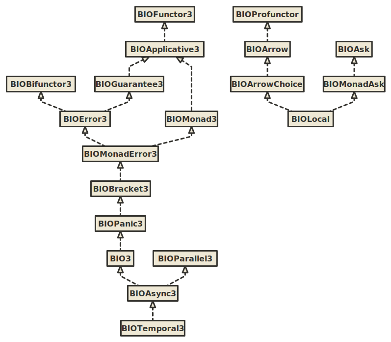
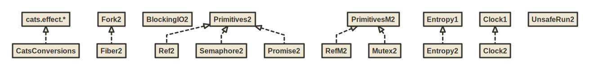

BIO
===

BIO is a set of typeclasses and algebras for programming in tagless final style using bifunctor or trifunctor effect types with variance.

Key syntactic features:

1. Ergonomic `F` summoner that is a single point of entry to all methods in the hierarchy
2. Import-less syntax. Syntax is available immediately after IDE auto-import.

These syntactic features allow you to write in a low ceremony, IDE-friendly and newcomer-friendly style:

```scala mdoc:to-string
import izumi.functional.bio.{F, BIOMonad, BIOMonadAsk, BIOPrimitives, BIORef3}

def adder[F[+_, +_]: BIOMonad: BIOPrimitives](i: Int): F[Nothing, Int] =
  F.mkRef(0)
   .flatMap(ref => ref.update(_ + i) *> ref.get)

// update ref from the environment and return result
def adderEnv[F[-_, +_, +_]: BIOMonadAsk](i: Int): F[BIORef3[F, Int], Nothing, Int] =
  F.access {
    ref => 
      for {
        _   <- ref.update(_ + i)
        res <- ref.get
      } yield res
  }
```

Key semantic features:

1. Typed error handling with bifunctor effect types
2. Automatic conversions to equivalent `cats.effect` instances in `import izumi.functional.bio.catz._`
3. Automatic adaptation of trifunctor typeclasses to bifunctor typeclasses when required
4. No ambiguous implicit errors. It's legal to have both `BIOMonad3` and `BIOMonadAsk` as constraints,
    despite the fact that `BIOMonadAsk` provides a `BIOMonad3`: `def adderEnv[F[-_, +_, +_]: BIOMonad3: BIOMonadAsk] // would still work`
5. Wrappers for primitive concurrent data structures: `BIORef`, `BIOPromise`, `BIOSemaphore`

To use it, add `fundamentals-bio` library:

@@@vars

```scala
libraryDependencies += "io.7mind.izumi" %% "fundamentals-bio" % "$izumi.version$"
```

@@@

Overview
--------

The following graphic shows the current BIO inheritance hierarchy. Note that all the trifunctor `BIO*3` typeclasses
have bifunctor `BIO*` counterparts.



[(image)](media/bio-hierarchy.svg)

Auxiliary algebras:



[(image)](media/algebras.svg)

Relationship hierarchy:


[(image)](media/bio-relationship-hierarchy.svg)
