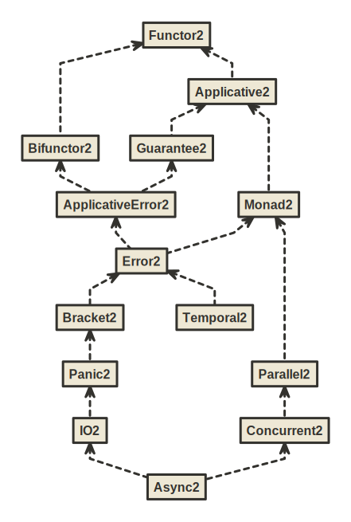

BIO Hierarchy
=============

**BIO** is a set of typeclasses and algebras for programming in tagless final style using bifunctor effect types with variance.

Key syntactic features:

1. Ergonomic `F` summoner that is a single point of entry to all methods in the hierarchy
2. Import-less syntax. Syntax is automatically available whenever any typeclass from the hierarchy is imported, e.g. immediately after IDE auto-import.

These syntactic features allow you to write in a low ceremony, IDE-friendly and newcomer-friendly style:

```scala mdoc:to-string
import izumi.functional.bio.{F, Monad2, Primitives2}

def adder[F[+_, +_]: Monad2: Primitives2](i: Int): F[Nothing, Int] =
  F.mkRef(0)
   .flatMap(ref => ref.update(_ + i) *> ref.get)
```

Key semantic features:

1. Typed error handling with bifunctor effect types
2. Automatic conversions to equivalent `cats.effect` instances using `import izumi.functional.bio.catz._`
3. No ambiguous implicit errors. It's legal to have both `Monad2` and `Applicative2` as constraints,
   despite the fact that `Monad2` provides an `Applicative2`.
4. Primitive concurrent data structures: `Ref`, `Promise`, `Semaphore`

To use it, add `fundamentals-bio` library:

@@@vars

```scala
libraryDependencies += "io.7mind.izumi" %% "fundamentals-bio" % "$izumi.version$"
```

@@@


If you're using Scala `2.12` you **must** enable `-Ypartial-unification` and either `-Xsource:2.13` or `-Xsource:3` for this library to work correctly:

```scala
// REQUIRED options for Scala 2.12
scalacOptions += "-Ypartial-unification"
scalacOptions += "-Xsource:2.13" // either this
// scalacOptions += "-Xsource:3" // or this
```

Most likely you’ll also need to add [Kind Projector](https://github.com/typelevel/kind-projector) plugin:

```scala
addCompilerPlugin("org.typelevel" % "kind-projector" % "0.13.2" cross CrossVersion.full)
```

## Overview

The following graphic shows the current `BIO` hierarchy.



[(image)](media/bio-relationship-hierarchy.svg)

Auxiliary algebras:


[(image)](media/algebras.svg)

Raw inheritance hierarchy:


[(image)](media/bio-hierarchy.svg)

## Syntax, Implicit Punning

All implicit syntax in BIO is available automatically without wildcard imports
with the help of so-called "implicit punning", as in the following example:


```scala mdoc:to-string
import izumi.functional.bio.Monad2

def loop[F[+_, +_]: Monad2]: F[Nothing, Nothing] = {
  val unitEffect: F[Nothing, Unit] = Monad2[F].unit
  unitEffect.flatMap(_ => loop)
}
```

Note: a `.flatMap` method is available on the `unitEffect` value of an abstract type parameter `F`,
even though we did not import any syntax implicits using a wildcard import.

The `flatMap` method was added by the implicit punning on the `Monad2` name.
 In short, implicit punning just means that instead of creating a companion object for a type with the same name as the type,
we create "companion" implicit conversions with the same name. So that whenever you import the type,
you are also always importing the syntax-providing implicit conversions.

This happens to be a great fit for Tagless Final Style, since nearly all TF code will import the names of the used typeclasses.

Implicit Punning for typeclass syntax relieves the programmer from having to manually import syntax implicits in every file in their codebase.

## cats-effect compatibilty

Import `izumi.functional.bio.catz._` for shim compatibilty with cats-effect. You can run `http4s` and all the other cats-effect libraries with just BIO typeclasses, without requiring any cats-effect typeclasses.

## Data Types

`Ref2`, `Promise2` and `Semaphore2` provide basic concurrent mutable state primitives. They require a `Primitives2` capability to create.
With `Primitiives2[F]` in implicit scope, use `F.mkRef`/`F.mkPromise`/`F.mkSemaphore` respectively. (See also example at top of the page)

`Free` monad, as well as `FreeError` and `FreePanic`  provide building blocks for DSLs when combined with a DSL describing functor.

`Morphism1/2/3` provide unboxed natural transformations for functors with 1,2,3-arity respectively, with `Isomorphism1/2/3` modeling two-way transformations.

## Misc Capabilities

`Clock1/2/3` gives access to current time.

`Entropy1/2/3` models random numbers.

`UnsafeRun2` allows executing effects (it is required for conversion to cats' `ConcurrentEffect` which also allows unsafe running)

## Examples

[distage-example](https://github.com/7mind/distage-example) is a full example application written in Tagless Final Style using BIO typeclasses.

You may also find a video walkthrough of using BIO on Youtube by [DevInsideYou — Tagless Final with BIO](https://www.youtube.com/watch?v=ZdGK1uedAE0&t=580s)

## Removal of trifunctor hierarchy

Since version 1.2.0 the trifunctor hierarchy has been removed, due to the fact that since ZIO version 2.0 they cannot be implemented for ZIO and also because of lack of use.

See details in https://github.com/7mind/izumi/issues/2026
