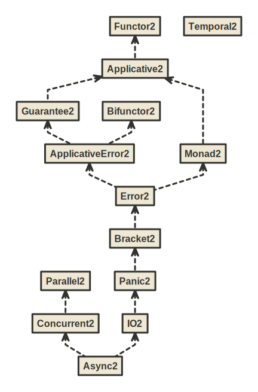

BIO Hierarchy
=============

BIO is a set of typeclasses and algebras for programming in tagless final style using bifunctor or trifunctor effect types with variance.

Key syntactic features:

1. Ergonomic `F` summoner that is a single point of entry to all methods in the hierarchy
2. Import-less syntax. Syntax is automatically available whenever any typeclass from the hierarchy is imported, e.g. immediately after IDE auto-import.

These syntactic features allow you to write in a low ceremony, IDE-friendly and newcomer-friendly style:

```scala mdoc:to-string
import izumi.functional.bio.{F, Monad2, MonadAsk3, Primitives2, Ref3}

def adder[F[+_, +_]: Monad2: Primitives2](i: Int): F[Nothing, Int] =
  F.mkRef(0)
   .flatMap(ref => ref.update(_ + i) *> ref.get)

// update ref from the environment and return result
def adderEnv[F[-_, +_, +_]: MonadAsk3](i: Int): F[Ref3[F, Int], Nothing, Int] =
  F.access {
    ref => 
      for {
        _   <- ref.update(_ + i)
        res <- ref.get
      } yield res
  }
```

Key semantic features:

1. Typed error handling with bifunctor effect types
2. Automatic conversions to equivalent `cats.effect` instances using `import izumi.functional.bio.catz._`
3. Automatic adaptation of trifunctor typeclasses to bifunctor typeclasses when required
4. No ambiguous implicit errors. It's legal to have both `Monad3` and `MonadAsk3` as constraints,
   despite the fact that `MonadAsk3` provides a `BIOMonad3`:
   ```scala
   def adderEnv[F[-_, +_, +_]: Monad3: MonadAsk3] // would still work
   ```
5. Primitive concurrent data structures: `Ref`, `Promise`, `Semaphore`

To use it, add `fundamentals-bio` library:

@@@vars

```scala
libraryDependencies += "io.7mind.izumi" %% "fundamentals-bio" % "$izumi.version$"
```

@@@


On Scala `2.12` you _must_ enable partial unification and set `2.13` source mode for the library to work correctly:

```scala
// _Required_ options for Scala 2.12
scalacOptions += "-Ypartial-unification"
scalacOptions += "-Xsource:2.13"
```

Most likely you’ll also need to add [Kind Projector](https://github.com/typelevel/kind-projector) plugin:

```scala
addCompilerPlugin("org.typelevel" % "kind-projector" % "0.11.0" cross CrossVersion.full)
```


Overview
--------

The following graphic shows the current BIO hierarchy. Note that all the trifunctor typeclasses ending in `*3` typeclasses have bifunctor counterparts ending in `*2`.


[(image)](media/bio-relationship-hierarchy.svg)

Auxiliary algebras:


[(image)](media/algebras.svg)

Raw inheritance hierarchy:



[(image)](media/bio-hierarchy.svg)
