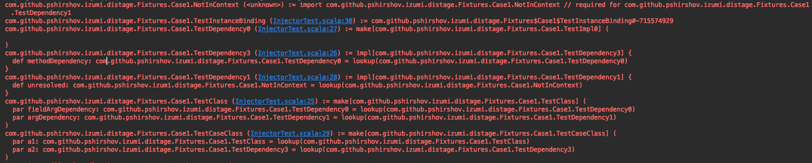

distage Staged Dependency Injection
============

`distage` is a pragmatic module system for Scala that combines safety and reliability of pure FP with extreme late binding and flexibility
of runtime dependency injection frameworks, such as Guice.

`distage` is unopinionated and integrates well with both sides of the 'Scala coin', you can use it easily with imperative
frameworks such as Akka and Play or use it with [Tagless Final Style](#tagless-final-style) and FP libraries of your choice.

More info:

- Slides: [distage: Purely Functional Staged Dependency Injection](https://www.slideshare.net/7mind/distage-purely-functional-staged-dependency-injection-bonus-faking-kind-polymorphism-in-scala-2)
- @ref[Motivation for DI frameworks](motivation.md)

### Tutorial

Suppose we want to create an abstract `Greeter` component that we can use without knowing its concrete implementation:

```tut:book
trait Greeter {
  def hello(name: String): Unit
}
```

A simple implementation would be:

```tut:book
final class PrintGreeter extends Greeter {
  override def hello(name: String) = println(s"Hello $name!") 
}
```

Let's define some classes that want a `Greeter` around:

```tut:book
trait Byer {
  def bye(name: String): Unit
}

class PrintByer extends Byer {  
  override def bye(name: String) = println(s"Bye $name!")
}

class HelloByeApp(greeter: Greeter, byer: Byer) {
  def run(): Unit = {
    println("What's your name?")
    val name = readLine()
    
    greeter.hello(name)
    byer.bye(name)
  }
}
```

To actually run the app, we need to bind the real implementations of `Greeter` and `Byer`. 

```tut:book
import distage.{ModuleDef, Injector}

object HelloByeModule extends ModuleDef {
  make[Greeter].from[PrintGreeter]
  make[Byer].from[PrintByer]
  make[HelloByeApp]
}
```

Since `HelloByeApp` implements itself, we don't have to specify an implementation.

Now we're ready to go:
 
```tut:invisible
// A hack because `tut` REPL fails to create classes via reflection when defined in REPL for some reason..
// Also, we want to override HelloByeApp to not use stdin
val originalModule = HelloByeModule

object HelloByeModule extends ModuleDef {
  make[Greeter].from(new PrintGreeter)
  make[Byer].from(new PrintByer)
  make[HelloByeApp].from((greeter: Greeter, byer: Byer) => new HelloByeApp(greeter, byer) {
    override def run(): Unit = {
      println("What's your name?")
      val name = "kai"
      println(name)
     
      greeter.hello(name)
      byer.bye(name)
    }
  })
}
```

```tut:silent
val injector = Injector()

val plan = injector.plan(HelloByeModule)
val objects = injector.produce(plan)

val app = objects.get[HelloByeApp]
```

```tut:book
app.run()
```

What just happened:

Given a set of bindings, such as `HelloByeModule`, `distage` will lookup the dependencies (constructor or function arguments)
of each implementation and deduce a `plan` to satisfy each dependency using the other implementations in that module, it will happily return
the `plan` back to you as a simple datatype. We can look at `HelloByeModule`'s plan while we're at it:

```tut:invisible
val plan = injector.plan(originalModule)
```

```tut:book
plan.render
```

Since plans are just data, we need to interpret them to create the actual object graph -
`Injector`'s `produce` method provides the default interpreter. Injector contains no logic of its own beyond interpreting
instructions.

Injector output is fully determined by the plan.

This is obviously great for [debugging](#debugging-introspection-diagnostics-and-hooks)!

In fact, we might as well [verify the plan at compile-time](#compile-time-checks) or [splice equivalent Scala code](#compile-time-instantiation)
to do the instantiation before ever running the application. When used in that way,
`distage` is a great alternative to compile-time frameworks such as `MacWire` all the while keeping the flexibility to interpret
at runtime when needed. Said flexibility allows adding features, such as [Plugins](#plugins) and 
[Typesafe Config integration](#config-files), just by transforming plans and bindings.

Note that `distage` classes are always created exactly once, even if many different classes depend on them - they're `Singletons`.
For non-singleton semantics, see [Auto-Factories](#auto-factories).

Modules can be combined into larger modules with `++` and `overridenBy` operators.

Let's use `overridenBy` to greet in ALL CAPS:

```tut:silent
val caps = HelloByeModule.overridenBy(new ModuleDef {
  make[Greeter].from(new Greeter {
    override def hello(name: String) = println(s"HELLO ${name.toUpperCase}")
  }))
}

val capsUniverse = injector.produce(caps)
```

```tut:book
capsUniverse.get[HelloByeApp].run()
```

We've overriden the `Greeter` binding in `HelloByeModule` with a new implementation of `Greeter` that prints in ALL CAPS.
For simple cases like this we can write implementations inplace.

This concludes the basic `distage` tutorial!
Check out the other sections for docs on advanced features, [integrations](#integrations) and unique features,
such as [Garbage Collection](#using-garbage-collector).

### ModuleDef Syntax

DSL for defining bindings from interface to implementation

Basic operators:

Polymorphism:


### Set Bindings / Multibindings

Set bindings are useful for implementing event listeners, plugins, hooks, http routes, etc.

To define a Set binding use `.many` and `.add` methods in @scaladoc[ModuleDef](com.github.pshirshov.izumi.distage.model.definition.ModuleDef)
DSL.

For example, we can serve all [http4s](https://http4s.org) routes added in multiple different modules:

```tut:silent:reset
// boilerplate
import cats.implicits._
import cats.effect._
import distage._
import org.http4s._
import org.http4s.dsl.io._
import org.http4s.implicits._
import org.http4s.server.blaze._

import scala.concurrent.ExecutionContext.Implicits.global

implicit val contextShift = IO.contextShift(global)
implicit val timer = IO.timer(global)
```

```tut:book
object HomeRouteModule extends ModuleDef {

  val homeRoute = HttpRoutes.of[IO] { 
    case GET -> Root / "home" => Ok(s"Home page!") 
  }

  many[HttpRoutes[IO]]
    .add(homeRoute)
}
```

We've used `many` method to declare an open `Set` of http routes and then added one HTTP route into it.
When module definitions are combined, `Sets` for the same binding will be merged together.
You can summon a Set Bindings by summoning a scala `Set`, as in `Set[HttpRoutes[IO]]`.

Let's define a new module with another route:

```tut:book
object BlogRouteModule extends ModuleDef {

  val blogRoute = HttpRoutes.of[IO] { 
    case GET -> Root / "blog" / post => Ok(s"Blog post ``$post''!") 
  }
  
  many[HttpRoutes[IO]]
    .add(blogRoute)
}
```

Now it's the time to define a `Server` component to serve all the routes we've got now:

```tut:book
class HttpServer(routes: Set[HttpRoutes[IO]]) {
  
  val router: HttpApp[IO] = 
    routes.toList.foldK.orNotFound

  val serverResource = 
    BlazeServerBuilder[IO]
      .bindHttp(8080, "localhost")
      .withHttpApp(router)
      .resource
}

object HttpServerModule extends ModuleDef {
  make[HttpServer]
}
```

Now, let's wire all the modules and create the server!

```tut:invisible
// A hack because `tut` REPL fails to create classes via reflection when classes are defined in REPL...
object HttpServerModule extends ModuleDef {
  make[HttpServer].from(new HttpServer(_))
}
```

```tut:silent
val finalModule = Seq(
    HomeRouteModule,
    BlogRouteModule,
    HttpServerModule,
  ).merge

val objects = Injector().produce(finalModule)

val server = objects.get[HttpServer]
```

But does it work?

```tut:book
server.router.run(Request(uri = uri("/home"))).unsafeRunSync
```

```tut:book
server.router.run(Request(uri = uri("/blog/1"))).
  flatMap(_.as[String]).unsafeRunSync
```

Great!

See [Guice wiki on Multibindings](https://github.com/google/guice/wiki/Multibindings) for more on the concept.

### Tagless Final Style

distage works well with tagless final style. As an example, let's take [freestyle's tagless example](http://frees.io/docs/core/handlers/#tagless-interpretation)
and make it safer and more flexible by replacing dependencies on global implementations from `import`'s with explicit modules.

Tagless Final is a pattern of definition allowing us to defnie pure programs

- preliminary https://medium.com/@calvin.l.fer/deferring-commitments-tagless-final-704d768f15cb
- more at bwhatever article https://www.beyondthelines.net/programming/introduction-to-tagless-final/

If you're not familiar with tagless final you can skip this section

these are the benefits distage brings as TF driver compared to implicits

- explicit easy overrides
- <s>easy effectful instantiation and resource management</s>
- multiple different implementations via Id
- by contrast, implicit domain will be consistent

First, the program we want to write:

```tut:book
import cats._
import cats.implicits._
import distage._

trait Validation[F[_]] {
  def minSize(s: String, n: Int): F[Boolean]
  def hasNumber(s: String): F[Boolean]
}
def Validation[F[_]: Validation]: Validation[F] = implicitly

trait Interaction[F[_]] {
  def tell(msg: String): F[Unit]
  def ask(prompt: String): F[String]
}
def Interaction[F[_]: Interaction]: Interaction[F] = implicitly

class TaglessProgram[F[_]: Monad: Validation: Interaction] {
  def program: F[Unit] = for {
    userInput <- Interaction[F].ask("Give me something with at least 3 chars and a number on it")
    valid     <- (Validation[F].minSize(userInput, 3), Validation[F].hasNumber(userInput)).mapN(_ && _)
    _         <- if (valid) 
                    Interaction[F].tell("awesomesauce!")
                 else 
                    Interaction[F].tell(s"$userInput is not valid")
  } yield ()
}

class Program[F[_]: TagK: Monad] extends ModuleDef {
  make[TaglessProgram[F]]

  addImplicit[Monad[F]]
}
```

@scaladoc[TagK](com.github.pshirshov.izumi.fundamentals.reflection.WithTags#TagK) is distage's analogue of `TypeTag` for higher-kinded types such as `F[_]`,
it allows preserving type-information at runtime for types that aren't yet known at definition.
You'll need to add a @scaladoc[TagK](com.github.pshirshov.izumi.fundamentals.reflection.WithTags#TagK) context bound to create a module parameterized by an abstract `F[_]`.
Use @scaladoc[Tag](com.github.pshirshov.izumi.fundamentals.reflection.WithTags#Tag) to create modules parameterized by non-higher-kinded types.

Interpreters:

```tut:invisible
class Program[F[_]: TagK: Monad] extends ModuleDef {
  make[TaglessProgram[F]].from(new TaglessProgram()(_: Monad[F], _: Validation[F], _: Interaction[F]))

  addImplicit[Monad[F]]
}
```

```tut:book
import scala.util.Try
import cats.instances.all._

val tryValidation = new Validation[Try] {
  override def minSize(s: String, n: Int): Try[Boolean] = Try(s.size >= n)
  override def hasNumber(s: String): Try[Boolean] = Try(s.exists(c => "0123456789".contains(c)))
}
  
val tryInteraction = new Interaction[Try] {
  override def tell(s: String): Try[Unit] = Try(println(s))
  override def ask(s: String): Try[String] = Try("This could have been user input 1")
}

object TryInterpreters extends ModuleDef {
  make[Validation[Try]].from(tryValidation)
  make[Interaction[Try]].from(tryInteraction)
}

// combine all modules
val TryProgram = new Program[Try] ++ TryInterpreters

// create object graph
val objects = Injector().produce(TryProgram)

// run
objects.get[TaglessProgram[Try]].program
```

The program module is polymorphic over its eventual monad, we can easily parameterize it by a different monad:

```tut:book
import cats.effect._

def IOInterpreters = ???
def IOProgram = new Program[IO] ++ IOInterpreters
```

We can leave it polymorphic as well: 

```tut:book
def SyncInterpreters[F[_]: Sync] = ???
def SyncProgram[F[_]: TagK: Sync] = new Program[F] ++ SyncInterpreters[F]
```

Or choose different interpreters at runtime:

```tut:book
def DifferentTryInterpreters = ???
def chooseInterpreters(default: Boolean) = {
  val interpreters = if (default) TryInterpreters else DifferentTryInterpreters
  new Program[Try] ++ interpreters
}
```

Modules can be polymorphic over arbitrary kinds - use `TagKK` to abstract over bifunctors:

```tut:book
class BifunctorIOModule[F[_, _]: TagKK] extends ModuleDef 
```

Or use `Tag.auto.T` to abstract over any kind:

```tut:book
class MonadTransModule[F[_[_], _]: Tag.auto.T] extends ModuleDef
```

```tut:book
class TrifunctorModule[F[_, _, _]: Tag.auto.T] extends ModuleDef
```

```tut:book
class EldritchModule[F[+_, -_[_, _], _[_[_, _], _], _, _[_[_]]]: Tag.auto.T] extends ModuleDef
```

consult @scaladoc[HKTag](com.github.pshirshov.izumi.fundamentals.reflection.WithTags#HKTag) docs for more details

### Function Bindings

To bind to a function instead of constructor use `.from` method in @scaladoc[ModuleDef](com.github.pshirshov.izumi.distage.model.definition.ModuleDef) DSL:

```tut:book:reset
import distage._

case class HostPort(host: String, port: Int)

class HttpServer(hostPort: HostPort)

object HttpServerModule extends ModuleDef {
  make[HttpServer].from {
    hostPort: HostPort =>
      val modifiedPort = hostPort.port + 1000
      new HttpServer(hostPort.copy(port = modifiedPort))
  }
}
```

To inject named instances or config values, add annotations to lambda arguments' types:

```tut:book
import distage.config._

object HostPortModule extends ModuleDef {
  make[HostPort].named("default").from(HostPort("localhost", 8080))
  make[HostPort].from {
    (maybeConfigHostPort: Option[HostPort] @ConfPath("http"),
     defaultHostPort: HostPort @Id("default")) =>
      maybeConfigHostPort.getOrElse(defaultHostPort)
  }
}
```

Given a `Locator` we can retrieve instances by type, call methods on them or summon them with a function:

```tut:invisible
class Hello {
  def apply(name: String): Unit = println(s"Hello $name")
}

class Bye {
  def apply(name: String): Unit = println(s"Bye $name")
}

object HelloByeModule extends ModuleDef {
  make[Hello].from(new Hello)
  make[Bye].from(new Bye)
}
```

```tut:book
import scala.util.Random

val objects = Injector().produce(HelloByeModule)

objects.run {
  (hello: Hello, bye: Bye) =>
    val names = Array("Snow", "Marisa", "Shelby")
    val rnd = Random.nextInt(3)
    println(s"Random index: $rnd")
    hello(names(rnd))
    bye(names(rnd))
}
```

```tut:book
objects.runOption { i: Int => i + 10 } match {
  case None => println("I thought I had an Int in my object graph!")
  case Some(i) => println(s"Int is $i")
}
```

For further details, see @scaladoc[ProviderMagnet](com.github.pshirshov.izumi.distage.model.providers.ProviderMagnet)

### Config files

`distage-config` library parses `typesafe-config` into arbitrary case classes or sealed traits and makes them available
for summoning as a class dependency.

To use it, add `distage-config` library:

```scala
libraryDependencies += Izumi.R.distage_config
```
or

@@@vars
```scala
libraryDependencies += "com.github.pshirshov.izumi.r2" %% "distage-config" % "$izumi.version$"
```
@@@

If you're not using @ref[sbt-izumi-deps](../sbt/00_sbt.md#bills-of-materials) plugin.

Write a config in HOCON format:

```hocon
# resources/application.conf
program {
    config {
        different = true
    }
}
```

Add `ConfigModule` into your injector:

```scala
import distage.config._
import com.typesafe.config.ConfigFactory

val config = ConfigFactory.load()

val injector = Injector(new ConfigModule(AppConfig(config)))
```

Now you can automatically parse config entries into case classes and can summon them from any class:

```scala
final case class Config(different: Boolean)

class ConfiguredTaglessProgram[F](
  config: Config @ConfPath("program.config"),
  primaryProgram: TaglessProgram[F] @Id("primary"),
  differentProgram: TaglessProgram[F] @Id("different") ) {

    val program = if (config.different) differentProgram else primaryProgram
}

class ConfiguredTryProgram[F[_]: TagK: Monad] extends ModuleDef {
  make[ConfiguredProgram[F]]
  make[TaglessProgram[F]].named("primary")
  make[TaglessProgram[F]].named("different")
}
```

### Plugins

Plugins are a distage extension that allows you to automatically pick up all `Plugin` modules that are defined in specified package on the classpath.

Plugins are especially useful in scenarios with [extreme late-binding](#roles), when the list of loaded application modules is not known ahead of time. 
Plugins are compatible with [compile-time checks](#compile-time-checks) as long as they're defined in a separate module.

To use plugins add `distage-plugins` library:

```scala
libraryDependencies += Izumi.R.distage_plugins
```
or

@@@vars
```scala
libraryDependencies += "com.github.pshirshov.izumi.r2" %% "distage-plugins" % "$izumi.version$"
```
@@@

If you're not using @ref[sbt-izumi-deps](../sbt/00_sbt.md#bills-of-materials) plugin.

Create a module extending the `PluginDef` trait instead of `ModuleDef`:

```scala
package com.example.petstore

import distage._
import distage.plugins._

trait PetStorePlugin extends PluginDef {
  make[PetRepository]
  make[PetStoreService]
  make[PetStoreController]
}
```

At your app entry point use a plugin loader to discover all `PluginDefs`:

```scala
val pluginLoader = new PluginLoaderDefaultImpl(
  PluginConfig(
    debug = true
    , packagesEnabled = Seq("com.example.petstore") // packages to scan
    , packagesDisabled = Seq.empty         // packages to ignore
  )
)

val appModules: Seq[PluginBase] = pluginLoader.load()
val app: ModuleBase = appModules.merge
```

Launch as normal with the loaded modules:

```scala
Injector().produce(app).get[PetStoreController].run
```

Plugins also allow a program to extend itself at runtime by adding new `Plugin` classes to the classpath via `java -cp`

### Compile-Time Checks

@@@ warning { title='TODO' }
Sorry, this page is not ready yet

Relevant ticket: https://github.com/pshirshov/izumi-r2/issues/51
@@@

As of now, an experimental plugin-checking API is available in `distage-app` module.

To use it add `distage-app` library:

```scala
libraryDependencies += Izumi.R.distage_app
```
or

@@@vars
```scala
libraryDependencies += "com.github.pshirshov.izumi.r2" %% "distage-app" % "$izumi.version$"
```
@@@

If you're not using @ref[sbt-izumi-deps](../sbt/00_sbt.md#bills-of-materials) plugin.

Only plugins defined in a different module can be checked at compile-time, `test` scope counts as a different module.

##### Example:

In main scope:

```scala
// src/main/scala/com/example/AppPlugin.scala
package com.example
import distage._
import distage.plugins._
import distage.config._
import com.github.pshirshov.izumi.distage.app.ModuleRequirements

final case class HostPort(host: String, port: Int)

final case class Config(hostPort: HostPort)

final class Service(conf: Config @ConfPath("config"), otherService: OtherService)

// OtherService class is not defined here, even though Service depends on it
final class AppPlugin extends PluginDef {
  make[Service]
}

// Declare OtherService as an external dependency
final class AppRequirements extends ModuleRequirements(
  // If we remove this line, compilation will rightfully break
  Set(DIKey.get[OtherService])
)
```

In config:

```scala
// src/main/resources/application.conf
// We are going to check if our starting configuration is correct as well.
config {
  // If we remove these, the compilation will rightfully break, as the `HostPort` case class won't deserialize from the config
  host = localhost
  port = 8080
}
```

In test scope:

```scala
// src/test/scala/com/example/test/AppPluginTest.scala
package com.example.test

import com.example._
import org.scalatest.WordSpec
import com.github.pshirshov.izumi.distage.app.StaticPluginChecker

final class AppPluginTest extends WordSpec {
  
  "App plugin will work (if OtherService will be provided later)" in {
    StaticPluginChecker.checkWithConfig[AppPlugin, AppRequirements](disableTags = "", configFileRegex = "*.application.conf")   
  }

}
```

`checkWithConfig` will run at compile-time, every time that AppPluginTest is recompiled.

You can participate in this ticket at https://github.com/pshirshov/izumi-r2/issues/51

### Auto-Traits

@@@ warning { title='TODO' }
Sorry, this page is not ready yet
@@@

...

### Auto-Factories

`distage` can automatically create `Factory` classes from suitable traits.
This feature is especially useful for `Akka`.

Given a class `ActorFactory`:

```scala
class UserActor(sessionId: UUID, sessionRepo: SessionRepo)

trait ActorFactory {
  def createActor(sessionId: UUID): UserActor
}
```

And a binding of `ActorFactory` *without* an implementation

```scala
class ActorModule extends ModuleDef {
  make[ActorFactory]
}
```

`distage` will derive and bind the following implementation for `ActorFactory`:

```scala
class ActorFactoryImpl(sessionRepo: SessionRepo) extends ActorFactory {
  override def createActor(sessionId: UUID): UserActor = {
    new UserActor(sessionId, sessionRepo)
  }
}
```

You can use this feature to concisely provide non-singleton semantics for some of your components.

By default, the factory implementation class will be created automatically at runtime.
To create factories at compile-time use `distage-static` module.

### Compile-Time Instantiation

@@@ warning { title='TODO' }
Sorry, this page is not ready yet

Relevant ticket: https://github.com/pshirshov/izumi-r2/issues/453
@@@

WIP

You can participate in this ticket at https://github.com/pshirshov/izumi-r2/issues/453

### Inner Classes and Path-Dependent Types

To instantiate path-dependent types via constructor, their prefix type has to be present in DI object graph:

```scala

trait Path {
  class A
  class B
}

val path = new Path {}

val module = new ModuleDef {
  make[path.A]
  make[path.type].from(path.type: path.type)
}
```

The same applies to type projections:

```scala
val module1 = new ModuleDef {
  make[Path#B]
  make[Path].from(new Path {})
}
```

Provider and instance bindings and also compile-time mode in `distage-static` module do not require the singleton type prefix to be present in DI object graph:

```scala
val module2 = new ModuleDef {
  make[Path#B].from {
    val path = new Path {}
    new path.B
  }
}
```

### Implicits Injection

@@@ warning { title='TODO' }
Sorry, this page is not ready yet

Relevant ticket: https://github.com/pshirshov/izumi-r2/issues/230
@@@

Implicits are managed like any other class. To make them available for summoning, declare them in a module:

```scala
import cats.Monad
import distage._
import scalaz.zio.IO
import scalaz.zio.interop.catz._

object IOMonad extends ModuleDef {
  addImplicit[Monad[IO[Throwable, ?]]]
  // same as make[Monad[IO[Throwable, ?]]].from(implicitly[Monad[IO[Throwable, ?]]])
}
```

Implicits for managed classes are injected from the object graph, not from the surrounding lexical scope.
If they were captured from lexical scope at the time of binding definition, then classes would effectively depend on a
specific *implementation* of implicits. 
Depending on implementations is unmodular and directly contradicts the idea of using a dedicated module system in the first place,
therefore you're encouraged to wire implicits with their implementations in your of module definitions.
 
```scala
import cats._
import distage._

class KVStore[F[_], V](implicit M: Monad[F]) {
  def fetch(key: String): F[V]
}

val kvstoreModuleBad = new ModuleDef {
  // We DON'T want this import to be necessary here
  // import cats.instances.either._

  make[KVStore[Either[Error, ?]]].from[KVStoreEitherImpl]
}

// Instead, wire implicits explicitly
val kvstoreModuleGood = new ModuleDef {
  // Ok to import here
  import cats.instances.either._
  
  addImplicit[Monad[Either[Error, ?]]]
  
  make[KVStore[Either[Error, ?]]].from[KVStoreEitherImpl]
}
```

Implicits obey the usual lexical scope in user code.

You can participate in this ticket at https://github.com/pshirshov/izumi-r2/issues/230

### Monadic effects instantiation

@@@ warning { title='TODO' }
Sorry, this page is not ready yet

Relevant ticket: https://github.com/pshirshov/izumi-r2/issues/331
@@@

Example of explicitly splitting effectful and pure instantiations:

```scala
import cats._
import cats.implicits._
import distage._
import distage.config._
import com.typesafe.config.ConfigFactory

import scala.concurrent.{Await, Future}
import scala.concurrent.duration.Duration
import scala.concurrent.ExecutionContext.global

case class DbConf()
case class MsgQueueConf()
case class RegistryConf()

class DBService[F[_]]
class MsgQueueService[F[_]]
class RegistryService[F[_]]

class DomainService[F[_]: Monad]
( dbService: DBService[F]
, msgQueueService: MsgQueueService[F]
, registryService: RegistryService[F]
) {
  def run: F[Unit] = Monad[F].unit
}

class ExternalInitializers[F[_]: TagK: Monad] extends ModuleDef {
  make[F[DBService[F]]].from { 
    dbConf: DbConf @ConfPath("network-service.db") => new DBService[F]().pure[F] 
  }
  make[F[MsgQueueService[F]]].from { 
    msgQueueConf: MsgQueueConf @ConfPath("network-service.msg-queue") => new MsgQueueService[F]().pure[F] 
  }
  make[F[RegistryService[F]]].from { 
    registryConf: RegistryConf @ConfPath("network-service.registry") => new RegistryService[F]().pure[F]
  }
}

val injector = Injector(new ConfigModule(AppConfig(ConfigFactory.load())))
val monadicActionsLocator = injector.produce(new ExternalInitializers[Future])

val main: Future[Unit] = monadicActionsLocator.run {
  ( dbF: Future[DBService[Future]]
  , msgF: Future[MsgQueueService[Future]]
  , regF: Future[RegistryService[Future]]
  ) => for {
    db <- dbF
    msg <- msgF
    reg <- regF

    externalServicesModule = new ModuleDef {
      make[DBService[Future]].from(db)
      make[MsgQueueService[Future]].from(msg)
      make[RegistryService[Future]].from(reg)
    }

    domainServiceModule = new ModuleDef {
      make[DomainService[Future]]
    }

    allServices = injector.produce(externalServicesModule ++ domainServiceModule)

    _ <- allServices.get[DomainService[Future]].run
  } yield ()
}

Await.result(main, Duration.Inf)
```

Side-effecting instantiation is not recommended in general – ideally, resources and lifetimes should be managed outside of `distage`. A rule of thumb is:
if a class and its dependencies are stateless, and can be replaced by a global `object`, it's ok to inject them with  `distage`.
However, `distage` does provide helpers to help manage lifecycle, see: [Auto-Sets](#auto-sets-collecting-bindings-by-predicate)

You can participate in this ticket at https://github.com/pshirshov/izumi-r2/issues/331

### Import Materialization

@@@ warning { title='TODO' }
Sorry, this page is not ready yet
@@@

...

### Depending on Locator

Classes can depend on the Locator:

```scala
import distage._

class A(all: LocatorRef) {
  def c = all.get.get[C]
}
class B
class C

val module = new ModuleDef {
  make[A]
  make[B]
  make[C]
}

val locator = Injector().produce(module)

assert(locator.get[A].c eq locator.get[C]) 
```

It's recommended to avoid this if possible, doing so is often a sign of broken application design.

### Ensuring service boundaries using API modules

...

### Roles 

@@@ warning { title='TODO' }
Sorry, this page is not ready yet
@@@

"Roles" are a pattern of multi-tenant applications, in which multiple separate microservices all reside within a single `.jar`.
This strategy helps cut down development, maintenance and operations costs associated with maintaining fully separate code bases and binaries.
The apps that should be launched are chosen by command-line parameters: `./launcher app1 app2 app3`. When launching less apps
than are available in the launcher - `./launcher app1`, redundant components will be collected by the [garbage collector](#using-garbage-collector)
and won't be started.

Roles: a viable alternative to Microservices:

https://github.com/7mind/slides/blob/master/02-roles/target/roles.pdf

### Test Kit

`distage-testkit` module provides integration with `scalatest`:

```scala
libraryDependencies += Izumi.R.distage_testkit
```
or

@@@vars
```scala
libraryDependencies += "com.github.pshirshov.izumi.r2" %% "distage-plugins" % "$izumi.version$"
```
@@@

If you're not using @ref[sbt-izumi-deps](../sbt/00_sbt.md#bills-of-materials) plugin.

Example usage:

```scala
import distage._
import com.github.pshirshov.izumi.distage.testkit.DistageSpec

class TestClass {
  def hello: String = "Hello World!"
}

class Test extends DistageSpec {
  override protected def makeBindings: ModuleBase = new ModuleDef {
    make[TestClass]
  }

  "TestClass" should {

    "Say hello" in di {
      testClass: TestClass =>
        assert(testClass.hello == "Hello World!")
    }

  }
}
```

### Using Garbage Collector

A garbage collector is included in `distage` by default, to use it parameterize the injector with garbage collection roots:

```scala
import distage._

class Main

// Designate `Main` class as the garbage collection root
val roots = Seq(DIKey.get[Main])

// Enable GC
val injector = Injector(roots)
```

GC will remove all bindings that aren't transitive dependencies of the chosen `GC root` keys from the plan - they will never be instantiated.

In the following example:

```scala
import distage._

case class A(b: B)
case class B()
case class C() {
  println("C!")
}

val module = new ModuleDef {
  make[A]
  make[B]
  make[C]
}

val roots = Seq(DIKey.get[A])

val locator = Injector(roots).produce(module)

locator.find[A]
// res0: Option[A] = Some(A(B()))
locator.find[B]
// res1: Option[B] = Some(B())
locator.find[C]
// res2: Option[C] = None
```

Class `C` was removed because it neither `B` nor `A` depended on it. It's not present in the `Locator` and the `"C!"` message was never printed.
But, if class `B` were to depend on `C` as in `case class B(c: C)`, it would've been retained, because `A` - the GC root, would depend on `B` which in turns depends on `C`.

GC serves two important purposes:

* It enables faster [tests](#test-kit) by omitting unrequired instantiations and initialization of potentially heavy resources,
* It enables multiple separate applications, aka "[Roles](#roles)" to be hosted within a single `.jar`.

### Circular Dependencies support

`distage` automatically resolves circular dependencies, including self-reference:

```scala
import distage._

case class A(b: B)
case class B(a: A) 
case class C(c: C)

val locator = Injector().produce(new ModuleDef {
  make[A]
  make[B]
  make[C]
})

locator.get[A] eq locator.get[B].a
// res0: Boolean = true
locator.get[B] eq locator.get[A].b
// res1: Boolean = true
locator.get[C] eq locator.get[C].c
// res2: Boolean = true
``` 

#### Automatic Resolution with generated proxies

The above strategy depends on `distage-proxy-cglib` module which is brought in by default with `distage-core`.

It's enabled by default. If you want to disable it, use `noCogen` bootstrap environment:

```scala
import com.github.pshirshov.izumi.distage.bootstrap.DefaultBootstrapContext
import distage._

Injector(DefaultBootstrapContext.noCogen)
```

#### Manual Resolution with by-name parameters

Most cycles can also be resolved manually when identified, using `by-name` parameters.

Circular dependencies in the following example are all resolved via Scala's native `by-name`'s, without any proxy generation:

```scala
import com.github.pshirshov.izumi.distage.bootstrap.DefaultBootstrapContext.noCogen
import distage._

class A(b0: => B) {
  def b: B = b0
}

class B(a0: => A) {
  def a: A = a0
}

class C(self: => C) {
  def c: C = self
}

val module = new ModuleDef {
  make[A]
  make[B]
  make[C]
}

val locator = Injector(noCogen).produce(module)

assert(locator.get[A].b eq locator.get[B])
assert(locator.get[B].a eq locator.get[A])
assert(locator.get[C].c eq locator.get[C])
``` 

The proxy generation via `cglib` is still enabled by default, because in scenarios with [extreme late-binding](#roles),
cycles can emerge unexpectedly, outside of control of the origin module.

NB: Currently a limitation applies to by-names - ALL dependencies on a class engaged in a by-name circular dependency have to be by-name,
otherwise distage will transparently revert to generating proxies.

### Auto-Sets: Collecting Bindings By Predicate

AutoSet @scaladoc[Planner](com.github.pshirshov.izumi.distage.model.Planner) Hooks traverse the class graph and collect all classes matching a predicate.

Using Auto-Sets, one can, for example, collect all `AutoCloseable` classes and `.close()` them after the application has finished work.

Note: it's not generally recommended to construct stateful, effectful or resource-allocating classes with `distage`, a general rule of thumb is:
if a class and its dependencies are stateless and can be replaced by a global `object`, it's ok to inject them with  `distage`. However, an example is given anyway,
as a lot of real applications depend on global resources, such as JDBC connections, `ExecutionContext` thread pools, Akka Systems, etc. that should 
be closed properly at exit.

```scala
trait PrintResource(name: String) {
  def start(): Unit = println(s"$name started")
  def stop(): Unit = println(s"$name stopped")
}

class A extends PrintResource("A")
class B(val a: A) extends PrintResource("B")
class C(val b: B) extends PrintResource("C")

val resources = Injector(new BootstraModuleDef {
  many[PlanningHook]
    .add(new AssignableFromAutoSetHook[PrintResource])
}).produce(new ModuleDef {
  make[C]
  make[B]
  make[A]
}).get[Set[PrintResource]]

resources.foreach(_.start())
resources.reverse.foreach(_.stop())

// Will print:
// A started
// B started
// C started
// C stopped
// B stopped
// A stopped
```

Calling `.foreach` on an auto-set is safe; the actions will be executed in order of dependencies.
Auto-Sets preserve ordering, they use `ListSet` under the hood, unlike user-defined [Sets](#multibindings--set-bindings).
e.g. If `C` depends on `B` depends on `A`, autoset order is: `A, B, C`, to start call: `A, B, C`, to close call: `C, B, A`.
When you use auto-sets for finalization, you **must** `.reverse` the autoset.

Note: Auto-Sets are NOT subject to [Garbage Collection](#using-garbage-collector), they are assembled *after* garbage collection is done,
as such they can't contain garbage by construction.

#### Weak Sets

[Set bindings](#set-bindings--multibindings) can contain *weak* references. References designated as weak will
be retained by [Garbage Collector](#using-garbage-collector) _only_ if there are other references to them except the
set binding itself.

Example:

```scala
import distage._

sealed trait SetElem

final class Strong extends SetElem {
  println("Strong constructed")
}
final class Weak extends SetElem {
  println("Weak constructed")
}

val module = new ModuleDef {
  make[Strong]
  make[Weak]
  
  many[SetElem]
    .ref[Strong]
    .weak[Weak]
}

// Designate Set[SetElem] as the garbage collection root,
// everything that Set[SetElem] does not strongly depend on will be garbage collected
// and will not be constructed. 
val roots = Seq(DIKey.get[Set[SetElem]])

// Enable GC
val injector = Injector(gcRoots = roots)

val locator = injector.produce(roots)
// Strong constructed!

assert(locator.get[Set[SetElem]].size == 1)
```

The `Weak` class was not required in any dependency of `Set[SetElem]`, so it was pruned.
The `Strong` class remained, because the reference to it was **strong**, therefore it was counted as a dependency of `Set[SetElem]`

If we change `Strong` to depend on `Weak`, then `Weak` will be retained:

```scala
final class Strong(weak: Weak) {
  println("Strong constructed")
}

assert(locator.get[Set[SetElem]].size == 2)
```

### Debugging, Introspection, Diagnostics and Hooks

You can print the `plan` to get detailed info on what will happen during instantiation. The printout includes file:line info 
so your IDE can show you where the binding was defined! 

```scala
val plan = Injector().plan(module)

System.err.println(plan)
```



You can also query a plan to see the dependencies and reverse dependencies of a specific class and their order of instantiation:

```scala
// Print dependencies
System.err.println(plan.topology.dependencies.tree(DIKey.get[Circular1]))
// Print reverse dependencies
System.err.println(plan.topology.dependees.tree(DIKey.get[Circular1]))
```


The printer highlights circular dependencies.

distage also uses some macros to create `TagK`s and [function bindings](#function-bindings),
you can turn on macro debug output during compilation by setting `-Dizumi.distage.debug.macro=true` java property:

```bash
sbt -Dizumi.distage.debug.macro=true compile
```

Macros power `distage-static` module, an alternative backend that does not use JVM runtime reflection to instantiate classes and auto-traits.

### Extensions and Plan Rewriting - writing a distage extension

...

### Migrating from Guice

...

### Migrating from MacWire

...

### Integrations

...

### Cats

To import cats integration add `distage-cats` library:

```scala
libraryDependencies += Izumi.R.distage_cats
```

or

@@@vars
```scala
libraryDependencies += "com.github.pshirshov.izumi.r2" %% "distage-cats" % "$izumi.version$"
```
@@@

If you're not using @ref[sbt-izumi-deps](../sbt/00_sbt.md#bills-of-materials) plugin.

Usage:

```scala
import cats.implicits._
import cats.effect._
import distage._
import distage.interop.cats._
import com.example.{DBConnection, AppEntrypoint}

object Main extends IOApp {
  def run(args: List[String]): IO[Unit] = {
    val myModules = module1 |+| module2 // Monoid instance for ModuleDef is available now
    
    for {
      plan <- myModules.resolveImportsF[IO] { // resolveImportsF is now available
        case i if i.target == DIKey.get[DBConnection] =>
           DBConnection.create[IO]
      } 
      classes <- Injector().produceIO[IO](plan) // produceIO is now available
      _ <- classes.get[AppEntrypoint].run
    } yield ()
  }
}
```

### Scalaz

### ZIO

### Freestyle

### Eff

## PPER

See @ref[PPER Overview](../pper/00_pper.md)

@@@ index

* [Motivation](motivation.md)

@@@
