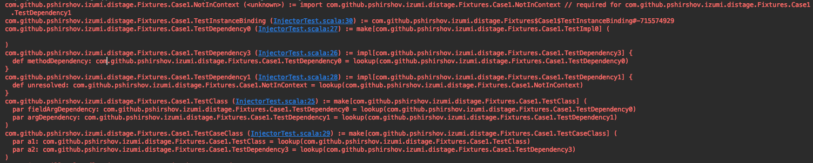
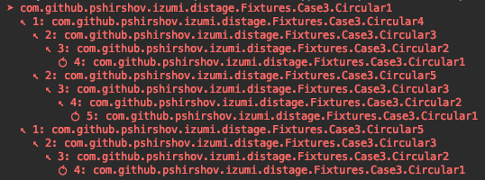
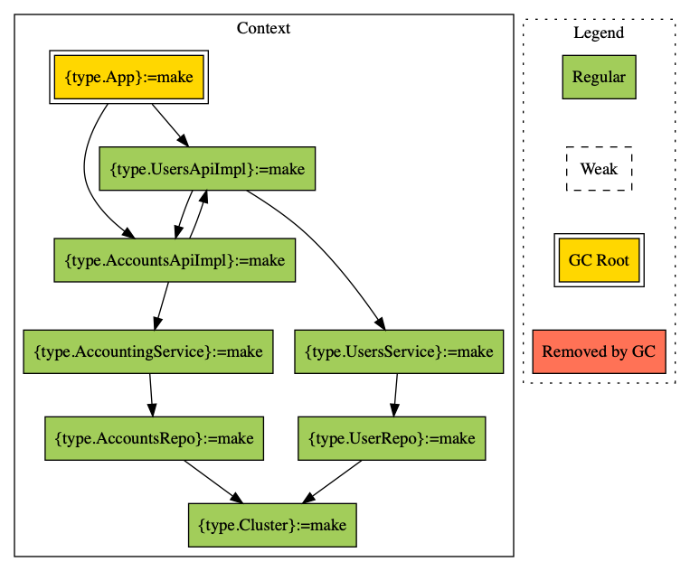

# Debugging

@@toc { depth=2 }

### Testing Plans

TODO: not applicable to DIPlan

Use `OrderedPlan#assertValid` method to test whether the plan will execute correctly when passed to `Injector#produce`.

```scala mdoc:reset:to-string
import distage.{DIKey, Roots, ModuleDef, Injector}

class A(b: B)
class B

def badModule = new ModuleDef {
  make[A]
  make[B].fromEffect(zio.Task { ??? })
}

val badPlan = Injector[cats.effect.IO]().plan(badModule, Roots.target[A])
```

```scala mdoc:crash:to-string
// the effect types are mismatched - `badModule` uses `zio.Task`, but we expect `cats.effect.IO`

badPlan.assertValid[cats.effect.IO]().unsafeRunSync()
```

```scala mdoc:to-string
def goodModule = new ModuleDef {
  make[A]
  make[B].fromEffect(cats.effect.IO(new B))
}

val plan = Injector[cats.effect.IO]().plan(goodModule, Roots.target[A])
```

```scala mdoc:to-string
// the effect types in `goodModule` and here match now

plan.assertValid[cats.effect.IO]().unsafeRunSync()
```

### Pretty-printing plans

You can print the output of `plan.render()` to get detailed info on what will happen during instantiation. The printout includes source
and line numbers so your IDE can show you where the binding was defined!

```scala mdoc:to-string
println(plan.render())
```



You can also query a plan to see the dependencies and reverse dependencies of a specific class and their order of instantiation:

```scala mdoc:to-string
// Print dependencies
println(plan.renderDeps(DIKey[A]))

// Print reverse dependencies
println(plan.renderDependees(DIKey[B]))
```

The printer highlights circular dependencies:



To debug macros used by `distage` you may use the following Java Properties:

```bash
# izumi-reflect macros
-Dizumi.debug.macro.rtti=true

# izumi.distage.constructors.* macros
-Dizumi.debug.macro.distage.constructors=true

# Functoid macro
-Dizumi.debug.macro.distage.functoid=true
```

### Graphviz rendering

Add `GraphDumpBootstrapModule` to your `Injector`'s configuration to enable writing GraphViz files with a graphical representation of the `OrderedPlan`. Data will be saved to `./target/plan-last-full.gv` and `./target/plan-last-nogc.gv` in the current working directory.

```scala mdoc:reset:to-string
import distage.{GraphDumpBootstrapModule, Injector}

Injector(GraphDumpBootstrapModule)
```

You'll need a `GraphViz` installation to render these files into a viewable PNG images:

```bash
dot -Tpng target/plan-last-nogc.gv -o out.png
```


