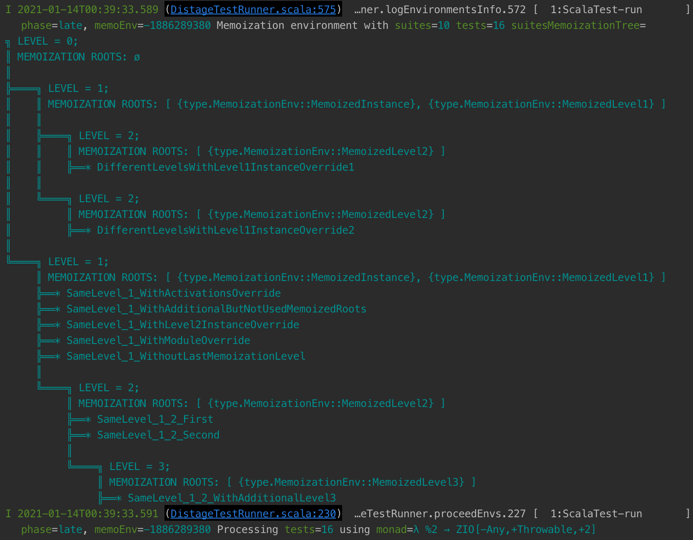

# distage-testkit

@@toc { depth=2 }

### Quick Start

`distage-testkit` simplifies pragmatic purely-functional program testing providing `Spec*`
[ScalaTest](https://www.scalatest.org/) base classes for any existing Scala effect type with kind `F[_]`,
`F[+_, +_]`, `F[-_, +_, +_]` or `Identity`. `Spec`s provide an interface similar to ScalaTest's
[`WordSpec`](http://doc.scalatest.org/3.1.0/org/scalatest/wordspec/AnyWordSpec.html), however
`distage-testkit` adds additional capabilities such as: first class support for effect types; dependency injection; and
parallel execution.

Usage of `distage-testkit` generally follows these steps:

1. Extend a base class corresponding to the effect type:
    - No effect type - @scaladoc[`SpecIdentity`](izumi.distage.testkit.scalatest.SpecIdentity)
    - `F[_]` - @scaladoc[`Spec1[F]`](izumi.distage.testkit.scalatest.Spec1), for monofunctors (`cats.effect.IO`
      , `monix`)
    - `F[+_, +_]` - @scaladoc[`Spec2[F]`](izumi.distage.testkit.scalatest.Spec2), for bifunctors (`ZIO`, `monix-bio`)
    - `ZIO[-R, +E, +A]` - @scaladoc[`SpecZIO`](izumi.distage.testkit.scalatest.Spec3) for `ZIO` with environment support in tests
2. Override `def config: TestConfig` to customize the @scaladoc[`TestConfig`](izumi.distage.testkit.TestConfig)
3. Establish test case contexts
   using [`should`](https://www.scalatest.org/scaladoc/3.2.0/org/scalatest/verbs/ShouldVerb.html),
   [`must`](https://www.scalatest.org/scaladoc/3.2.0/org/scalatest/verbs/MustVerb.html),
   or [`can`](https://www.scalatest.org/scaladoc/3.2.0/org/scalatest/verbs/CanVerb.html).
4. Introduce test cases using one of the `in` methods. These test cases can have a variety of forms, from plain
   functions returning an
   [assertion](https://www.scalatest.org/scaladoc/3.2.0/org/scalatest/Assertions.html), to effectful functions with
   dependencies:
    - No effect type / `Identity` -
      @scaladoc[`in`](izumi.distage.testkit.services.scalatest.dstest.DistageAbstractScalatestSpec$$LowPriorityIdentityOverloads)
    - @scaladoc[`in` for `F[_]`](izumi.distage.testkit.services.scalatest.dstest.DistageAbstractScalatestSpec$$DSWordSpecStringWrapper)
    - @scaladoc[`in` for `F[+_, +_]`](izumi.distage.testkit.services.scalatest.dstest.DistageAbstractScalatestSpec$$DSWordSpecStringWrapper2)
    - @scaladoc[`in` for `F[-_, +_, +_]`](izumi.distage.testkit.services.scalatest.dstest.DistageAbstractScalatestSpec$$DSWordSpecStringWrapper3)
    - Test cases dependent on injectables: @scaladoc[`Functoid`](izumi.distage.model.providers.Functoid)

### API Overview

The highest value tests to develop [in our experience](https://blog.7mind.io/constructive-test-taxonomy.html) are those
that verify the communication behavior of components. These are tests of blackbox interfaces, with atomic or group
isolation levels.

To demonstrate usage of `distage-testkit` we'll consider a hypothetical game score system. This system will have a
model, logic, and service which we'll then define test cases to verify. Our application will use `ZIO[-R, +E, +A]`.

We'll start with the following model and service interface for the game score system:

```scala mdoc:fakepackage:to-string
"fakepackage app": Unit

import zio._
import zio.managed._
import zio.Console

final case class Score(
  value: Int
)

final case class Config(
  starValue: Int,
  mangoValue: Int,
  defaultBonus: Int,
)

trait BonusService {
  def queryCurrentBonus: Task[Int]
  def increaseCurrentBonus(delta: Int): Task[Int]
}

object Score {
  val zero = Score(0)

  def addStar(config: Config, score: Score) =
    score.copy(value = score.value + config.starValue)

  def echoConfig(config: Config): Task[Config] =
    for {
      _ <- Console.printLine(config.toString)
    } yield config

  def addMango(config: Config, score: Score): RIO[BonusService, Score] =
    for {
      bonusService <- ZIO.service[BonusService]
      currentBonus <- bonusService.queryCurrentBonus
    } yield {
      val value = score.value + config.mangoValue + currentBonus
      score.copy(value = value)
    }
}
```

This represents a game score system where the player can collect Stars or Mangoes with differently configured and
calculated point values.

#### `Spec` Base Classes

There are test suite base classes for functor, bifunctor and trifunctor effect types. We will be choosing the one that
matches our application's effect type from the following:

- No effect type, imperative usage - @scaladoc[`SpecIdentity`](izumi.distage.testkit.scalatest.SpecIdentity)
- `F[_]` - @scaladoc[`Spec1[F]`](izumi.distage.testkit.scalatest.Spec1)
- `F[+_, +_]` - @scaladoc[`Spec2[F]`](izumi.distage.testkit.scalatest.Spec2)
- `ZIO[-R, +E, +A]` - @scaladoc[`SpecZIO`](izumi.distage.testkit.scalatest.SpecZIO)

The effect monad is expected to support sync and async effects. `distage-testkit` provides this support for `Identity`
, `monix`, `monix-bio`, `ZIO`, and monads wth instances of `cats-effect` or @ref[BIO](../bio/00_bio.md) typeclasses. For
our demonstration application, the tests will use the `ZIO[-R, +E, +A]` effect type. This means we'll be
using `SpecZIO` for the test suite base class.

The default config (`super.config`) has `pluginConfig`, which by default will scan the package the test is defined in
for defined Plugin modules. See the @ref:[`distage-extension-plugins`](./distage-framework.md#plugins) documentation for
more information. For our demonstration the module will be provided using explicit `moduleOverrides` instead of
classpath scanning, like so:

```scala mdoc:invisible
```

```scala mdoc:fakepackage:to-string
"fakepackage app": Unit

import com.typesafe.config.ConfigFactory
import distage.ModuleDef
import izumi.distage.testkit.scalatest.{AssertZIO, Spec3}

abstract class Test extends SpecZIO with AssertZIO {
  val defaultConfig = Config(
    starValue = 10,
    mangoValue = 256,
    defaultBonus = 10,
  )

  override def config = super
    .config.copy(
      moduleOverrides = new ModuleDef {
        make[Config].from(defaultConfig)
      },
      debugOutput = true,
    )
}
```

```scala mdoc:invisible

// The goal is to demonstrate testkit plugin integration. `package` is not
// currently supported in mdoc code. To hack around this the `package app` code
// blocks are not interpreted and the actual test tested is the one below.

import izumi.distage.plugins.PluginConfig
import izumi.distage.testkit.services.scalatest.dstest.DistageTestsRegistrySingleton

trait MdocTest extends Test {
  def name: String
  override final def suiteName = name
  override def config = super.config.copy(
    pluginConfig = PluginConfig.const(BonusServicePlugin)
  )
}

object MdocTest {
  def preRunSetup(): Unit = {
    DistageTestsRegistrySingleton.resetRegistry()
  }
}

final case class SuiteCtor(construct: () => org.scalatest.Suite)
implicit def suiteCtor(s: => org.scalatest.Suite) = SuiteCtor(() => s)

def __runTest__(suiteCtors: SuiteCtor*) = {
  // remove all previous tests from registry
  DistageTestsRegistrySingleton.resetRegistry()

  // run constructors to add the tests to registry
  val suites = suiteCtors.map(_.construct())

  println("```")
  suites.foreach {
    s =>
      org.scalatest.nostacks.nocolor.run(s)
      println("\n")
  }
  println("```")
}
```

#### Test Cases

In `WordSpec`, a test case is a sentence (a `String`) followed by `in` then the body. In
`distage-testkit` the body of the test case is not limited to a function returning an
[assertion](https://www.scalatest.org/scaladoc/3.2.0/org/scalatest/Assertions.html).

@scaladoc[Functions that take arguments](izumi.distage.model.providers.Functoid)
and functions using effect types are also supported. Function arguments and effect environments will be provided
according to the `distage` object graph created from the modules defined
in [`def config: TestConfig`](izumi.distage.testkit.TestConfig).

#### Assertions

All of the base classes support test cases that are:

- Assertions.
- Functions returning an assertion.
- Functions returning unit that fail on exception.

These are introduced using `in` from
@scaladoc[DistageAbstractScalatestSpec.LowPriorityIdentityOverloads](izumi.distage.testkit.services.scalatest.dstest.DistageAbstractScalatestSpec$$LowPriorityIdentityOverloads)

The assertion methods are the same as ScalaTest as the base classes extend
[ScalaTest Assertions](https://www.scalatest.org/scaladoc/3.2.0/org/scalatest/Assertions.html).

```scala mdoc:invisible
// minimal check for that scalatest reference
import org.scalatest.Assertions
```

Let's now create a simple test for our demonstration application:

```scala mdoc:fakepackage:to-string
"fakepackage app": Unit

class ScoreSimpleTest extends Test {

  "Score" should {

    "increase by config star value" in {
      val starValue = util.Random.nextInt()
      val mangoValue = util.Random.nextInt()
      val defaultBonus = util.Random.nextInt()
      val config = Config(starValue, mangoValue, defaultBonus)
      val expected = Score(starValue)
      val actual = Score.addStar(config, Score.zero)
      assert(actual == expected)
    }

    // Use `Config` from the module in the `Test` class above
    "increase by config star value from DI" in {
      config: Config =>
        val expected = Score(defaultConfig.starValue)
        val actual = Score.addStar(config, Score.zero)
        assert(actual == expected)
    }

  }
}
```

```scala mdoc:passthrough
__runTest__(new ScoreSimpleTest with MdocTest { def name = "ScoreSimpleTest" })
```

#### Assertions with Effects

All of the base classes support test cases that are effects with assertions. Functions returning effects will have
arguments provided from the object graph. These test cases are supported by
@scaladoc[`in` from DSWordSpecStringWrapper](izumi.distage.testkit.services.scalatest.dstest.DistageAbstractScalatestSpec$$DSWordSpecStringWrapper).

The different effect types fix the `F[_]` argument for this syntax:

- `Spec1`: `F[_]`
- `Spec2`: `F[Throwable, _]`
- `Spec3`: `F[Any, Throwable, _]`

With our demonstration application we'll use this to verify the `Score.echoConfig` method. The `Config` required is from
the `distage` object graph defined in `moduleOverrides`.
By using a function with a `Config` argument in `in`, the required argument will be injected by `distage-testkit`.

```scala mdoc:fakepackage:to-string
"fakepackage app": Unit

class ScoreEffectsTest extends Test {
  "testkit operations with effects" should {

    "support assertions in effects" in {
      (config: Config) =>
        for {
          actual <- Score.echoConfig(config)
          _      <- assertIO(actual == config)
        } yield ()
    }

    "support assertions outside of effect" in {
      (config: Config) =>
        for {
          actual <- Score.echoConfig(config)
        } yield {
          assert(actual == config)
        }
    }
  }
}
```

```scala mdoc:passthrough
__runTest__(new ScoreEffectsTest with MdocTest { def name = "ScoreEffectsTest" })
```

#### Assertions with Effects with Environments

@scaladoc[The `in` method for `F[_, _, _]` effect types](izumi.distage.testkit.services.scalatest.dstest.DistageAbstractScalatestSpec$$DSWordSpecStringWrapper3)
supports injection of environments from the object graph in addition to simple assertions and assertions with effects.

A test that verifies the `BonusService` in our demonstration would be:

```scala mdoc:fakepackage:to-string
"fakepackage app": Unit

abstract class BonusServiceTest extends Test {
  "BonusService" should {

    "initially use default bonus as current" in {
      for {
        bonusService <- ZIO.service[BonusService]
        currentBonus <- bonusService.queryCurrentBonus
        _            <- Console.printLine(s"currentBonus = $currentBonus")
        _            <- assertIO(currentBonus == defaultConfig.defaultBonus)
      } yield ()
    }

    "increment by delta" in {
      for {
        delta        <- zio.Random.nextInt
        bonusService <- ZIO.service[BonusService]
        initialBonus <- bonusService.queryCurrentBonus
        actualBonus  <- bonusService.increaseCurrentBonus(delta)
        expectedBonus = initialBonus + delta
        _            <- assertIO(actualBonus == expectedBonus)
      } yield ()
    }

  }
}
```

The @ref[ZIO Environment injection](basics.md#zio-environment-bindings) support extends to the test cases, here we request two components implicitly using the ZIO environment:

- `BonusService` - is requested by `ZIO.service[BonusService]`
- `zio.Random.Service` - is requested by `zio.random.nextInt`

While this compiles just fine, this test cannot be run without the object graph containing a `BonusService` component!

Our demonstration application includes `dummy` and `production` implementations for `BonusService`.
For each implementation, we define a `ZManaged` value describing how to create and finalize it.
After adding implementations for `BonusService` component using these `ZManaged`'s as constructors, our test cases will be able to use the component `BonusService`.

```scala mdoc:fakepackage:to-string
"fakepackage app": Unit

object DummyBonusService {

  class Impl(
     bonusState: Ref[Int]
  ) extends BonusService {

    override def queryCurrentBonus: UIO[Int] = {
      bonusState.get
    }

    override def increaseCurrentBonus(delta: Int): UIO[Int] = {
      bonusState.updateAndGet(_ + delta)
    }
  }

  val acquire: Task[DummyBonusService.Impl] = for {
    ref <- Ref.make(10)
    impl = new Impl(ref)
  } yield impl

  val release: UIO[Unit] = ZIO.unit

  val managed: TaskManaged[DummyBonusService.Impl] =
    acquire.toManagedWith(_ => release)
}
```

This dummy implementation is useful for verification in both automated tests and functional prototypes.

For a real system we might build a production implementation like the following. This hypothetical implementation would
perform an HTTP request to a REST service. We'll introduce a production service, but this actual query will be
unimplemented for our demonstration:

```scala mdoc:fakepackage:to-string
"fakepackage app": Unit

object ProdBonusService {

  class Impl(
    console: Console,
    url: String,
  ) extends BonusService {

    override def queryCurrentBonus = for {
      _ <- console.printLine(s"querying $url")
    } yield ???

    override def increaseCurrentBonus(delta: Int) = for {
      _ <- console.printLine(s"post to $url")
    } yield ???
  }

  val acquire: RIO[Console, ProdBonusService.Impl] = for {
    console <- ZIO.service[Console]
    impl      = new Impl(console, "https://my-bonus-server/current-bonus.json")
  } yield impl

  val release: UIO[Unit] = ZIO.unit

  val managed: RManaged[Console, ProdBonusService.Impl] =
    acquire.toManagedWith(_ => release)
}
```


#### Pattern: Dual Test Tactic

The testing of `BonusService` in our demonstration application will follow the Dual Test Tactic. See our blog
post [Unit, Functional, Integration? You are doing it wrong](https://blog.7mind.io/constructive-test-taxonomy.html) for
a discussion of test taxonomy and the value of this tactic.

A binding for the implementation of `BonusService` must be passed to `distage`, to be able to build a `zio.ZEnvironment[BonusService]` to inject into the `ZIO` environment of the test.

But note that we have two implementations, to use both one option is to define separate modules for the dummy and production implementations.
One module would be used by tests and the other only by production.

However, this is not as declaring both implementations in our modules at the same time but with different activations.

Our demonstration application will use the @scaladoc[StandardAxis.Repo](izumi.distage.model.definition.StandardAxis$$Repo$) `Dummy` and `Prod` axis tags:

```scala mdoc:invisible
// why does it not work under mdoc huh???
import izumi.distage.plugins.ForcedRecompilationToken.disabled._
```

```scala mdoc:fakepackage:to-string
"fakepackage app": Unit

import distage.plugins.PluginDef
import distage.Activation
import distage.StandardAxis.Repo

object BonusServicePlugin extends PluginDef {
  make[BonusService]
    .fromZManagedEnv(DummyBonusService.managed)
    .tagged(Repo.Dummy)

  make[BonusService]
    .fromZManagedEnv(ProdBonusService.managed)
    .tagged(Repo.Prod)
}
```

Here we used @ref[ZIO Environment injection](basics.md#zio-environment-bindings) `.fromZManagedEnv` to supply the environment dependencies for `ProdBonusService.managed`, namely `Console`.
`.fromZIOEnv`+ methods can be used with `ZLayer`, `ZManaged` `ZIO` or `Lifecycle[ZIO[R, E, _], _]`.

Note that the `BonusServicePlugin` is not explicitly added to the `Test.config`:
But, this `PluginDef` class is defined in the same package as the test, namely in `app`. By default the `pluginConfig`
for the test will include the test's package, which will be scanned by `distage` for `PluginDef` instances.

Continuing with the pattern, a trait will control which implementation is activated:

```scala mdoc:fakepackage:to-string
"fakepackage app": Unit

trait DummyTest extends Test {
  override def config = super
    .config.copy(
      activation = Activation(Repo -> Repo.Dummy)
    )
}

trait ProdTest extends Test {
  override def config = super
    .config.copy(
      activation = Activation(Repo -> Repo.Prod)
    )
}
```

With these, a production test and a dummy test can be introduced for the demonstration game score application. Note how
these share the same test code, in `BonusServiceTest` and differ only in activations.

When extended beyond this small example, this pattern simplifies system level tests, sanity checks, and even a pragmatic
form of [N-Version Programming](https://en.wikipedia.org/wiki/N-version_programming):

```scala mdoc:fakepackage:to-string
"fakepackage app": Unit

class ProdBonusServiceTest extends BonusServiceTest with ProdTest

class DummyBonusServiceTest extends BonusServiceTest with DummyTest
```

```scala mdoc:passthrough
__runTest__(new DummyBonusServiceTest with MdocTest { def name = "DummyBonusServiceTest"})
```

#### Test Case Context

The `testkit` ScalaTest base classes include the following verbs for establishing test context:

- [`should`](https://www.scalatest.org/scaladoc/3.2.0/org/scalatest/verbs/ShouldVerb.html)
- [`must`](https://www.scalatest.org/scaladoc/3.2.0/org/scalatest/verbs/MustVerb.html)
- [`can`](https://www.scalatest.org/scaladoc/3.2.0/org/scalatest/verbs/CanVerb.html)

#### Configuration

The test suite class for your application should override the `def config: TestConfig` attribute.

`config` defines plugin configuration, memoization, module overrides and other options.

See also:

- @scaladoc[`TestConfig` API docs](izumi.distage.testkit.TestConfig).
- [Memoization](#resource-reuse-memoization)
- [Execution Order](#execution-order)

### Syntax Reference

For `F[_]`, including `Identity`:

- `in { assert(???) }`: The test case is a function returning an
  [assertion](https://www.scalatest.org/scaladoc/3.2.0/org/scalatest/Assertions.html).
- `in { (a: A, b: B) => assert(???) }`: The test case is a function returning an assertion. The `a` and
  `b` will be injected from the object graph.
- `in { (a: A, b: B) => ???: F[Unit] }`: The test case is a function returning an effect to be executed. The `a` and `b`
  will be injected from the object graph. The test case will fail if the effect fails.
- `in { (a: A, b: B) => ???: F[Assertion] }`: The test case is a function returning an effect to be executed. The `a`
  and `b` will be injected from the object graph. The test case will fail if the effect fails or produces a failure
  assertion.

For `F[-_, +_, +_]`, it's same with `F[Any, _, _]`:

- `in { ???: ZIO[C with D, _, Unit] }`: The test case is an effect requiring an environment. The test
  case will fail if the effect fails. The environment will be injected from the object graph.
- `in { ???: ZIO[C with D, _, Assertion] }`: The test case is an effect requiring an environment. The
  test case will fail if the effect fails or produces a failure assertion. The environment will be injected from the
  object graph.
- `in { (a: A, b: B) => ZIO[C with D, _, Assertion] }`: The test case is a function producing an
  effect requiring an environment. All of `a: A`, `b: B`, `zio.ZEnvironment[C]` and `zio.ZEnvironment[D]`
  will be injected from the object graph.

Provided by trait @scaladoc[AssertZIO](izumi.distage.testkit.scalatest.AssertZIO):

- `assertIO(_: Boolean): zio.ZIO[Any, Nothing, Assertion]`

Provided by trait @scaladoc[AssertMonix](izumi.distage.testkit.scalatest.AssertMonix):

- `assertIO(_: Boolean): monix.eval.Task[Assertion]`

Provided by trait @scaladoc[AssertCIO](izumi.distage.testkit.scalatest.AssertCIO):

- `assertIO(_: Boolean): cats.effect.IO[Assertion]`

Provided by trait @scaladoc[AssertIO2](izumi.distage.testkit.scalatest.AssertIO2):

- `assertBIO[F[+_, +_]: IO2](_: Boolean): F[Nothing, Assertion]`

Provided by trait @scaladoc[AssertSync](izumi.distage.testkit.scalatest.AssertSync):

- `assertIO[F[_]: Sync](_: Boolean): F[Assertion]`

### Execution Order

By default, tests are executed in parallel.
This includes tests using `ZIO`, `monix`, `cats.effect.IO`, or any effect type with @ref[BIO](../bio/00_bio.md) or `cats-effect` typeclass instances.
`Identity` is treated as an effect type for imperative code.

Interoperability with all existing Scala effect types is provided by implicit instances of
@scaladoc[`QuasiIO`](izumi.distage.model.effect.QuasiIO), @scaladoc[`QuasiAsync`](izumi.distage.model.effect.QuasiAsync)
, and @scaladoc[`QuasiIORunner`](izumi.distage.model.effect.QuasiIORunner). These components will be provided to the
application automatically via @scaladoc[`DefaultModule`](izumi.distage.modules.DefaultModule), but may be overridden by
user bindings if different behavior or support for custom effect types is required.

The execution of tests is grouped into:

- [memoization levels](#resource-reuse-memoization).
- test suite
- test cases

The default is to run all of these in parallel.

The @scaladoc[`TestConfig`](izumi.distage.testkit.TestConfig) has options to change the behavior for each of these groups.
The default is @scaladoc[`Parallelism.Unlimited`](izumi.distage.testkit.TestConfig$$Parallelism$$Unlimited$) which does not constrain the number of parallel tests.
`Parallelism.Fixed(n: Int)` limits the execution to at most `n` test cases.
While `Parallelism.Sequential` executes the test cases one at a time.

- `parallelEnvs` - Parallelism level for distinct memoization environments.
- `parallelSuites` - Parallelism level for test suites.
- `parallelTests` - Parallelism level for test cases.

If a group is configured to execute sequentially this will execute after the parallel tests.

For example, the `BonusServiceTest` above consists of two test cases and one test suite.
Both test cases will be executed in parallel using the capabilities of the effect type.

The `NotUsingMemoTest` and `UsingMemoTest` test suites below demonstrate executing the test cases sequentially for each test suite.
However, the two suites themselves will execute in parallel as they are in the same memoization environment.

### Resource Reuse - Memoization

For each test, a new object graph with injected values is created.
Without using memoization, all components will be created, acquired and released anew for each test case.
This may be unwanted.
For example, you may wish to reuse a single PostgreSQL container for a sequence of test cases.
In which case the PostgreSQL component should be memoized for the duration of those test cases.

Configuring memoization determines whether summoning a component results in a fresh component or reuses an existing, memoized, instance.

Further, the memoization environment determines how the test cases are scheduled for execution.
See [the execution order section for further information.](#execution-order)

#### Memoization Environments

Memoization strategy applied when a component is summoned is defined by the *memoization environment*. Each distinct
memoization environment uses a distinct memoization store. When a component instance is memoized that instance is shared
across all tests that use the same memoization environment.
@scaladoc[`TestConfig`](izumi.distage.testkit.TestConfig) contains the options that define the memoization environment:

1. `memoizationRoots` - These components will be acquired once and shared across all tests that used the same
   memoization environment.
2. `activation` - Chosen activation axis. Differences in Activation that affect the memoized part of the graph (that
   alter implementations of components in `memoizationRoots` *or* their transitive dependencies) will
   cause the test to execute in a new memoization environment.
3. `pluginConfig` - Defines the plugins to source module definitions.
4. `forcedRoots` - Components treated as a dependency of every test. A component added both to `forcedRoots` and
   `memoizationRoots` will be acquired at the start of all tests and released at the end of all tests in the memoization
   environment.
5. `moduleOverrides` - Overrides the modules from `pluginConfig`.

The module environment depends on instantiation of the `memoizationRoots` components. Changes to the
config that alter implementations of these components *or* their dependencies will change the memoization environment
used. This includes, but is not limited to, changes to `activation`, `pluginConfig` and `moduleOverrides`.

When the `TestConfig` option @scaladoc[`debugOutput`](izumi.distage.testkit.TestConfig) is true the debug output will include memoization environment diagnostics.
This can also be controlled using the [`izumi.distage.testkit.debug`](izumi.distage.testkit.DebugProperties$) system property.

#### Memoization Levels

Since version `1.0` the above memoization environments scheme has been generalized to support unlimited nesting of memoization environments.

Nested memoization levels allow more and better sharing of heavy components among test suites. With previous strategy of single-level memoization environments, any change in `TestConfig` that forces a new memoization environment would cause every single memoized component to be recreated in a new environment.

With new strategy, the memoization environment may be manually partitioned into levels and if a change in `TestConfig` does not cause a divergence at one of the levels, the nested levels may then fully reuse the object sub-graph of all parent levels that do not diverge.

For clarity, the memoization tree structure is printed before test runs. For example, a memoization tree of a project with the following test suites:

```scala mdoc:invisible
import distage.DIKey
import izumi.distage.testkit.TestConfig

class MemoizedInstance
class MemoizedLevel1
class MemoizedLevel2
class MemoizedLevel3
```

```scala mdoc:to-string
class SameLevel_1_WithActivationsOverride extends SpecZIO {
  override protected def config: TestConfig = {
    super.config.copy(
        memoizationRoots = Map(
          1 -> Set(DIKey[MemoizedInstance], DIKey[MemoizedLevel1]),
          2 -> Set(DIKey[MemoizedLevel2]),
        ),
    )
  }
}

class SameLevel_1_2_WithAdditionalLevel3 extends SameLevel_1_WithActivationsOverride {
  override protected def config: TestConfig = {
    super.config.copy(
      memoizationRoots =
        super.config.memoizationRoots ++
        Set(DIKey[MemoizedLevel3]),
    )
  }
}
```

May be visualized as follows:



Technical note: divergence of memoization levels is calculated based on equality of @ref[recipes of future object graphs](debugging.md#pretty-printing-plans), not equality of allocated/existing object graphs.

Note: [original github ticket](https://github.com/7mind/izumi/issues/1188)

#### Examples

The first example will acquire the `BonusService` for each test case. This will not use memoization.

```scala mdoc:fakepackage
"fakepackage app": Unit

import izumi.distage.testkit.TestConfig

class NotUsingMemoTest extends DummyTest {
  override def config = super
    .config.copy(
      // this demo requires the tests to run sequentially
      parallelTests = TestConfig.Parallelism.Sequential
    )

  "Not memoizing BonusService" should {
    "use a new instance in the first case" in {
      for {
        delta        <- zio.Random.nextInt

        bonusService <- ZIO.service[BonusService]
        _            <- Console.printLine(s"\n bonusService = ${bonusService} \n")

        // change the bonus service state
        currentBonus <- bonusService.increaseCurrentBonus(delta)
        expectedBonus = defaultConfig.defaultBonus + delta

        _            <- assertIO(currentBonus == expectedBonus)
      } yield ()
    }

    "use a new instance in the second case" in {
      for {
        bonusService <- ZIO.service[BonusService]
        _            <- Console.printLine(s"\n bonusService = ${bonusService} \n")

        currentBonus <- bonusService.queryCurrentBonus

        // verify the state is unchanged from default
        _            <- assertIO(currentBonus == defaultConfig.defaultBonus)
      } yield ()
    }
  }
}
```

These two tests will run sequentially. There is no memoization configured for the dependencies. Each test case will
acquire a fresh instance from the object graph. For our demonstration this results in a new `BonusService` instance for
each test case.

```scala mdoc:passthrough
__runTest__(new NotUsingMemoTest with MdocTest { def name = "NotUsingMemoTest" })
```

Configuring the test to memoize `BonusService` will result in the same instance being used for both test cases:

```scala mdoc:fakepackage
"fakepackage app": Unit

import distage.DIKey

class UsingMemoTest extends DummyTest {
  override def config = super
    .config.copy(
      memoizationRoots = super.config.memoizationRoots ++ Set(DIKey[BonusService]),
      // this demo requires the test cases to run sequentially
      parallelTests = TestConfig.Parallelism.Sequential
    )

  val delta = util.Random.nextInt()

  "Memoizing BonusService" should {
    "use a new instance in the first case" in {
      for {
        bonusService <- ZIO.service[BonusService]
        _            <- Console.printLine(s"\n bonusService = ${bonusService} \n")

        // change the bonus service state
        currentBonus <- bonusService.increaseCurrentBonus(delta)
        expectedBonus = defaultConfig.defaultBonus + delta

        _            <- assertIO(currentBonus == expectedBonus)
      } yield ()
    }

    "use the same instance in the second case" in {
      for {
        bonusService <- ZIO.service[BonusService]
        _            <- Console.printLine(s"\n bonusService = ${bonusService} \n")

        currentBonus <- bonusService.queryCurrentBonus
        expectedBonus = defaultConfig.defaultBonus + delta

        // verify the change in the first case modified this bonusService
        _            <- assertIO(currentBonus == expectedBonus)
      } yield ()
    }
  }
}
```

The memoization roots include `BonusService`. This results in the same `BonusService` instance for each test case.

This test requires the effect of the first test case to occur prior to the second test case.
As discussed [Execution Order section](#execution-order): Without configuring test cases for sequential execution this order would not be guaranteed.

Note that this test will *not* use the same `BonusService` instance as `NotUsingMemoTest`.
The configs for these test have different memoization roots.
This results in different [memoization environments](#memoization-environments).

If the memoization environments are equal then the components will be shared.

For our example, any other test suite with the same memoization environment will share the same `BonusService` instance:

```scala mdoc:fakepackage
"fakepackage app": Unit

class AnotherUsingMemoTest extends DummyTest {
  // This is the same memoization environment even tho the config is declared separately
  override def config = super
    .config.copy(
      memoizationRoots = super.config.memoizationRoots ++ Set(DIKey[BonusService]),
      // this demo requires the test cases to run sequentially
      parallelTests = TestConfig.Parallelism.Sequential
    )

  "Another test using BonusService" should {
    "use the same instance" in {
      for {
        bonusService <- ZIO.service[BonusService]
        _            <- Console.printLine(s"\n bonusService = ${bonusService} \n")
        currentBonus <- bonusService.queryCurrentBonus
        _            <- Console.printLine(s"currentBonus = ${currentBonus}")
      } yield ()
    }
  }
}
```

Both tests suites, all three test cases, will use same memoization environment and the same `bonusService` instance:

```scala mdoc:passthrough
__runTest__(
  new UsingMemoTest with MdocTest { def name = "UsingMemoTest" },
  new AnotherUsingMemoTest with MdocTest { def name = "AnotherUsingMemoTest" },
)
```

#### Pseudocode

Suppose that the lookup of an instance for a component uses a hypothetical function `lookup(graph, type and tag)`. This
function is memoized using storage specific to the current memoization environment. This memoization environment is
uniquely defined by the test config options above. This would have pseudocode like:

```
rootComponents = planRoots(memoizationRoots, activation, forcedRoots, ...)
memoizationEnvironment = getOrCreate(rootComponents)
memoizationStore = memoizationEnvironment.store
...
for each test case
  add forcedRoots to component dependencies
  for each component dependency:
    if memoizationStore contains component
    then
      instance = memoizationStore.lookup(component)
    else
      instance = acquireComponent(component)
      if (component is in memoizationRoot paths)
        memoizationStore.add(component, instance)
    ...
```

### Forced Roots

`forcedRoots` field of `TestConfig` specifies components to synthetically add to the dependencies of every test within this test suite / memoization environment.

If forced root components are not memoized, they will be acquired and released for each test case.

If memoized, they will be acquired and released once, before all and after all the tests within this memoization environment.

They provide an alternative to ScalaTest's native `beforeEach/beforeAll` that can use functional effects instead of mutability (However, `All` here includes the entire memoization environment, not the enclosing test suite)

Forced roots may be configured per-activation / combination of activations, e.g. you may force postgres table setup to happen only in test environments with `Repo -> Repo.Prod` activation.

### Test Selection

#### Using `IntegrationCheck`

Implementation classes that inherit from @scaladoc[`izumi.distage.model.provisioning.IntegrationCheck`](izumi.distage.model.provisioning.IntegrationCheck)
will have their `resourceCheck()` method called before the test instantiation to check if external test dependencies —
such as Docker containers in @ref[distage-framework-docker](distage-framework-docker.md) —
are available for the test (or for the role when in main scope).

If not, the test will be canceled/ignored.

This feature therefore allows you to selectively run only the fast in-memory tests that have no external dependencies
by shutting down the docker daemon (or another source of external dependencies).

Integration checks are executed only in `distage-testkit` tests and `distage-framework` @ref[roles](distage-framework.md#roles).

### References

- [distage Example Project](https://github.com/7mind/distage-example) project shows how to use `distage`, `distage-testkit` & `distage-framework-docker`
- Video for [Hyper-pragmatic Pure FP Testing with distage-testkit](https://www.youtube.com/watch?v=CzpvjkUukAs) – is an overview of the concepts, design and usage.
- Slides for [Hyper-pragmatic Pure FP testing with distage-testkit](https://www.slideshare.net/7mind/hyperpragmatic-pure-fp-testing-with-distagetestkit)
- Slides for [Scala, Functional Programming and Team Productivity](https://www.slideshare.net/7mind/scala-functional-programming-and-team-productivity)
- 7mind blog [Constructive Test Taxonomy](https://blog.7mind.io/constructive-test-taxonomy.html)
- [N-Version Programming](https://en.wikipedia.org/wiki/N-version_programming)

## Extended Example

This is an excerpt from [distage-example](https://github.com/7mind/distage-example), specifically
the [tests](https://github.com/7mind/distage-example/blob/develop/src/test/scala/leaderboard/tests.scala) source.
Techniques in that example to look for:

- Placing the `Profiles` component in the `memoizationRoots`. The axis `Repo.Prod` uses a PostgreSQL docker container.
  This is shared across test cases since the `Profiles[IO]` depends on the PostgreSQL connection which then depends on
  the container instance.
- Use of `Scene.Managed` to use `Repo.Prod` components in a managed environment.

You may also take other projects' test suites written with `distage-testkit` as reference:

- [tests in `d4s` library](https://github.com/PlayQ/d4s/tree/develop/d4s-test/src/test/scala/d4s)
- [tests in `distage-testkit` library](https://github.com/7mind/izumi/tree/develop/distage/distage-testkit-scalatest/src/test/scala/izumi/distage/testkit/distagesuite)
- [tests in `distage-framework-docker` library](https://github.com/7mind/izumi/tree/develop/distage/distage-framework-docker/src/test/scala/izumi/distage/testkit/docker)

```scala mdoc:reset:invisible:to-string
type QueryFailure = Throwable

object leaderboard {
  object model {
    type UserId = java.util.UUID
    type Score = Long
  }
  import model._

  object repo {
    trait Ladder[F[_, _]] {
      def submitScore(userId: UserId, score: Score): F[QueryFailure, Unit]
      def getScores: F[QueryFailure, List[(UserId, Score)]]
    }
    trait Profiles[F[_, _]]
  }

  object zioenv {
    import zio.{IO, ZIO, URIO}
    import repo.Ladder
    type LadderEnv = Ladder[IO]
    type RndEnv = Rnd[IO]
    object ladder extends Ladder[ZIO[LadderEnv, _, _]] {
      def submitScore(userId: UserId, score: Score): ZIO[LadderEnv, QueryFailure, Unit] = ZIO.serviceWithZIO(_.submitScore(userId, score))
      def getScores: ZIO[LadderEnv, QueryFailure, List[(UserId, Score)]]                = ZIO.serviceWithZIO(_.getScores)
    }
    object rnd extends Rnd[ZIO[RndEnv, _, _]] {
      override def apply[A]: URIO[RndEnv, A] = ZIO.serviceWithZIO(_.apply[A])
    }
  }
}

trait Rnd[F[_, _]] {
  def apply[A]: F[Nothing, A]
}
object Rnd {
  final class Impl[F[_, _]] extends Rnd[F] { def apply[A] = ??? }
}
```

```scala mdoc:to-string
import distage.{Activation, DIKey, ModuleDef}
import distage.StandardAxis.{Scene, Repo}
import distage.plugins.PluginConfig
import izumi.distage.testkit.TestConfig
import izumi.distage.testkit.scalatest.{AssertZIO, Spec3}
import leaderboard.model.{Score, UserId}
import leaderboard.repo.{Ladder, Profiles}
import leaderboard.zioenv.{ladder, rnd}
import zio.{ZIO, IO}

abstract class LeaderboardTest extends SpecZIO with AssertZIO {
  override def config = TestConfig(
    pluginConfig = PluginConfig.cached(packagesEnabled = Seq("leaderboard.plugins")),
    moduleOverrides = new ModuleDef {
      make[Rnd[IO]].from[Rnd.Impl[IO]]
    },
    // For testing, setup a docker container with postgres,
    // instead of trying to connect to an external database
    activation = Activation(Scene -> Scene.Managed),
    // Instantiate Ladder & Profiles only once per test-run and
    // share them and all their dependencies across all tests.
    // this includes the Postgres Docker container above and table DDLs
    memoizationRoots = Set(
      DIKey[Ladder[IO]],
      DIKey[Profiles[IO]],
    ),
    configBaseName = "leaderboard-test",
  )
}

trait DummyTest extends LeaderboardTest {
  override final def config = super.config.copy(
    activation = super.config.activation ++ Activation(Repo -> Repo.Dummy)
  )
}

trait ProdTest extends LeaderboardTest {
  override final def config = super.config.copy(
    activation = super.config.activation ++ Activation(Repo -> Repo.Prod)
  )
}

final class LadderTestDummy extends LadderTest with DummyTest
final class LadderTestPostgres extends LadderTest with ProdTest

abstract class LadderTest extends LeaderboardTest {

  "Ladder" should {
    // this test gets dependencies through arguments
    "submit & get" in {
      (rnd: Rnd[IO], ladder: Ladder[IO]) =>
        for {
          user  <- rnd[UserId]
          score <- rnd[Score]
          _     <- ladder.submitScore(user, score)
          res   <- ladder.getScores.map(_.find(_._1 == user).map(_._2))
          _     <- assertIO(res contains score)
        } yield ()
    }

    // other tests get dependencies via ZIO Env:
    "assign a higher position in the list to a higher score" in {
      for {
        user1  <- rnd[UserId]
        score1 <- rnd[Score]
        user2  <- rnd[UserId]
        score2 <- rnd[Score]

        _      <- ladder.submitScore(user1, score1)
        _      <- ladder.submitScore(user2, score2)
        scores <- ladder.getScores

        user1Rank = scores.indexWhere(_._1 == user1)
        user2Rank = scores.indexWhere(_._1 == user2)

        _ <- if (score1 > score2) {
          assertIO(user1Rank < user2Rank)
        } else if (score2 > score1) {
          assertIO(user2Rank < user1Rank)
        } else ZIO.unit
      } yield ()
    }

    // you can also mix arguments and env at the same time
    "assign a higher position in the list to a higher score 2" in {
      ladder: Ladder[IO] =>
          for {
            user1  <- rnd[UserId]
            score1 <- rnd[Score]
            user2  <- rnd[UserId]
            score2 <- rnd[Score]

            _      <- ladder.submitScore(user1, score1)
            _      <- ladder.submitScore(user2, score2)
            scores <- ladder.getScores

            user1Rank = scores.indexWhere(_._1 == user1)
            user2Rank = scores.indexWhere(_._1 == user2)

            _ <- if (score1 > score2) {
              assertIO(user1Rank < user2Rank)
            } else if (score2 > score1) {
              assertIO(user2Rank < user1Rank)
            } else ZIO.unit
          } yield ()
    }
  }

}
```
