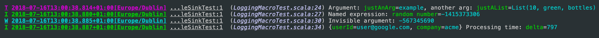
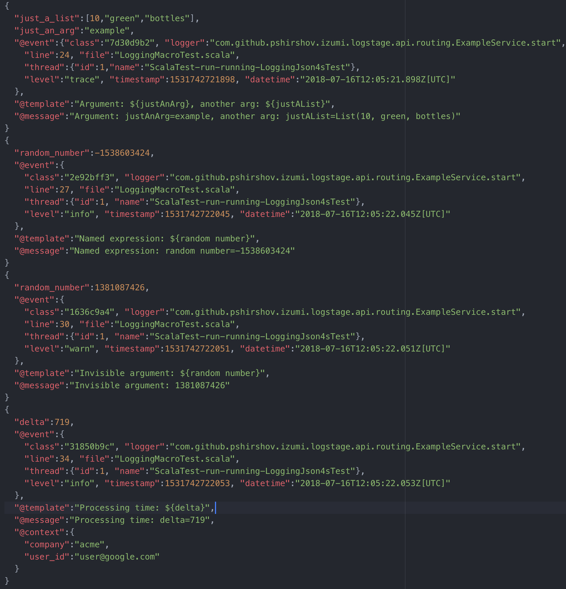

@@toc { depth=2 }

# LogStage

LogStage is a zero-cost structural logging framework for Scala & Scala.js

Key features:

1. LogStage extracts structure from ordinary string interpolations in your log messages with zero changes to code.
2. LogStage uses macros to extract log structure, its faster at runtime than a typical reflective structural logging frameworks,
3. Log contexts
4. Console, File and SLF4J sinks included, File sink supports log rotation,
5. Human-readable output and JSON output included,
6. Method-level logging granularity. Can configure methods `com.example.Service.start` and `com.example.Service.doSomething` independently,
7. Slf4J adapters: route legacy Slf4J logs into LogStage router

## Dependencies

@@@vars
```scala
libraryDependencies ++= Seq(
  // LogStage core library
  "io.7mind.izumi" %% "logstage-core" % "$izumi.version$",
  // Json output
  "io.7mind.izumi" %% "logstage-rendering-circe" % "$izumi.version$",
  // Router from Slf4j to LogStage
  "io.7mind.izumi" %% "logstage-adapter-slf4j" % "$izumi.version$",
  // LogStage integration with DIStage
  "io.7mind.izumi" %% "distage-extension-logstage" % "$izumi.version$",
  // Router from LogStage to Slf4J
  "io.7mind.izumi" %% "logstage-sink-slf4j " % "$izumi.version$",
)
```
@@@

## Overview

The following snippet:

```scala mdoc:to-string:reset
import logstage.IzLogger
import scala.util.Random

val logger = IzLogger()

val justAnArg = "example"
val justAList = List[Any](10, "green", "bottles")

logger.trace(s"Argument: $justAnArg, another arg: $justAList")

// custom name, not based on `val` name

logger.info(s"Named expression: ${Random.nextInt() -> "random number"}")

// print result without a name

logger.warn(s"Invisible argument: ${Random.nextInt() -> "random number" -> null}")

// add following fields to all messages printed by a new logger value

val ctxLogger = logger("userId" -> "user@google.com", "company" -> "acme")
val delta = Random.nextInt(1000)

ctxLogger.info(s"Processing time: $delta")
```

Will look like this in string form:



And like this in JSON:



Note:

1. JSON formatter is type aware!
2. Each JSON message contains `@class` field with holds a unique `event class` identifier.
   All events produced by the same source code line will share the same `event class`.

## Syntax Reference

1) Simple variable:

```scala
logger.info(s"My message: $argument")
```

2) Chain:

```scala
logger.info(s"My message: ${call.method} ${access.value}")
```

3) Named expression:

```scala
logger.info(s"My message: ${Some.expression -> "argname"}")
```

4) Invisible named expression:

```scala
logger.info(s"My message: ${Some.expression -> "argname" -> null}")
```

5) De-camelcased name:

```scala
logger.info(${camelCaseName -> ' '})
```

## Basic setup

```scala mdoc:to-string:reset
import logstage.{ConsoleSink, IzLogger, Trace}
import logstage.circe.LogstageCirceRenderingPolicy

val textSink = ConsoleSink.text(colored = true)
val jsonSink = ConsoleSink(LogstageCirceRenderingPolicy(prettyPrint = true))

val sinks = List(jsonSink, textSink)

val logger: IzLogger = IzLogger(Trace, sinks)
val contextLogger: IzLogger = logger("key" -> "value")

logger.info("Hey")

contextLogger.info("Hey")
```

## Log algebras

`LogIO`, `LogIO2` & `LogIO3` algebras provide a purely-functional API for one-, two-, and three-parameter effect types respectively:

```scala mdoc:to-string:reset
import logstage.{IzLogger, LogIO}
import cats.effect.IO

val logger = IzLogger()

val log = LogIO.fromLogger[IO](logger)

log.info(s"Hey! I'm logging with ${log}stage!").unsafeRunSync()(cats.effect.unsafe.IORuntime.global)
```

```
I 2019-03-29T23:21:48.693Z[Europe/Dublin] r.S.App7.res8 ...main-12:5384  (00_logstage.md:92) Hey! I'm logging with log=logstage.LogIO$$anon$1@72736f25stage!
```


`LogIO.log`/`LogIO2.log`/`LogIO3.log`/`IzLogger.log` let you refer to an implicit logger's methods without having to name a logger variable

```scala mdoc:to-string:reset
import logstage.LogIO
import logstage.LogIO.log

def logfun[F[_]: LogIO]: F[Unit] = {
  log.info(s"I'm logging with ${log}stage!")
}
```

### Adding Custom Context to Loggers

`LogIO*` algebras can be extended with custom context using their `.withCustomContext` method, same as `IzLogger`:

```scala mdoc:reset:invisible
import com.example.Entity

def load(entity: Entity): cats.effect.IO[Unit] = cats.effect.IO.unit
```

```scala mdoc:to-string
import cats.effect.IO
import cats.syntax.all._
import logstage.LogIO
import io.circe.Printer
import io.circe.syntax._

def importEntity(entity: Entity)(implicit log: LogIO[IO]): IO[Unit] = {
  val logWithContext: LogIO[IO] = {
    log.withCustomContext(
      "ID" -> entity.id,
      "entityAsJSON" -> entity.asJson.printWith(Printer.spaces2),
    )
  }

  load(entity).handleErrorWith {
    case error =>
      logWithContext.error(s"Failed to import entity: $error.").void
      // JSON message includes `ID` and `entityAsJSON` fields
  }
}
```

## ZIO environment support

`LogZIO.log` lets you carry `LogZIO` capability in environment.

Example:

```scala mdoc:to-string:reset
import logstage.{IzLogger, LogIO3, LogZIO}
import logstage.LogZIO.log
import zio.{Has, URIO}

val fn: URIO[LogZIO, Unit] = {
  log.info(s"I'm logging with ${log}stage!")
}

val logger: LogZIO.Service = LogIO3.fromLogger(IzLogger())

zio.Runtime.default.unsafeRun {
  fn.provide(Has(logger))
}
```

### Adding FiberId to log messages

`LogZIO.withFiberId` provides a `LogIO` instance that logs the current ZIO `FiberId` in addition to the JVM thread id:

```scala mdoc:override:to-string
val HACK_OVERRIDE_logger: LogZIO.Service = LogZIO.withFiberId(IzLogger())

zio.Runtime.default.unsafeRun {
   fn.provide(Has(HACK_OVERRIDE_logger))
}
```

```
I 2019-03-29T23:21:48.760Z[Europe/Dublin] r.S.App9.res10 ...main-12:5384  (00_logstage.md:123) {fiberId=0} Hey! I'm logging with log=logstage.LogZIO$$anon$1@c39104astage!
```

### Adding custom logging context to log messages

`LogZIO.withCustomContext` allows to append to the custom log context carried in ZIO environment when `LogZIO.log` is used for logging:

```scala mdoc:override:to-string
import zio._

def databaseCall(): ZIO[LogZIO, Throwable, String] = ZIO.succeed("stubbed")

def dbLayerFunction(arg: Int): ZIO[LogZIO, Throwable, String] = {
  LogZIO.withCustomContext("arg" -> arg) {
    for {
      result <- databaseCall
      _      <- log.info(s"Database call $result")
    } yield result
 }
}

def serviceLayerFunction1(): ZIO[LogZIO, Throwable, String] = {
  for {
    _      <- log.info("Going to call dbLayerFunction")
    result <- dbLayerFunction(1)
  } yield result
}

def serviceLayerFunction2(): ZIO[LogZIO, Throwable, String] = {
  log.info("Called serviceLayerFunction2").as("stubbed")
}

def controllerFunction(correlationId: String): ZIO[LogZIO, Throwable, String] = {
  LogZIO.withCustomContext("correlation_id" -> correlationId) {
    for {
      x     <- serviceLayerFunction1()
      y     <- serviceLayerFunction2()
      result = x + y
      _     <- log.info(s"Controller produced $result")
    } yield result
  } <* log.info("Some log after controller function (without correlation_id)")
}

// at the end of the world
zio.Runtime.default.unsafeRun {
   controllerFunction("123").provide(Has(logger))
}
```

```
I 2021-08-17T15:07:54.244 (00_logstage.md:220)  …App12.serviceLayerFunction1 [2280:Thread-60           ] correlation_id=123 Going to call dbLayerFunction
I 2021-08-17T15:07:54.342 (00_logstage.md:213)  …n.App12.dbLayerFunction.212 [2280:Thread-60           ] correlation_id=123, arg=1 Database call result=stubbed
I 2021-08-17T15:07:54.358 (00_logstage.md:226)  …App12.serviceLayerFunction2 [2280:Thread-60           ] correlation_id=123 Called serviceLayerFunction2
I 2021-08-17T15:07:54.367 (00_logstage.md:235)  ….controllerFunction.232.233 [2280:Thread-60           ] correlation_id=123 Controller produced result=stubbedstubbed
I 2021-08-17T15:07:54.371 (00_logstage.md:237)  …on.App12.controllerFunction [2280:Thread-60           ] Some log after controller function (without correlation_id)
```

### Tagless trifunctor support

`LogIO3Ask.log` adds environment support for all trifunctor effect types with an instance of `MonadAsk3[F]` typeclass from @ref[BIO](../bio/00_bio.md) hierarchy.

Example:

```scala mdoc:to-string:reset
import logstage.{LogIO3, LogIO3Ask, IzLogger}
import logstage.LogIO3Ask.log
import zio.{Has, ZIO}

def fn[F[-_, +_, +_]: LogIO3Ask]: F[Has[LogIO3[F]], Nothing, Unit] = {
 log.info(s"I'm logging with ${log}stage!")
}

val logger = LogIO3.fromLogger(IzLogger())

zio.Runtime.default.unsafeRun {
  fn[ZIO].provide(Has(logger))
}
```

Custom JSON rendering with LogstageCodec
----------------------------------------

If you define an instance of `LogstageCodec` for your type, it will be used when rendering your logs to JSON instead of the default renderer.

You can derive instances of `LogstageCodec` from Circe codecs with `logstage-rendering-circe` or write them manually.

Example:

```scala mdoc:reset:to-string
import io.circe.Codec
import io.circe.generic.semiauto
import logstage.LogstageCodec
import logstage.circe.LogstageCirceCodec

final case class KV(key: String, value: Int)

object KV {
  implicit val circeCodec: Codec[KV] = semiauto.deriveCodec[KV]
  implicit val logstageCodec: LogstageCodec[KV] = LogstageCirceCodec.derived[KV]
}
```

If you want to make sure that all values in your interpolations are rendered using `LogstageCodec` instead of default renderer,
use `IzStrictLogger`/`LogIOStrict` types from `logstage.strict` package:

```scala mdoc:to-string
import logstage.strict.IzStrictLogger
import logstage.ConsoleSink
import logstage.circe.LogstageCirceRenderingPolicy

val logger = IzStrictLogger(sink = ConsoleSink(LogstageCirceRenderingPolicy()))

logger.info(s"Got ${KV("key", 7) -> "KeyValue"}")
```

SLF4J Router
------------

When not configured, `logstage-adapter-slf4j` will log messages with level `>= Info` to `stdout`.

Due to the global mutable nature of `slf4j`, to configure slf4j logging you'll
have to mutate a global singleton `StaticLogRouter`. Replace its `LogRouter`
with the same one you use elsewhere in your application to use the same configuration for Slf4j.

```scala mdoc:to-string:reset
import logstage.IzLogger
import izumi.logstage.api.routing.StaticLogRouter

val myLogger = IzLogger()

// configure SLF4j to use the same router that `myLogger` uses
StaticLogRouter.instance.setup(myLogger.router)
```

JUL (`java.util.logging`) support
---------------------------------

There are two ways to integrate JUL framework with LogStage.

LogStage implements JUL log handler. Due to the global mutable nature of JUL framework,
to configure JUL logging you'll have to mutate a global singleton holding the root of the JUL logging hierarch `java.util.logging.Logger`.

This might be done the following way:

```scala
val logger = IzLogger()
val router: LogRouter = logger.router
val bridge = new LogstageJulLogger(router)
bridge.installOnly()
```

`LogstageJulLogger#installOnly()` method wipes all the logging handlers associated with the root logger and installs LogStage
as the only logging handler.

Alternatively, you may use [`jul-to-slf4j`](https://search.maven.org/artifact/org.slf4j/jul-to-slf4j) adapter for `slf4j`.

You might need to do the following in order for the adapter to properly initialize:

```scala
SLF4JBridgeHandler.removeHandlersForRootLogger()
SLF4JBridgeHandler.install()
```
