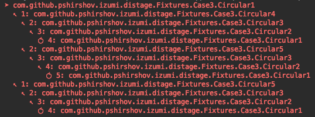

DiStage Staged Dependency Injection
============

DiStage is a modern dependency injection framework for Scala. Like Scala itself, DiStage seeks to combine the best practices of FP with the best practices of OOP.

Combining type safety, ease composition and separation of declaration from execution from FP, and late binding, modularity and scalability from OOP,
DiStage brings together a fusion that retains safety and clarity of pure FP without sacrificing full runtime flexibility and configurability of traditional 
runtime dependency injection frameworks such as Guice.

DiStage is *staged*, meaning that it's split into several distinct *stages*, like a multi-pass compiler. DiStage lets you add custom functionality between stages should you require it, yet it keeps a simple surface API.

### Defining simple modules

This is what Hello World looks like in DiStage:

```scala
import distage._

class Hello {
  def helloWorld() = println("Hello World!")
}

object HelloModule extends ModuleDef {
  make[Hello]
}

object Main extends App {
  val injector = Injector()
  
  val plan = injector.plan(HelloModule)
  
  val classes = injector.produce(plan)

  classes.get[Hello].helloWorld()
}
```

Let's review the new concepts line by line:

```scala
object HelloModules extends ModuleDef {
  make[Hello]
}
```

We define a *Module* for our application. A module specifies *what* classes to instantiate and *how* to instantiate them.

In this case we are using the default instantiation strategy - just calling the constructor, so we don't have to specify anything.

The default way to instantiate a class is to call its constructor. If the constructor accepts arguments, 
DiStage will first instantiate the arguments, then call the constructor. All the classes in DiStage are instantiated exactly once,
 even if multiple classes depend on them, in other words they are `Singletons`.
 
Modules can be combined using `++` operator. In DiStage, you'll combine all the modules in your application into one 
one large module representing your application. Don't worry, you won't have to do that manually, if you don't want to: DiStage comes with a mechanism 
to discover all the (specially marked) Modules on the classpath at boot-up time. See [Plugins](#plugins) for details.

However, If you choose to combine your modules manually, DiStage can offer compile-time checks to ensure that all the
dependencies have been wired and that your app will run. See [Static Configurations](#static-configurations) for details.
Whether you prefer the flexibility of runtime DI or the stability of compile-time DI, DiStage lets you mix and match different modes within one application.

Next:

```scala
object Main extends App {
  val injector = Injector()
  val plan = injector.plan(HelloModule)
```

We create an instantation `plan` from the module definition. Remember that DiStage is *staged*, instead of instantiating our 
definitions right away, DiStage first builds a pure representation of all the operations it will do and returns it back to us.
This allows us to easily implement additional functionality on top of DiStage without modifying the library. In fact, DiStage's built-in 
functionality such as [Plugins](#plugins) and [Configurations](#config-files) is not hard-wired, but is 
built on this framework of manipulating the `plan`. Plan rewriting also enables the [Import Injection Pattern](#import-injection-pattern) 
that will be especially interesting for the Scalazzi adepts seeking to free their programs of side effects.

```scala
  val classes = injector.produce(plan)

  classes.get[Hello].helloWorld()
```

After we execute the plan we're left a `Locator` that holds all of our app's classes. We can retrieve the class by type using `.get`

This concludes the first chapter. Next, we'll learn how to use multiple and named bindings:


// TODO blakdfg
distage is non-invasive and unopinionated, it tries to get out of the way of programmer as much as possible. As a consequence it does not use annotations

### MultiBindings / Set Bindings

Multibindings are useful for implementing event listeners, plugins, hooks, http routes, etc.

To define a multibinding use `.many` and `.add` methods in @scaladoc[ModuleDef](com.github.pshirshov.izumi.distage.model.definition.ModuleDef)
DSL:

```scala
import cats.effect._, org.http4s._, org.http4s.dsl.io._, scala.concurrent.ExecutionContext.Implicits.global
import distage._

object HomeRouteModule extends ModuleDef {
  many[HttpRoutes[IO]].add {
    HttpRoutes.of[IO] { case GET -> Root / "home" => Ok(s"Home page!") }
  }
}
```

Multibindings defined in different modules will be merged together into a single Set.
You can summon a multibinding by type `Set[_]`:

```scala
import cats.implicits._, import org.http4s.server.blaze._, import org.http4s.implicits._

object BlogRouteModule extends ModuleDef {
  many[HttpRoutes[IO]].add {
    HttpRoutes.of[IO] { case GET -> Root / "blog" / post => Ok("Blog post ``$post''!") }
  }
}

class HttpServer(routes: Set[HttpRoutes[IO]]) {
  def serve = BlazeBuilder[IO]
    .bindHttp(8080, "localhost")
    .mountService(routes.fold[HttpRoutes[IO]], "/")
    .start

  val count = routes.size
}

val context = Injector().run(HomeRouteModule ++ BlogRouteModule)
val server = context.get[HttpServer]

server.count // 2
```

For further detail see [Guice wiki on Multibindings](https://github.com/google/guice/wiki/Multibindings).

### Provider Bindings

To bind to a function instead of constructor use `.from` method in @scaladoc[ModuleDef](com.github.pshirshov.izumi.distage.model.definition.ModuleDef) DSL:

```scala
case class HostPort(host: String, port: Int)

class HttpServer(hostPort: HostPort)

trait HttpServerModule extends ModuleDef {
  make[HttpServer].from {
    hostPort: HostPort => new HttpServer(hostPort.host, hostPort + 1000)
  }
}
```

To inject named instances or config values, add annotations to lambda arguments' types:

```scala
trait HostPortModule extends ModuleDef {
  make[HostPort].from {
    (configHost: String @ConfPath("http.host"), configPort: Int @ConfPath("http.port")) =>
      HostPort(configHost, configPort)
  }
}
```

For further details, see scaladoc for @scaladoc[ProviderMagnet](com.github.pshirshov.izumi.distage.model.providers.ProviderMagnet)

### Tagless Final Style with DiStage

Disclaimer: I'm a maintainer of [distage](https://izumi.7mind.io/distage/index.html)

In your article, you talk a lot about a choice between Pure FP vs. OOP dependency injection, but one possibility that
wasn't expounded on is – **why not both**? In [distage](https://izumi.7mind.io/distage/index.html), we have first-class
support for tagless final style. Let's see how [freestyle tagless example](http://frees.io/docs/core/handlers/#tagless-interpretation)
looks in distage:

```scala
class Program[F: TagK: Monad] extends ModuleDef {
  make[TaglessProgram[F]]
}

object TryInterpreters extends ModuleDef {
  make[Validation.Handler[Try]].from(tryValidationHandler)
  make[Interaction.Handler[Try]].from(tryInteractionHandler)
}

// Combine modules into a full program
val TryProgram = new Program[Try] ++ TryInterpreters
```

where

```scala
class TaglessProgram[F[_]: Monad](validation: Validation[F], interaction: Interaction[F]) {
  def program = for {
      userInput <- interaction.ask("Give me something with at least 3 chars and a number on it")
      valid     <- (validation.minSize(userInput, 3), validation.hasNumber(userInput)).mapN(_ && _)
      _         <- if (valid) interaction.tell("awesomesauce!") else interaction.tell(s"$userInput is not valid")
  } yield ()
}

val validationHandler = new Validation.Handler[Try] {
  override def minSize(s: String, n: Int): Try[Boolean] = Try(s.size >= n)
  override def hasNumber(s: String): Try[Boolean] = Try(s.exists(c => "0123456789".contains(c)))
}

val interactionHandler = new Interaction.Handler[Try] {
  override def tell(s: String): Try[Unit] = Try(println(s))
  override def ask(s: String): Try[String] = Try("This could have been user input 1")
}
```

Notice how the program module stays completely polymorphic and abstracted from its eventual interpeter or what monad it
will run in? Want a program in different Monad? No problem:

```scala
val IOProgram = new Program[IO] ++ IOInterpreters
```

Want a program in the **same** Monad, but with different interpreters? No problem at all:

```scala
val DifferentTryProgram = new Program[Try] ++ DifferentTryInterpreters
```

Distage makes tagless final style easier and safer by making your implicit instances explicit and configurable as
first-class values. It even enforces typeclass coherence by disallowing multiple instances, so one wrong `import` can't
ruin your day. Distage is still [in active development](https://github.com/pshirshov/izumi-r2/) and somewhat lacks
documentation, but as of now we've been using it for months in production and it allowed to port our legacy code from
Akka/Guice stack to pure FP http4s/cats without losing neither ease of configuration and variability of a runtime DI
framework, nor parametricity and equational reasoning of pure FP tagless final style.

> The code below shows an example of reading configurations from a YAML file

We also have first-class support for configs, so your first example with manual config reading is not necessary. Just
put your config into typesafe-config and in distage you can request it in any module:

```scala
final case class Config(different: Boolean)

class ConfiguredTaglessProgram[F](
  @ConfPath("program.config") config: Config,
  @Id("primary") primaryProgram: TaglessProgram[F],
  @Id("different") differentProgram: TaglessProgram[F]) {

    val program = if (config.different) differentProgram else primaryProgram
}

class ConfiguredTryProgram[F: TagK: Monad] extends ModuleDef {
  make[ConfiguredProgram[F]]
  make[TaglessProgram[F]].named("primary")
  make[TaglessProgram[F]].named("different")
}
```

Where your config file looks like this:

```hocon
program {
    config {
        different = true
    }
}
```

> If you prefer compile-time check, consider using MacWire

Unfortunately, MacWire is fully static and cannot change dependencies at runtime. It would seem like the only choice is
between unsafe, but flexible, runtime dependency injection vs. safe, but rigid, compile-time schemes. That's not true,
however. **[Why not have both?](https://github.com/pshirshov/izumi-r2/issues/51)** By giving appropriate types to our
modules we can allow runtime variation, while at the same time guaranteeing correct instantiation. The proposed typing
scheme is currently a work in progress in distage, but already implementing a basic check is as easy as running the
exact same wiring code in compile-time macro instead of at runtime.

### Config files

...

### Auto-Factories & Auto-Traits

...

## Patterns

### Import Injection Pattern

...

### Depending on future values with by-name parameters

...

### Ensuring service boundaries using API modules

...

### Plugins

Sometimes, when rapidly prototyping, the additional friction of adding new modules into the system can disrupt developer's flow.
Distage plugin system can automatically pickup all modules defined in the program and by doing that reduce friction of adding new modules.

To define a plugin, first add distage-plugins library:

```scala
libraryDependencies += Izumi.R.distage_plugins
```
or
@@@vars
```scala
libraryDependencies += "com.github.pshirshov.izumi.r2" %% "distage-plugins" % "$izumi.version$"
```
@@@

If you're not using `sbt-izumi` plugin.

Create a module extending the `PluginDef` trait instead of `ModuleDef`:

```scala
trait PetStorePlugin extends PluginDef {
  make[PetRepository]
  make[PetStoreService]
  make[PetStoreController]
}
```

At your app entry point add a plugin loader:

```scala
val pluginLoader = new PluginLoaderDefaultImpl(
  PluginConfig(debug = false, packagesEnabled = Seq("com.example"), packagesDisabled = Seq.empty))
)

val appModules = pluginLoader.load()
val app = appModules.merge
```

Launch as normal with the loaded modules:

```scala
val injector = Injectors.bootstrap()
injector.run(app)
```

Plugins also allow a program to dynamically extend itself by adding new Plugin classes into the classpath which will be picked up at runtime.

### Roles, not microservices 

...

## Test Kit

### Fixtures and utilities

...

### Static Configurations

...

### Using Garbage Collector to instantiate only classes required for the test

...

## Detailed Feature Overview

### Implicits Injection

...

#### Typeclass Coherence Guarantees

### Compile-Time Checks

...

### Circular Dependencies support

...

#### Automatic Resolution with generated Proxies

#### Manual Resolution with by-name parameters

### Auto-Sets: Collecting Bindings By Predicate

...

#### Weak Sets

### Provider (Function) Bindings

...

### Debugging, Introspection, Diagnostics and Hooks

You can print a `plan` to get detailed info on what will happen during instantiation:

```scala
System.err.println(plan: OrderedPlan)
```


You can also query a plan to see the dependencies and reverse dependencies of a class and their instantiation:

```scala
// Print dependencies
System.err.println(plan.topology.dependees.tree(DIKey.get[Circular1]))
// Print reverse dependencies
System.err.println(plan.topology.dependees.tree(DIKey.get[Circular1]))
```



The printer highlights circular dependencies.

Distage also uses some macros, macros are currently used to create `TagK`s and [provider bindings](#provider-(function)-bindings).
If you think they've gone awry, you can turn macro debug output during compilation by setting `-Dizumi.distage.debug.macro=true` java property:

```bash
sbt -Dizumi.distage.debug.macro=true compile
```


Macros power `distage-static` module, an alternative backend that doesn't use JVM runtime reflection.

### Extensions and Plan Rewriting – writing our first DiStage extension

...

## Migrating from Guice

...

## Migrating from MacWire

...

## Integrations

...

### Cats

To import cats integration add distage-cats library:

```scala
libraryDependencies += Izumi.R.distage_cats
```
or
@@@vars
```scala
libraryDependencies += "com.github.pshirshov.izumi.r2" %% "distage-cats" % "$izumi.version$"
```
@@@

Usage:

```scala
import cats.implicits._
import cats.effect._
import distage._
import distage.cats._

object Main extends IOApp {
  def run(args: List[String]) = {
    val myModules = module1 |+| module2 // Monoid instance is available for ModuleDef
    
    Injector().runIO[IO](myModules)
  }
}
```

### Scalaz

### Freestyle

### Eff

## PPER

See @ref[PPER Overview](../pper/00_pper.md)
